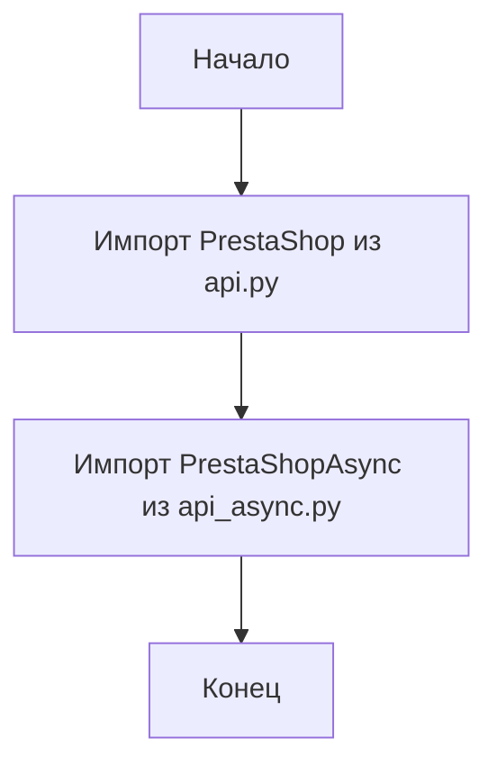

## Анализ кода `src/endpoints/prestashop/api/__init__.py`

### <алгоритм>

1.  **Начало**: Запуск модуля `__init__.py`.
2.  **Импорт `PrestaShop`**: Импорт класса `PrestaShop` из модуля `api.py`, расположенного в той же директории. Этот класс, вероятно, предоставляет функциональность для синхронного взаимодействия с API PrestaShop.
    *   _Пример_: `from .api import PrestaShop`
3.  **Импорт `PrestaShopAsync`**: Импорт класса `PrestaShopAsync` из модуля `api_async.py`, расположенного в той же директории. Этот класс, вероятно, предоставляет функциональность для асинхронного взаимодействия с API PrestaShop.
    *   _Пример_: `from .api_async import PrestaShopAsync`
4.  **Конец**: Завершение выполнения модуля `__init__.py`.

### <mermaid>

### <объяснение>

**Импорты:**

*   `from .api import PrestaShop`: Импортирует класс `PrestaShop` из модуля `api.py`, расположенного в той же директории. Точка `.` перед `api` указывает на относительный импорт, то есть импорт из текущей директории.  Этот класс предназначен для синхронной работы с API PrestaShop.
*   `from .api_async import PrestaShopAsync`: Импортирует класс `PrestaShopAsync` из модуля `api_async.py`, расположенного в той же директории. Это также относительный импорт. `PrestaShopAsync` предназначен для асинхронной работы с API PrestaShop.

**Назначение:**

Файл `__init__.py` в Python используется для обозначения директории как пакета. Он также может использоваться для импорта нужных модулей и классов для удобного доступа к ним из других частей проекта. В данном случае, `__init__.py` импортирует классы `PrestaShop` и `PrestaShopAsync`, которые, предположительно, являются основными точками входа для взаимодействия с API PrestaShop.

**Взаимосвязи:**

Данный модуль является частью пакета `src.endpoints.prestashop.api`, и он обеспечивает удобный доступ к функциональности работы с API PrestaShop, предоставляя два класса - для синхронных и асинхронных запросов.

**Потенциальные улучшения:**

*   В данном коде нет прямого использования импортированных классов. Этот `__init__.py` выступает как "экспортёр" классов.
*   Можно добавить docstrings в сам `__init__.py`, чтобы описать назначение этого пакета и классов.
*  Стоит обратить внимание на то, что в коде присутствует Shebang `#! .pyenv/bin/python3`, который не является стандартным для `__init__.py` файлов и обычно размещается в исполняемых скриптах.