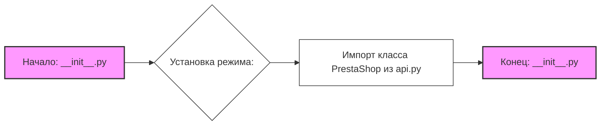

## Анализ кода `hypotez/src/endpoints/prestashop/api/__init__.py`

### <алгоритм>
1.  **Установка режима работы:** Задается переменная `MODE`, определяющая режим работы (в данном случае `dev`).
    *   Пример: `` устанавливает режим разработки.
2.  **Импорт модуля `PrestaShop`:** Из модуля `api.py`, расположенного в той же директории, импортируется класс `PrestaShop`.
    *   Пример: `from .api import PrestaShop` импортирует класс для работы с API PrestaShop.
    
### <mermaid>

**Описание диаграммы:**
- **Начало: `__init__.py`**: Точка входа, начало выполнения кода.
- **Установка режима: ``**: Присвоение значения 'dev' переменной `MODE`.
- **Импорт класса `PrestaShop` из `api.py`**: Импорт класса `PrestaShop`, находящегося в файле `api.py` в той же директории.
- **Конец: `__init__.py`**: Конечная точка выполнения кода в `__init__.py`.

**Зависимости:**
- Зависимость от модуля `api.py`, откуда импортируется класс `PrestaShop`.
- Модуль зависит от самого себя, как точка входа пакета.

### <объяснение>

**Импорты:**
- `from .api import PrestaShop`:  Импортирует класс `PrestaShop` из файла `api.py`, расположенного в той же директории (`src/endpoints/prestashop/api`). Этот класс, вероятно, содержит логику для взаимодействия с API PrestaShop.

**Переменные:**
- ``:  Глобальная переменная, определяющая режим работы приложения. В данном случае устанавливается режим разработки (`dev`). Это может влиять на то, как приложение ведет себя (например, включение логгирования, использование тестовых данных и т.д.).

**Функции:**
- В данном файле функций нет.

**Классы:**
- Класс `PrestaShop` импортируется, но его реализация находится в файле `api.py`. Файл `__init__.py` выступает в роли точки входа для пакета `api`, что позволяет пользователю импортировать `PrestaShop` из `src.endpoints.prestashop.api` вместо `src.endpoints.prestashop.api.api`.

**Объяснение и взаимосвязи:**

- Файл `__init__.py` делает пакет `api` импортируемым, а также определяет переменную `MODE`.
- Основная логика для работы с PrestaShop API, скорее всего, находится в файле `api.py`, и класс `PrestaShop` предоставляет интерфейс для этой логики.
- Наличие переменной `MODE` позволяет гибко настраивать поведение приложения в зависимости от текущей среды (разработка, тестирование, продакшн).

**Потенциальные ошибки и улучшения:**

- **Отсутствие документации:** Не хватает документации (docstring) для переменной `MODE`. Необходимо описать, как и для чего используется данная переменная, а также значения, которые могут быть ей присвоены, кроме `dev`.
- **Обработка `MODE`:** Непонятно, где и как используется значение `MODE`. В других частях проекта должна быть логика, которая использует эту переменную.
- **Неявные зависимости:** Необходимо явно указать зависимость от модуля `api.py`.
- **Абсолютные пути venv:** Пути к venv (#! venv/Scripts/python.exe и #! venv/bin/python/python3.12) стоит пересмотреть, так как они могут быть зависимы от конкретного окружения.