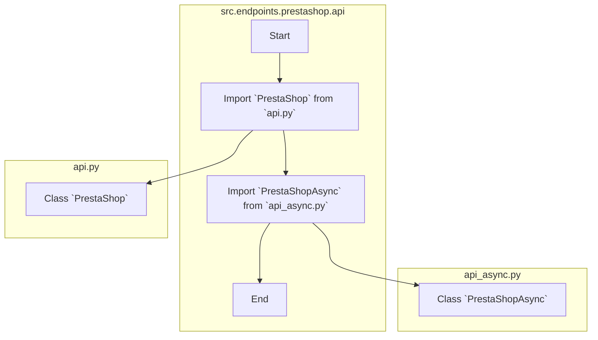

## АНАЛИЗ КОДА: `hypotez/src/endpoints/prestashop/api/__init__.py`

### <алгоритм>

1.  **Импорт модуля `api`:**
    *   Импортируется класс `PrestaShop` из модуля `api.py`, расположенного в том же каталоге. Этот класс, вероятно, содержит синхронные методы для взаимодействия с API PrestaShop.
    *   Пример:
        ```python
        from .api import PrestaShop
        # Теперь можно создать экземпляр PrestaShop:
        # prestashop_client = PrestaShop(api_url="...", api_key="...")
        ```

2.  **Импорт модуля `api_async`:**
    *   Импортируется класс `PrestaShopAsync` из модуля `api_async.py`, расположенного в том же каталоге. Этот класс, вероятно, предоставляет асинхронные методы для взаимодействия с API PrestaShop.
    *   Пример:
        ```python
        from .api_async import PrestaShopAsync
        # Теперь можно создать экземпляр PrestaShopAsync:
        # prestashop_async_client = PrestaShopAsync(api_url="...", api_key="...")
        ```

### <mermaid>



**Объяснение `mermaid`:**

*   `flowchart TD`: Определяет тип диаграммы как блок-схему с направлением сверху вниз.
*   `subgraph src.endpoints.prestashop.api`: Обозначает группу узлов, представляющую текущий файл `__init__.py`.
*   `Start`, `ImportAPI`, `ImportAPIAsync`, `End`: Узлы, представляющие начало, импорт классов `PrestaShop` и `PrestaShopAsync`, и конец процесса.
*   `ImportAPI --> ImportAPIAsync`: Указывает порядок импорта: сначала `PrestaShop`, потом `PrestaShopAsync`.
*    `subgraph api.py`: Обозначает группу узлов, представляющую файл `api.py`.
*   `PrestaShopClass`: Узел, представляющий класс `PrestaShop`.
*    `subgraph api_async.py`: Обозначает группу узлов, представляющую файл `api_async.py`.
*   `PrestaShopAsyncClass`: Узел, представляющий класс `PrestaShopAsync`.
*   `ImportAPI --> PrestaShopClass`: Указывает, что `PrestaShop` импортируется из файла `api.py`.
*   `ImportAPIAsync --> PrestaShopAsyncClass`: Указывает, что `PrestaShopAsync` импортируется из файла `api_async.py`.

### <объяснение>

**Импорты:**

*   `from .api import PrestaShop`: Импортирует класс `PrestaShop` из модуля `api.py` (относительный импорт). Этот класс, скорее всего, предоставляет интерфейс для синхронного взаимодействия с API PrestaShop. Он может включать методы, такие как `get`, `post`, `put`, `delete`, для выполнения запросов.

*   `from .api_async import PrestaShopAsync`: Импортирует класс `PrestaShopAsync` из модуля `api_async.py` (относительный импорт). Этот класс, вероятно, предоставляет асинхронный интерфейс для работы с API PrestaShop, что позволяет более эффективно обрабатывать запросы без блокировки основного потока. Это особенно полезно для параллельного выполнения нескольких запросов. Он также может включать методы, такие как `async get`, `async post`, `async put`, `async delete`.

**Классы:**

*   `PrestaShop`:
    *   Предположительно, этот класс содержит логику для синхронного взаимодействия с API PrestaShop.
    *   Он, вероятно, будет иметь методы для отправки HTTP-запросов к API PrestaShop, обработки ответов и возвращения результатов.
    *   Возможные атрибуты: `api_url` (URL API PrestaShop), `api_key` (ключ API).
    *   Пример использования:
        ```python
        # Создание экземпляра
        prestashop_api = PrestaShop(api_url="https://your-prestashop.com/api", api_key="your_api_key")
        # Получение списка заказов
        orders = prestashop_api.get("orders")
        ```

*   `PrestaShopAsync`:
    *   Предположительно, этот класс реализует асинхронное взаимодействие с API PrestaShop.
    *   Он использует `async/await` для неблокирующего выполнения запросов.
    *   Возможные атрибуты: `api_url`, `api_key`, `session` (aiohttp session).
    *   Пример использования:
        ```python
        # Создание экземпляра
        prestashop_async_api = PrestaShopAsync(api_url="https://your-prestashop.com/api", api_key="your_api_key")
        # Получение списка заказов (асинхронно)
        async def get_orders():
            orders = await prestashop_async_api.get("orders")
            return orders
        ```

**Функции:**

В этом файле функций нет, только импорты.

**Переменные:**

В этом файле нет переменных, только импорты классов.

**Потенциальные ошибки и улучшения:**

*   **Обработка ошибок:** В классах `PrestaShop` и `PrestaShopAsync` необходима надлежащая обработка ошибок, например, ошибок HTTP, ошибок JSON, и сетевых ошибок.
*   **Аутентификация:** Необходимо проверить, правильно ли обрабатывается аутентификация API PrestaShop.
*   **Логирование:** Добавление логирования поможет отслеживать работу классов и выявлять ошибки.
*   **Конфигурация:** Может быть полезно вынести настройки (URL API, ключ) в отдельный файл конфигурации.
*   **Документация:** Желательно добавить подробную документацию к классам `PrestaShop` и `PrestaShopAsync`, чтобы облегчить их использование.

**Взаимосвязь с другими частями проекта:**

Этот файл (`__init__.py`) является частью пакета `src.endpoints.prestashop.api`. Он служит точкой входа для этого пакета, предоставляя импортируемые классы `PrestaShop` и `PrestaShopAsync` для других частей проекта, которые хотят взаимодействовать с API PrestaShop. Например, другие модули проекта могут использовать эти классы для получения информации о товарах, заказах, клиентах и т.д. из магазина PrestaShop.

**Цепочка взаимосвязей:**

1.  `src.endpoints.prestashop.api` (текущий файл)
2.  `src.endpoints.prestashop.api.api` (модуль, предоставляющий синхронный API-клиент)
3.  `src.endpoints.prestashop.api.api_async` (модуль, предоставляющий асинхронный API-клиент)
4.  Другие модули проекта, которые используют API PrestaShop, импортируют классы из `src.endpoints.prestashop.api`.

Этот файл обеспечивает удобную точку доступа к классам для работы с PrestaShop API, а также разделяет логику синхронного и асинхронного взаимодействия, что способствует модульности и удобству использования.