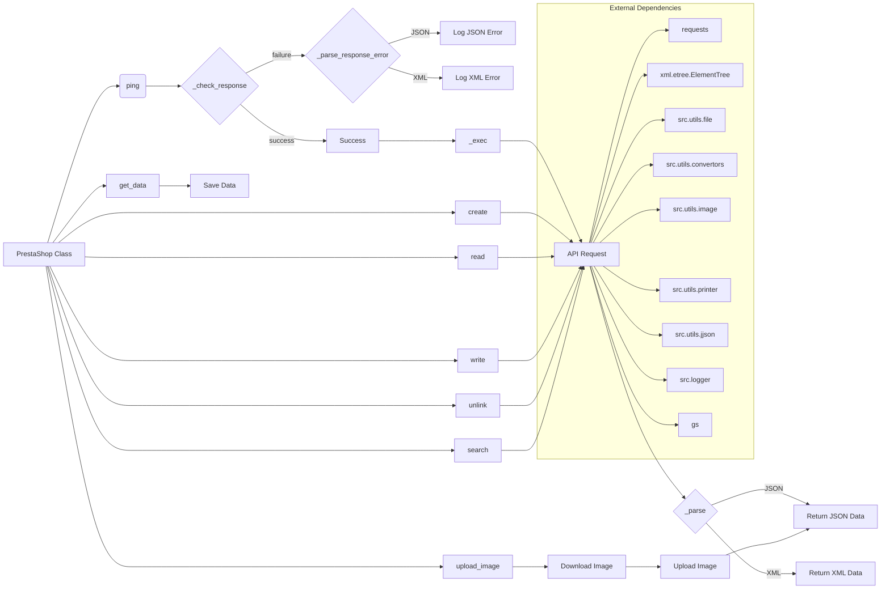

# <input code>

```python
## \file hypotez/src/endpoints/prestashop/api/api.py
# -*- coding: utf-8 -*-\n#! venv/Scripts/python.exe\n#! venv/bin/python/python3.12\n\n"""
.. module: src.endpoints.prestashop.api 
	:platform: Windows, Unix
	:synopsis:

"""
MODE = 'dev'


import os
import sys
from enum import Enum
from http.client import HTTPConnection
from requests import Session
from requests.models import PreparedRequest
from typing import Dict, List
from pathlib import Path
from xml.etree import ElementTree
from xml.parsers.expat import ExpatError

import header
from src import gs
from src.utils.file import save_text_file
from src.utils.convertors import dict2xml, xml2dict, base64_to_tmpfile
from src.utils.image import save_png_from_url
from src.utils.printer import pprint
from src.utils.jjson import j_loads, j_loads_ns, j_dumps
from src.logger import logger
from src.logger.exceptions import PrestaShopException, PrestaShopAuthenticationError


class Format(Enum):
    """Data types return (JSON, XML)

    @details
    @param Enum (int): 1 => JSON, 2 => XML
    @deprecated - я предпочитаю JSON 👍 :))
    """
    JSON = 'JSON'
    XML = 'XML'


class PrestaShop:
    # ... (rest of the code)
```

# <algorithm>

The code defines a `PrestaShop` class for interacting with a PrestaShop API.  The algorithm involves these steps:

1. **Initialization (`__init__`):**
   - Sets up the API domain and key from `gs.credentials.presta.client`.
   - Initializes debug mode, language, and data format.
   - Establishes an authenticated `requests.Session` object.
   - Performs a HEAD request to the API to retrieve the PrestaShop version.

2. **Ping (`ping`):**
   - Executes a HEAD request to the API domain.
   - Calls `_check_response` to validate the response.

3. **Response Check (`_check_response`):**
   - Checks if the status code is 200 or 201 (success).
   - If successful, returns `True`.
   - If not, logs the error using `logger` and calls `_parse_response_error`. Returns `False`.

4. **Error Handling (`_parse_response_error`):**
   - **JSON format:** Parses the JSON response and logs relevant error information (status code, URL, headers, response text).
   - **XML format:** Parses the XML response, extracts error code and message from the XML structure, and logs the error.

5. **Request Preparation (`_prepare`):**
   - Prepares the request URL by adding parameters (e.g., `filter`, `limit`, `language`).


6. **Request Execution (`_exec`):**
   - Uses `requests.Session` to execute the HTTP request (`GET`, `POST`, `PUT`, or `DELETE`).
   - Handles `data` conversion to XML if the format is `XML` using `dict2xml`.
   - Calls `_check_response` to handle potential errors during request execution.
   - Parses the response using `_parse`.
   - Returns the parsed data in JSON or XML format.
   - The `_check_response` method is crucial to ensure successful API interactions.


7. **Data Parsing (`_parse`):**
   - **JSON:** Parses the JSON response and extracts data from the 'PrestaShop' key.
   - **XML:** Parses the XML response using `ElementTree`.

8. **CRUD Operations:**
   - `create`, `read`, `write`, `unlink`, `search`: These methods utilize `_exec` to perform respective operations on the API with specific method (`POST`, `GET`, `PUT`, `DELETE`).
   - Data is passed as `data` parameter to `_exec`.
   - `get_data` saves the response data to a JSON file.
   - `remove_file` handles file deletion.

9. **Image Upload (`upload_image`, `upload_image_async`):**
   - Downloads the image from `img_url` using `save_png_from_url`.
   - Uses `create_binary` to upload the image to the API.
   - Removes the downloaded image after the upload.


# <mermaid>



# <explanation>

**Imports:**

- `os`, `sys`: Standard Python modules for operating system interaction and system-specific operations.
- `enum`: Used to define the `Format` enum.
- `http.client`:  Provides low-level HTTP communication.  It's likely used indirectly via `requests`.
- `requests`: A powerful HTTP library used for making requests to the PrestaShop API.
- `requests.models`: Needed for interacting with `requests` objects.
- `typing`: Provides type hints for better code readability and maintainability.
- `pathlib`: Used to work with file paths in an object-oriented way.
- `xml.etree.ElementTree`: Used for parsing XML responses from the PrestaShop API.
- `xml.parsers.expat`:  For XML parsing.  `ElementTree` likely handles errors.
- `header`: (unknown).  It's likely a file containing some constants or configuration data related to the application.
- `gs`: Implies a package that likely provides configurations or credential management.  Crucially, it contains `gs.credentials.presta.client.api_key`. This is a crucial component tying into configuration.
- `save_text_file`, `dict2xml`, `xml2dict`, `base64_to_tmpfile`, `save_png_from_url`: These modules from `src.utils` provide utility functions for file handling, data conversion, and image manipulation. This demonstrates a modular design pattern; a useful method for separating concerns.
- `pprint`:  From `src.utils.printer`, it's used for pretty-printing data structures.
- `j_loads`, `j_loads_ns`, `j_dumps`: From `src.utils.jjson`. These likely provide JSON encoding/decoding with potential features like namespace handling.
- `logger`: From `src.logger`. This crucial module provides logging functionality.
- `PrestaShopException`, `PrestaShopAuthenticationError`: Custom exceptions defined in `src.logger.exceptions` used for PrestaShop-specific error handling.


**Classes:**

- **`Format(Enum)`:** Defines possible data formats for API responses (JSON or XML).  It's marked as deprecated.
- **`PrestaShop`:** This is the core class for interacting with the PrestaShop API.
    - `client`: A `requests.Session` object, used for managing HTTP sessions.
    - `debug`, `language`, `data_format`, `ps_version`: Attributes for controlling behavior and storing API version details.
    - `__init__`: Initializes the `PrestaShop` object with API credentials and settings.
    - `ping`, `_check_response`, `_parse_response_error`: Methods for checking API connectivity and handling potential errors (very important for robust API calls).
    - `_prepare`, `_exec`:  Crucial for URL building and sending HTTP requests.
    - `_parse`:  Handles XML and JSON response parsing and validation.  It's a critical part of handling API responses.
    -  `create`, `read`, `write`, `unlink`, `search`:  CRUD operations on the PrestaShop API.
    - `create_binary`: Handles image uploads to the API.
    - `_save`, `get_data`, `remove_file`, `get_apis`, `get_languages_schema`, `upload_image_async`, `upload_image`, `get_product_images`:  Additional methods for complex tasks.

**Functions:**

- Detailed explanations of each function are provided within the algorithm section.

**Error Handling:**


The `_check_response` and `_parse_response_error` methods handle errors robustly by logging errors and parsing the response to identify specific errors (e.g., authentication problems). The use of custom exceptions (`PrestaShopException`, `PrestaShopAuthenticationError`) demonstrates a good practice of using specialized error types for better error handling in the application.

**Potential Improvements:**

- **Error Handling Refinement:** While error handling is present, consider adding more specific error conditions and handling for different HTTP status codes.
- **Input Validation:** Further validation for input parameters (e.g., `data` for API requests) to prevent unexpected behavior or security vulnerabilities.
- **Resource Management:** Closing the file opened in `create_binary`  and other parts of the code where a file is handled can improve resource management and prevent memory leaks and file corruption.

**Relationships with Other Parts of the Project:**

- `gs`: The code interacts with `gs` to get API credentials, demonstrating a dependency on a configuration module.
- `src.utils`: This package provides utilities for data conversion, file handling, image manipulation, and printing.
- `src.logger`: Crucial for error and status logging, indicating a robust logging approach.
- `requests`: For API communication.

The code follows a well-structured, modular approach, making it easier to understand, maintain, and integrate with other parts of the application.  It also includes thorough error handling, which is essential for any robust API interaction code.