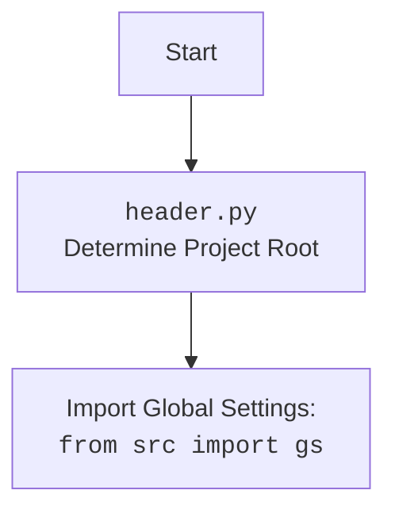

## ИНСТРУКЦИЯ:

Анализируй предоставленный код подробно и объясни его функциональность. Ответ должен включать три раздела:  

1. **<алгоритм>**: Опиши рабочий процесс в виде пошаговой блок-схемы, включая примеры для каждого логического блока, и проиллюстрируй поток данных между функциями, классами или методами.  
2. **<mermaid>**: Напиши код для диаграммы в формате `mermaid`, проанализируй и объясни все зависимости, 
    которые импортируются при создании диаграммы. 
    **ВАЖНО!** Убедитесь, что все имена переменных, используемые в диаграмме `mermaid`, 
    имеют осмысленные и описательные имена. Имена переменных вроде `A`, `B`, `C`, и т.д., не допускаются!  
    
    **Дополнительно**: Если в коде есть импорт `import header`, добавьте блок `mermaid` flowchart, объясняющий `header.py`:\
    ```mermaid
    flowchart TD
        Start --> Header[<code>header.py</code><br> Determine Project Root]
    
        Header --> import[Import Global Settings: <br><code>from src import gs</code>] 
    ```

3. **<объяснение>**: Предоставьте подробные объяснения:  
   - **Импорты**: Их назначение и взаимосвязь с другими пакетами `src.`.  
   - **Классы**: Их роль, атрибуты, методы и взаимодействие с другими компонентами проекта.  
   - **Функции**: Их аргументы, возвращаемые значения, назначение и примеры.  
   - **Переменные**: Их типы и использование.  
   - Выделите потенциальные ошибки или области для улучшения.  

Дополнительно, постройте цепочку взаимосвязей с другими частями проекта (если применимо).  

Это обеспечивает всесторонний и структурированный анализ кода.
## Формат ответа: `.md` (markdown)
**КОНЕЦ ИНСТРУКЦИИ**
```
## <алгоритм>

**1. Инициализация `PrestaShop`:**
    -   Создается экземпляр класса `PrestaShop` с параметрами `API_DOMAIN`, `API_KEY`, `data_format`, `default_lang` и `debug`.
    -   В конструкторе `__init__` формируется URL API, устанавливается API_KEY, включается debug режим, устанавливается язык и формат данных.
    -   Создается сессия `requests.Session` для выполнения HTTP запросов с аутентификацией.
    -   Выполняется HEAD запрос для получения версии PrestaShop.
        
        _Пример:_
        ```python
        api = PrestaShop(
            API_DOMAIN='https://your-prestashop-domain.com',
            API_KEY='your_api_key',
            default_lang=1,
            debug=True,
            data_format='JSON',
        )
        ```

**2. Проверка работоспособности `ping()`:**
    -   Выполняется HEAD запрос к API_DOMAIN.
    -   `_check_response()` проверяет статус ответа.
    -   Возвращает `True` при успешном подключении (200 или 201 статус), `False` - если есть ошибки.

        _Пример:_
        ```python
        api.ping() # Returns True or False
        ```

**3. Обработка ответа `_check_response()`:**
    -   Принимает статус код и ответ.
    -   Если статус код 200 или 201, возвращает `True`.
    -   Иначе вызывает `_parse_response_error()` для обработки ошибки и возвращает `False`.

        _Пример:_
        ```python
        response = self.client.request(method='GET', url='https://example.com/api/products')
        self._check_response(response.status_code, response)
        ```

**4. Обработка ошибок `_parse_response_error()`:**
    -   Разбирает текст ответа на JSON или XML в зависимости от `data_format`.
    -   Извлекает код и сообщение об ошибке.
    -   Логгирует критическую ошибку при JSON формате, ошибку при XML формате.
    
        _Пример:_
        ```python
        response_with_error = self.client.request(method='GET', url='https://example.com/api/invalid_resource')
        self._parse_response_error(response_with_error)
        ```

**5. Подготовка URL `_prepare()`:**
    -   Принимает URL и параметры запроса.
    -   Формирует полный URL с параметрами для запроса, используя `requests.PreparedRequest`.

        _Пример:_
        ```python
        url = self._prepare('https://example.com/api/products', {'display': 'full', 'limit': 10})
        # url будет: https://example.com/api/products?display=full&limit=10
        ```
**6. Выполнение HTTP запроса `_exec()`:**
    -   Принимает параметры ресурса, ID, метод, данные, заголовки, фильтры, форматы, лимиты, язык, и т.д.
    -   Формирует URL используя `_prepare()`.
    -   Выполняет HTTP запрос с помощью `self.client.request()`.
    -   Проверяет ответ с помощью `_check_response()`.
    -   Парсит ответ JSON или XML и возвращает данные.
        
        _Пример:_
         ```python
         data = api._exec(
             resource='products',
             method='GET',
             limit='5',
             display='full',
             io_format='JSON'
         )
         ```

**7. Парсинг ответа `_parse()`:**
    -   Парсит XML или JSON в зависимости от `data_format`.
    -   Возвращает распарсенный словарь (JSON) или ElementTree (XML)

        _Пример:_
        ```python
        response_text = '{"PrestaShop": {"products": [...]}}'
        parsed_data = self._parse(response_text)
        ```

**8. Создание ресурса `create()`:**
    -   Вызывает `_exec` с методом POST для создания нового ресурса.

        _Пример:_
        ```python
        data = {'product': {'name': 'Test Product', 'price': 10.00}}
        new_product = api.create('products', data)
        ```

**9. Чтение ресурса `read()`:**
    -   Вызывает `_exec` с методом GET для чтения ресурса по ID.

         _Пример:_
         ```python
         product = api.read('products', 123)
         ```

**10. Обновление ресурса `write()`:**
    -   Вызывает `_exec` с методом PUT для обновления ресурса по ID.

         _Пример:_
         ```python
         data = {'product': {'id': 123, 'name': 'Updated Product'}}
         updated_product = api.write('products', data)
         ```

**11. Удаление ресурса `unlink()`:**
    -   Вызывает `_exec` с методом DELETE для удаления ресурса по ID.

        _Пример:_
        ```python
        api.unlink('products', 123)
        ```

**12. Поиск ресурсов `search()`:**
    -   Вызывает `_exec` с методом GET и фильтрами для поиска ресурсов.
    
         _Пример:_
         ```python
         products = api.search('products', filter='[name]=%Test%', limit='5')
         ```

**13. Создание бинарного файла `create_binary()`:**
    -   Открывает файл для чтения.
    -   Выполняет POST запрос с бинарными данными для загрузки файла.
        
        _Пример:_
        ```python
        api.create_binary('images/products/123', 'image.jpg', 'image')
        ```

**14. Сохранение данных в файл `_save()`:**
    -   Сохраняет JSON данные в файл, используя `j_dumps()` и `save_text_file()`.

        _Пример:_
        ```python
        data_to_save = {'products': [{'id': 1}, {'id': 2}]}
        self._save('products.json', data_to_save)
        ```

**15. Получение данных с сохранением `get_data()`:**
    -   Вызывает `_exec` для получения данных.
    -   Сохраняет полученные данные в файл с помощью `_save()`.
    
        _Пример:_
        ```python
        product_data = api.get_data('products', limit='10')
        ```

**16. Удаление файла `remove_file()`:**
    -   Удаляет файл из файловой системы.
    
        _Пример:_
         ```python
         api.remove_file('tmp_image.png')
         ```

**17. Получение списка API `get_apis()`:**
    -   Вызывает `_exec` для получения списка доступных API.
        
        _Пример:_
        ```python
        available_apis = api.get_apis()
        ```

**18. Получение схемы языка `get_languages_schema()`:**
    -   Вызывает `_exec` для получения схемы языков.

         _Пример:_
         ```python
         language_schema = api.get_languages_schema()
         ```

**19. Асинхронная загрузка изображения `upload_image_async()`:**
    -   Сохраняет изображение с URL в PNG файл с помощью `save_png_from_url()`.
    -   Загружает изображение в PrestaShop, используя `create_binary()`.
    -   Удаляет временный файл.

        _Пример:_
         ```python
          api.upload_image_async('images/products/123', 123, 'https://example.com/image.jpg', 'image')
         ```

**20. Загрузка изображения `upload_image()`:**
    -   Аналогично `upload_image_async()`, но синхронно.
    -   Сохраняет изображение с URL в PNG файл с помощью `save_png_from_url()`.
    -   Загружает изображение в PrestaShop, используя `create_binary()`.
    -   Удаляет временный файл.
    
         _Пример:_
         ```python
          api.upload_image('images/products/123', 123, 'https://example.com/image.jpg', 'image')
         ```

**21. Получение изображений продукта `get_product_images()`:**
    -   Вызывает `_exec` для получения списка изображений продукта.

         _Пример:_
         ```python
         product_images = api.get_product_images(123)
         ```

## <mermaid>

```mermaid
flowchart TD
    Start(Start) --> Init[Initialize <code>PrestaShop</code> Class];
    
    Init --> SetCredentials[Set API Credentials];
    SetCredentials --> CreateSession[Create HTTP Session];
    CreateSession --> GetPSVersion[Get PrestaShop Version];
    
    GetPSVersion --> Ping[<code>ping()</code>];
    Ping --> CheckResponse[<code>_check_response()</code>];
    CheckResponse -- Status 200/201 --> PingSuccess[Return True];
    CheckResponse -- Other Status --> ParseError[<code>_parse_response_error()</code>];
     ParseError --> PingFail[Return False];
    
    PingSuccess --> EndPing[End <code>ping()</code>] ;
    PingFail --> EndPing;
    
    Init --> PrepareURL[<code>_prepare()</code> URL];
    PrepareURL --> ExecuteRequest[<code>_exec()</code> HTTP Request];
    ExecuteRequest --> CheckExecResponse[<code>_check_response()</code>];
    CheckExecResponse -- Status 200/201 --> ParseResponse[<code>_parse()</code> Response];
     CheckExecResponse -- Other Status --> ParseError;
    ParseResponse --> ReturnData[Return Parsed Data];
    
    
    ReturnData --> CreateResource[<code>create()</code>];
    CreateResource --> ExecuteRequest;
    ReturnData --> ReadResource[<code>read()</code>];
    ReadResource --> ExecuteRequest;
    ReturnData --> UpdateResource[<code>write()</code>];
     UpdateResource --> ExecuteRequest;
    ReturnData --> DeleteResource[<code>unlink()</code>];
    DeleteResource --> ExecuteRequest;
    ReturnData --> SearchResource[<code>search()</code>];
    SearchResource --> ExecuteRequest;
    
    Start --> CreateBinaryFile[<code>create_binary()</code>];
    CreateBinaryFile --> SendBinaryData[Send Binary Data];
     SendBinaryData --> ParseResponse;
   
    Start --> SaveData[<code>_save()</code>];
     SaveData --> SaveToFile[Save JSON To File];
     
    Start --> GetData[<code>get_data()</code>];
    GetData --> ExecuteRequest;
     ExecuteRequest --> SaveData;
     
    Start --> RemoveFile[<code>remove_file()</code>];
    RemoveFile --> DeleteFile[Delete File From Disk];
    
    Start --> GetAPIs[<code>get_apis()</code>];
    GetAPIs --> ExecuteRequest;
    
    Start --> GetLanguageSchema[<code>get_languages_schema()</code>];
    GetLanguageSchema --> ExecuteRequest;

     Start --> UploadImageAsync[<code>upload_image_async()</code>];
     UploadImageAsync --> DownloadImage[Download Image];
     DownloadImage --> CreateBinaryFile;
     CreateBinaryFile --> DeleteFile;
     
     Start --> UploadImage[<code>upload_image()</code>];
      UploadImage --> DownloadImage;
     DownloadImage --> CreateBinaryFile;
     CreateBinaryFile --> DeleteFile;
    
    Start --> GetProductImages[<code>get_product_images()</code>];
    GetProductImages --> ExecuteRequest;
     
     
    
    
    classDef classFill fill:#f9f,stroke:#333,stroke-width:2px
    class Init,SetCredentials,CreateSession,GetPSVersion,Ping,CheckResponse,ParseError,PrepareURL,ExecuteRequest,CheckExecResponse,ParseResponse,ReturnData,SendBinaryData,SaveToFile,DeleteFile classFill
```


### Анализ зависимостей `mermaid` диаграммы:

1.  **`Start`**: Начало процесса, представляет собой точку входа для любого сценария.
2.  **`Init`**: Инициализация класса `PrestaShop`, где устанавливаются параметры API и создается сессия.
3.  **`SetCredentials`**: Установка учетных данных API, таких как API_KEY и API_DOMAIN.
4.  **`CreateSession`**: Создание HTTP-сессии для выполнения запросов к API.
5.  **`GetPSVersion`**: Получение версии PrestaShop, выполняя HEAD-запрос.
6.  **`Ping`**: Функция `ping()`, выполняющая проверку соединения с API.
7.  **`CheckResponse`**: Функция `_check_response()`, которая проверяет статус ответа HTTP.
8.  **`ParseError`**: Функция `_parse_response_error()`, обрабатывающая ошибки API.
9.  **`PrepareURL`**: Функция `_prepare()`, подготавливающая URL для запроса.
10. **`ExecuteRequest`**: Функция `_exec()`, выполняющая HTTP-запрос к API.
11. **`CheckExecResponse`**: Проверка ответа на запрос в `_exec()`.
12. **`ParseResponse`**: Функция `_parse()`, разбирающая JSON или XML ответ.
13. **`ReturnData`**: Возврат полученных данных.
14. **`CreateResource`**: Функция `create()`, создающая новый ресурс.
15. **`ReadResource`**: Функция `read()`, читающая существующий ресурс.
16. **`UpdateResource`**: Функция `write()`, обновляющая существующий ресурс.
17. **`DeleteResource`**: Функция `unlink()`, удаляющая ресурс.
18. **`SearchResource`**: Функция `search()`, выполняющая поиск ресурсов.
19. **`CreateBinaryFile`**: Функция `create_binary()`, создающая бинарный файл.
20. **`SendBinaryData`**: Отправка бинарных данных на сервер.
21. **`SaveData`**: Функция `_save()`, сохраняющая данные в файл.
22. **`SaveToFile`**: Сохранение данных в JSON файл.
23. **`GetData`**: Функция `get_data()`, получающая данные и сохраняющая их в файл.
24. **`RemoveFile`**: Функция `remove_file()`, удаляющая файл с диска.
25. **`DeleteFile`**: Удаление файла с диска.
26. **`GetAPIs`**: Функция `get_apis()`, возвращающая список доступных API.
27. **`GetLanguageSchema`**: Функция `get_languages_schema()`, получающая схему языка.
28.  **`UploadImageAsync`**: Функция `upload_image_async()`, загружающая изображение асинхронно.
29.  **`DownloadImage`**: Загрузка изображения.
30. **`UploadImage`**: Функция `upload_image()`, загружающая изображение.
31. **`GetProductImages`**: Функция `get_product_images()`, получающая изображения продукта.

## <объяснение>

### Импорты:

-   **`os`**: Модуль для работы с операционной системой, используется для удаления файлов.
-   **`sys`**: Модуль для работы с системными переменными, используется для перенаправления потока ошибок при debug режиме.
-   **`enum.Enum`**: Используется для создания перечисления `Format` (JSON/XML).
-   **`http.client.HTTPConnection`**: Используется для низкоуровневых HTTP-соединений.
-   **`pathlib.Path`**: Используется для работы с путями в файловой системе.
-   **`typing`**: Модуль для аннотации типов, обеспечивающий статическую проверку типов.
-   **`xml.etree.ElementTree`**: Используется для работы с XML-данными.
-   **`xml.parsers.expat.ExpatError`**: Используется для отлова ошибок парсинга XML.
-   **`requests.Session`**: Используется для выполнения HTTP-запросов.
-   **`requests.models.PreparedRequest`**: Используется для подготовки URL с параметрами.
-   **`header`**: Локальный модуль, предположительно, для определения корня проекта и загрузки глобальных настроек.
-   **`src.gs`**: Глобальные настройки проекта.
-   **`src.logger.exceptions`**: Пользовательские исключения, специфичные для PrestaShop API.
-   **`src.logger.logger`**: Пользовательский логгер для регистрации ошибок и отладочных сообщений.
-   **`src.utils.convertors.base64`**: Утилиты для работы с base64 кодированием.
-   **`src.utils.convertors.dict`**: Утилиты для преобразования словарей в XML.
-   **`src.utils.convertors.xml2dict`**: Утилиты для преобразования XML в словари.
-   **`src.utils.file`**: Утилиты для работы с файлами.
-   **`src.utils.image`**: Утилиты для работы с изображениями, например, сохранение PNG из URL.
-   **`src.utils.jjson`**: Утилиты для работы с JSON.
-   **`src.utils.printer`**: Утилиты для форматированного вывода.

### Классы:

-   **`Format(Enum)`**: Перечисление, определяющее форматы данных (JSON или XML).
-   **`PrestaShop`**: Класс для взаимодействия с PrestaShop API.
    -   **Атрибуты**:
        -   `client`: Объект `requests.Session` для выполнения HTTP-запросов.
        -   `debug`: Флаг для включения/выключения режима отладки.
        -   `language`: ID языка по умолчанию.
        -   `data_format`: Формат данных по умолчанию (JSON/XML).
        -    `ps_version`: Версия PrestaShop.
    -   **Методы**:
        -   `__init__()`: Конструктор, инициализирующий класс.
        -   `ping()`: Проверяет работоспособность API.
        -   `_check_response()`: Проверяет статус ответа HTTP и обрабатывает ошибки.
        -   `_parse_response_error()`: Разбирает ошибки из ответа API.
        -   `_prepare()`: Формирует URL для запроса.
        -   `_exec()`: Выполняет HTTP-запрос к API.
        -   `_parse()`: Разбирает ответ API (JSON/XML).
        -   `create()`: Создает новый ресурс в API.
        -   `read()`: Читает ресурс из API.
        -   `write()`: Обновляет существующий ресурс в API.
        -   `unlink()`: Удаляет ресурс из API.
        -   `search()`: Выполняет поиск ресурсов в API.
        -   `create_binary()`: Загружает бинарный файл в API.
        -   `_save()`: Сохраняет данные в файл.
        -   `get_data()`: Получает данные и сохраняет их в файл.
        -    `remove_file()`: Удаляет файл из файловой системы.
        -   `get_apis()`: Получает список всех доступных API.
        -   `get_languages_schema()`: Получает схему языков.
        -   `upload_image_async()`: Загружает изображение асинхронно.
        -   `upload_image()`: Загружает изображение.
        -    `get_product_images()`: Получает изображения продукта.

### Функции:

-   Большинство функций являются методами класса `PrestaShop` и описаны в разделе "Классы".

### Переменные:

-   **`API_DOMAIN`**: URL домена PrestaShop API.
-   **`API_KEY`**: Ключ API для доступа к PrestaShop.
-   **`client`**: HTTP сессия, используется классом `PrestaShop`.
-   **`debug`**: Флаг, включающий/выключающий режим отладки.
-   **`language`**: ID языка по умолчанию.
-   **`data_format`**: Формат данных по умолчанию (JSON/XML).
-   **`ps_version`**: Версия PrestaShop.
-   Многочисленные локальные переменные внутри методов.

### Потенциальные ошибки и области для улучшения:

-   **Обработка ошибок**:
    -   Обработка ошибок может быть расширена для более точного определения причин ошибок и их типов.
    -   Не все ошибки в API PrestaShop могут быть корректно обработаны текущей реализацией.
-   **Асинхронность**:
    -   Может быть добавлена асинхронная работа для увеличения производительности, особенно при загрузке нескольких изображений.
-   **Валидация данных**:
    -   Отсутствует валидация входных данных, что может приводить к ошибкам.
-   **Использование `header.py` и `src.gs`**:
    -  Использование `header.py` для определения корня проекта и импорта `src.gs` может быть улучшено путем непосредственного определения корневой директории, не используя внешнего файла.
-   **Поддержка XML**:
    -   Предпочтение отдается JSON, но поддержка XML сохраняется. Необходим ли XML? Возможно, стоит сфокусироваться только на JSON.
-   **Логирование**:
    -   Может быть улучшено путем добавления более детальных сообщений в лог, что может упростить отладку.
-   **Общая структура**:
    -   Код может быть реорганизован для улучшения читаемости и повторного использования.

### Взаимосвязи с другими частями проекта:

-   Импорт `header` указывает на использование механизма загрузки глобальных настроек, это является критической частью.
-   Импорт `src.gs` указывает на использование глобальных настроек, что также является критическим элементом.
-   Импорты из `src.logger`, `src.utils` показывают, что этот модуль зависит от пользовательского логгера, утилит для преобразования и работы с файлами, которые используются в других частях проекта.
-   Цепочка зависимостей: `PrestaShop API` -> `src.logger` -> `src.utils`.
-   Этот модуль используется в качестве клиента для взаимодействия с PrestaShop API. Он является основной точкой интеграции PrestaShop в проект.