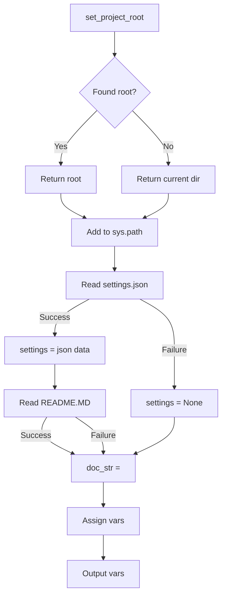

# <input code>

```python
## \file hypotez/src/endpoints/prestashop/api/header.py
# -*- coding: utf-8 -*-\
#! venv/Scripts/python.exe
#! venv/bin/python/python3.12

"""
.. module: src.endpoints.prestashop.api 
	:platform: Windows, Unix
	:synopsis:

"""
MODE = 'dev'

import sys
import json
from packaging.version import Version

from pathlib import Path
def set_project_root(marker_files=('pyproject.toml', 'requirements.txt', '.git')) -> Path:
    """ Finds the root directory of the project starting from the current file's directory,
    searching upwards and stopping at the first directory containing any of the marker files.

    Args:
        marker_files (tuple): Filenames or directory names to identify the project root.
    
    Returns:
        Path: Path to the root directory if found, otherwise the directory where the script is located.
    """
    __root__:Path
    current_path:Path = Path(__file__).resolve().parent
    __root__ = current_path
    for parent in [current_path] + list(current_path.parents):
        if any((parent / marker).exists() for marker in marker_files):
            __root__ = parent
            break
    if __root__ not in sys.path:
        sys.path.insert(0, str(__root__))
    return __root__


# Get the root directory of the project
__root__ = set_project_root()
"""__root__ (Path): Path to the root directory of the project"""

from src import gs

settings:dict = None
try:
    with open(gs.path.root / 'src' /  'settings.json', 'r') as settings_file:
        settings = json.load(settings_file)
except (FileNotFoundError, json.JSONDecodeError):
    ...

doc_str:str = None
try:
    with open(gs.path.root / 'src' /  'README.MD', 'r') as settings_file:
        doc_str = settings_file.read()
except (FileNotFoundError, json.JSONDecodeError):
    ...


__project_name__ = settings.get("project_name", 'hypotez') if settings  else 'hypotez'
__version__: str = settings.get("version", '')  if settings  else ''
__doc__: str = doc_str if doc_str else ''
__details__: str = ''
__author__: str = settings.get("author", '')  if settings  else ''
__copyright__: str = settings.get("copyrihgnt", '')  if settings  else ''
__cofee__: str = settings.get("cofee", "Treat the developer to a cup of coffee for boosting enthusiasm in development: https://boosty.to/hypo69")  if settings  else "Treat the developer to a cup of coffee for boosting enthusiasm in development: https://boosty.to/hypo69"
```

# <algorithm>

**Шаг 1:** `set_project_root(marker_files)` находит корневую директорию проекта.
*   Получает текущую директорию файла.
*   Итерируется по родительским директориям, проверяя наличие `marker_files` (например, `pyproject.toml`, `requirements.txt`, `.git`).
*   Возвращает найденную корневую директорию. Если корневая директория не найдена, возвращается текущая директория.
*   Добавляет корневую директорию в `sys.path`.


**Пример:** Если текущий файл находится в `hypotez/src/endpoints/prestashop/api/header.py`, а корневой директорией проекта является `hypotez`, функция вернет `Path("hypotez")`.

**Шаг 2:** Получение `__root__`.
*   Вызов функции `set_project_root()`.


**Шаг 3:** Чтение `settings.json`.
*   Используется `gs.path.root` для построения пути к `settings.json` внутри корневой директории проекта.
*   Если файл найден и корректный JSON, то данные из `settings.json` загружаются в переменную `settings`.
*   В случае ошибок (например, файл не найден или некорректный JSON), `settings` остаётся `None`.

**Шаг 4:** Чтение `README.MD`.
*   Аналогично шагу 3, но для файла `README.MD`.
*   Если файл найден, `doc_str` содержит его содержимое.

**Шаг 5:** Инициализация переменных.
*   Получение значений из `settings` для `__project_name__`, `__version__`, `__author__`, `__copyright__`, `__cofee__`.
*   Если `settings` пустые, используется значение по умолчанию (`hypotez`, пустая строка).
*   `__doc__` получает содержимое `README.MD` или пустую строку.


# <mermaid>



**Подключаемые зависимости:**
*   `sys`: Для работы с системными переменными, в том числе добавления в `sys.path`.
*   `json`: Для парсинга `settings.json`.
*   `packaging.version`: Для работы с версиями.
*   `pathlib`: Для работы с путями.
*   `src.gs`: Для получения корневой директории проекта (`gs.path.root`).


# <explanation>

**Импорты:**

*   `sys`: Предоставляет доступ к системным переменным, включая `sys.path`, который используется для импорта модулей из разных директорий.
*   `json`:  Для работы с JSON-файлами, в частности, для загрузки настроек из `settings.json`.
*   `packaging.version`: Для работы с версиями пакетов.  Это может быть использовано для проверки совместимости или сравнения версий.
*   `pathlib`: Для работы с путями к файлам, что значительно улучшает читаемость и поддерживает кросс-платформенность.
*   `src.gs`:  Этот импорт предполагает наличие модуля `gs` в директории `src`.  Этот модуль, вероятно, содержит функции или классы, связанные с файловой системой и ресурсами проекта. Без знания `gs`, сложно сказать, что он делает, но это модуль, предназначенный для работы с базовыми задачами.


**Классы:**

В коде нет определённых классов.

**Функции:**

*   `set_project_root(marker_files)`: Находит корневую директорию проекта.  Аргумент `marker_files` позволяет задавать разные маркеры для поиска корня (например, `pyproject.toml`, `requirements.txt`, `.git`).  Возвращает `Path` к корневой директории.
   *   **Пример:** `set_project_root(('pyproject.toml',))` вернет `Path("path/to/project")`, если `pyproject.toml` находится в этой директории.

**Переменные:**

*   `__root__`:  `Path` - содержит путь к корневой директории проекта.
*   `settings`: `dict` -  хранит данные из `settings.json`.  Инициализируется `None`, что позволяет обрабатывать случаи отсутствия файла или невалидного JSON.
*   `doc_str`: `str` - хранит содержимое файла `README.MD`.  Также инициализируется `None`.
*   `__project_name__`, `__version__`, `__doc__`, `__details__`, `__author__`, `__copyright__`, `__cofee__`:  `str` - переменные, содержащие информацию о проекте, полученные из `settings.json` или с указанными значениями по умолчанию.

**Возможные ошибки и улучшения:**

*   **Обработка ошибок:** Использование `try...except` для обработки `FileNotFoundError` и `json.JSONDecodeError` при чтении `settings.json` и `README.MD` — хороший пример обработки исключений.  Можно расширить обработку для других возможных исключений (например, если файл поврежден или имеет неверный формат).
*   **Типизация:**  Код использует аннотации типов для аргументов и возвращаемых значений функции `set_project_root`.  Это полезно для лучшей читаемости и поддержки. Это должно быть применено к остальным переменным.
*   **Пояснения в коде:**  Некоторые переменные имеют слабую документацию. Можно добавить более подробные комментарии к логике и использованию переменных.
*   **Модуль `gs`:**  Необходимо более подробно понять, что делает модуль `gs` и его функция `gs.path.root`.  Это может помочь в понимании проекта в целом.


**Цепочка взаимосвязей:**

Код из `header.py` получает информацию о проекте (название, версия, автор, описание).  Эта информация, скорее всего, используется в других частях проекта, например, в API-эндпоинтах, документации и других модулях.  Информация о проекте необходима для корректной работы других модулей.