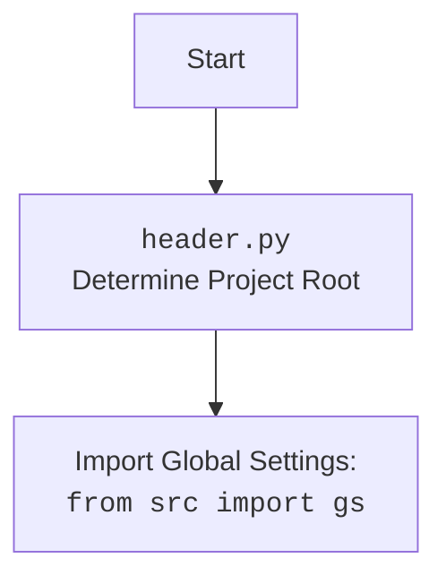

## <алгоритм>

1.  **`set_project_root(marker_files)` Function**
    *   **Начало:** Функция `set_project_root` вызывается с кортежем `marker_files` (по умолчанию `('__root__', '.git')`).
    *   **Инициализация:**
        *   Переменная `current_path` инициализируется как абсолютный путь к директории, содержащей файл `header.py`.
        *   Переменная `__root__` инициализируется значением `current_path`.
    *   **Поиск родительской директории:**
        *   Цикл перебирает все родительские директории, начиная с текущей.
        *   Для каждой родительской директории `parent` проверяется, существует ли в ней хотя бы один из файлов или директорий, указанных в `marker_files`.
            *   **Пример:** Проверяется, существует ли `parent / '__root__'` или `parent / '.git'`.
        *   Если хотя бы один маркер найден, то `__root__` присваивается значение `parent` и цикл прерывается.
    *   **Добавление в `sys.path`:**
        *   Если директория `__root__` отсутствует в `sys.path`, то она добавляется в начало.
    *   **Возврат:** Функция возвращает значение переменной `__root__` (путь к корневой директории проекта).
        *   **Пример:** Если маркер найден в `hypotez/`, `__root__` будет `hypotez/`.

2.  **Инициализация `__root__`:**
    *   Вызывается `set_project_root()`, результат присваивается `__root__`.

3.  **Импорт `src.gs`:**
    *   Выполняется импорт `from src import gs`, который предполагает, что `src.gs` определен в проекте.

4.  **Чтение `settings.json`:**
    *   Переменная `settings` инициализируется как `None`.
    *   Блок `try...except` пытается открыть и прочитать файл `settings.json`, расположенный в `src/` корневой директории.
        *   Если файл успешно прочитан, его содержимое парсится в формате JSON и присваивается переменной `settings`.
        *   Если возникает `FileNotFoundError` или `json.JSONDecodeError`, блок `except` выполняется, но ничего не делает (пропускает ошибку).

5.  **Чтение `README.MD`:**
    *   Переменная `doc_str` инициализируется как `None`.
    *   Блок `try...except` пытается открыть и прочитать файл `README.MD`, расположенный в `src/` корневой директории.
        *   Если файл успешно прочитан, его содержимое присваивается переменной `doc_str`.
        *   Если возникает `FileNotFoundError` или `json.JSONDecodeError`, блок `except` выполняется, но ничего не делает (пропускает ошибку).

6.  **Инициализация глобальных переменных:**
    *   Если `settings` был успешно загружен, глобальные переменные `__project_name__`, `__version__`, `__author__`, `__copyright__`, `__cofee__` извлекаются из словаря `settings` с дефолтными значениями в случае отсутствия ключа. Если `settings` не загружен, то используются дефолтные значения для этих переменных.
    *  Если `doc_str` был успешно загружен, то `__doc__` получает его значение, иначе остается пустой строкой.
    *   Переменная `__details__` инициализируется пустой строкой.

## <mermaid>

```mermaid
flowchart TD
    Start[Start: header.py] --> FindRoot[<code>set_project_root()</code><br>Determine Project Root using marker files: '__root__', '.git' ]
    FindRoot --> SetRootPath[Set project root path: <br><code>__root__</code>]
    SetRootPath --> ImportGS[Import Global Settings: <br><code>from src import gs</code>]
    ImportGS --> ReadSettings[Read settings file <br> <code>settings.json</code> if exists]
    ReadSettings --> ReadReadme[Read readme file <br> <code>README.MD</code> if exists]
    ReadReadme --> InitializeGlobalVars[Initialize project variables:<br> <code>__project_name__</code>, <code>__version__</code>, <code>__doc__</code>, <code>__author__</code>,<br> <code>__copyright__</code>, <code>__cofee__</code>]
    InitializeGlobalVars --> End[End]
    

    style Start fill:#f9f,stroke:#333,stroke-width:2px
    style End fill:#ccf,stroke:#333,stroke-width:2px
```



**Объяснение `mermaid`:**

*   **`flowchart TD`**:  Объявляет диаграмму типа "flowchart" (блок-схема) с направлением сверху вниз (TD).
*   **`Start`**: Обозначает начало процесса, а именно запуск скрипта `header.py` .
*   **`FindRoot`**: Блок, представляющий функцию `set_project_root()`, которая определяет корень проекта.
*   **`SetRootPath`**: Представляет присвоение найденного корня проекта глобальной переменной `__root__`.
*   **`ImportGS`**: Блок, который показывает импорт глобальных настроек `from src import gs`.
*  **`ReadSettings`**: Блок, представляющий чтение файла `settings.json`, если он существует.
*  **`ReadReadme`**: Блок, представляющий чтение файла `README.MD`, если он существует.
*   **`InitializeGlobalVars`**:  Представляет процесс инициализации глобальных переменных на основе данных из файла настроек и README.
*   **`End`**: Обозначает завершение процесса.
*   **`style`**: Оформление отдельных блоков (например, `Start` и `End`)

**Импорт зависимостей**

*   `sys`: Стандартный модуль Python, используемый для работы с системными переменными и функциями, такими как `sys.path`.
*   `json`: Стандартный модуль Python для работы с данными в формате JSON, используется для чтения `settings.json`.
*   `pathlib.Path`:  Модуль для работы с путями к файлам и директориям в объектно-ориентированном стиле.
*   `packaging.version.Version`:  Модуль для работы с версиями пакетов, не используется в текущем коде.
*   `from src import gs`: импорт модуля `gs` из пакета `src`. Этот модуль, вероятно, содержит глобальные настройки и константы проекта, включая корневой путь проекта.

## <объяснение>

**Импорты:**

*   `sys`: Используется для добавления корневой директории проекта в `sys.path`, чтобы Python мог импортировать модули из этого проекта.
*   `json`: Используется для чтения данных конфигурации из файла `settings.json`.
*   `pathlib.Path`: Используется для работы с путями к файлам и каталогам. Это делает код более читабельным и кроссплатформенным.
*    `packaging.version.Version`: Не используется в данном коде, поэтому можно предположить что данный импорт избыточен.
*   `from src import gs`: Этот импорт предполагает наличие модуля `gs` в пакете `src`, который содержит глобальные настройки, например, объект `gs.path`, вероятно, содержащий путь к корневой директории.

**Функции:**

*   `set_project_root(marker_files)`:
    *   **Аргументы:**
        *   `marker_files` (tuple): Кортеж файлов или каталогов, по наличию которых определяется корень проекта.
    *   **Возвращает:**
        *   `Path`: Объект `pathlib.Path`, представляющий путь к корневой директории проекта или директории файла, если маркер не найден.
    *   **Назначение:**
        *   Определяет корневую директорию проекта, ищет её на основе маркеров, таких как `__root__` или `.git`.
        *   Добавляет корневую директорию в `sys.path`, чтобы можно было импортировать модули из этой директории.
        *  **Примеры**:
           *   `set_project_root(('marker.txt', '.config'))`: будет искать файлы или каталоги `marker.txt` и `.config`
           *   `set_project_root()`: будет искать каталоги `__root__` или `.git`, так как это значение по умолчанию.

**Переменные:**

*   `__root__` (Path): Путь к корневой директории проекта, определяемый функцией `set_project_root`.
*   `settings` (dict): Словарь с настройками, загруженными из `settings.json`.
*   `doc_str` (str): Строка, содержащая содержимое файла `README.MD`.
*   `__project_name__` (str): Имя проекта, загруженное из `settings.json` или значение по умолчанию 'hypotez'.
*   `__version__` (str): Версия проекта, загруженная из `settings.json` или пустая строка.
*   `__doc__` (str): Описание проекта, загруженное из `README.MD` или пустая строка.
*   `__details__` (str): Детали проекта, инициализируется пустой строкой.
*   `__author__` (str): Автор проекта, загруженный из `settings.json` или пустая строка.
*   `__copyright__` (str): Авторское право проекта, загруженное из `settings.json` или пустая строка.
*   `__cofee__` (str): Строка с призывом угостить разработчика кофе, загруженная из `settings.json` или строка по умолчанию.

**Цепочка взаимосвязей:**

1.  `header.py` определяет корневую директорию проекта и добавляет её в `sys.path`.
2.  `header.py` импортирует `src.gs`, который предоставляет доступ к глобальным настройкам и путям проекта.
3.  `header.py` пытается прочитать `settings.json` и `README.MD` для инициализации глобальных переменных проекта.
4.  Глобальные переменные, определенные в `header.py`, могут использоваться другими модулями проекта.

**Потенциальные ошибки и области для улучшения:**

*   **Обработка ошибок:** В блоках `try...except` для чтения файлов `settings.json` и `README.MD` ошибки просто игнорируются. Возможно, стоит добавить логирование ошибок или выдавать предупреждения.
*   **Избыточный импорт**: Импорт `packaging.version` не используется в коде.
*   **Упрощение логики:** Код можно упростить, разбив чтение файлов настроек и README на отдельные функции.
*   **Отсутствие обработки случая когда `gs` не импортировался**: В случае если модуль `gs` не доступен, код вероятно вызовет ошибку в блоках, где он используется.
*   **Именование переменных**: Переменные вида `__name__` как правило обозначают системные константы и не рекомендуется их использование для пользовательских констант, которые несут смысловую нагрузку.

**Дополнительно:**

*   Этот код является частью системы для управления настройками и метаданными проекта, обеспечивая централизованный доступ к информации о проекте.
*   Используется  для организации и структуризации проекта, позволяя другим модулям получать информацию о проекте из одного места.