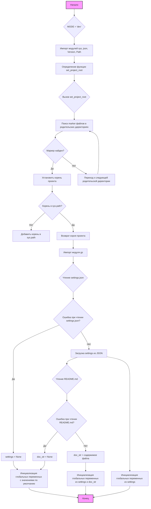

## <алгоритм>

1. **Начало:**
   - Объявление глобальной переменной `MODE` со значением `'dev'`.
   - Импорт необходимых модулей: `sys`, `json`, `packaging.version.Version`, `pathlib.Path`.
   - Определение функции `set_project_root` для определения корневой директории проекта.
   
   Пример:
   ```python
   MODE = 'dev'
   import sys
   import json
   from pathlib import Path
   ```

2. **`set_project_root`:**
   - Функция принимает кортеж `marker_files` с именами файлов/папок для поиска корня.
   - Определяет текущую директорию файла.
   - Перебирает все родительские директории, начиная с текущей.
   - Проверяет, существует ли хотя бы один маркерный файл в текущей родительской директории.
   - Если маркер найден, устанавливает текущую родительскую директорию как корень проекта и выходит из цикла.
   - Если корень не в `sys.path`, добавляет его.
   - Возвращает корень проекта как `Path` объект.

   Пример:
   ```python
   # Ищем в текущей директории или родительских директориях файлы 'pyproject.toml', 'requirements.txt' или '.git'
   root_dir = set_project_root(marker_files=('pyproject.toml', 'requirements.txt', '.git'))
   # root_dir будет представлять Path объект корневой директории, где найдет один из маркерных файлов
   ```

3. **Определение `__root__`:**
   - Вызывает функцию `set_project_root()` для определения корневой директории проекта.
   - Сохраняет результат в глобальную переменную `__root__`.

   Пример:
   ```python
   __root__ = set_project_root()
   ```

4. **Импорт `gs`:**
   - Импортирует модуль `gs` из пакета `src`. Предположительно, этот модуль содержит глобальные настройки проекта.

   Пример:
   ```python
   from src import gs
   ```

5. **Загрузка `settings` из `settings.json`:**
   - Пытается открыть и прочитать файл `settings.json` из директории `src` относительно корня проекта.
   - Загружает содержимое файла JSON в словарь `settings`.
   - В случае ошибки `FileNotFoundError` или `json.JSONDecodeError`, переменная `settings` остаётся `None`.

   Пример:
   ```python
   try:
        with open(gs.path.root / 'src' /  'settings.json', 'r') as settings_file:
            settings = json.load(settings_file)
    except (FileNotFoundError, json.JSONDecodeError):
        settings = None
   # Если файл settings.json существует и JSON валиден, то settings будет словарем
   # Иначе settings будет None
   ```
   
6. **Загрузка `doc_str` из `README.MD`:**
   - Пытается открыть и прочитать файл `README.MD` из директории `src` относительно корня проекта.
   - Сохраняет содержимое файла в строку `doc_str`.
   - В случае ошибки `FileNotFoundError` или `json.JSONDecodeError`, переменная `doc_str` остается `None`.
   Пример:
   ```python
   try:
    with open(gs.path.root / 'src' /  'README.MD', 'r') as settings_file:
        doc_str = settings_file.read()
    except (FileNotFoundError, json.JSONDecodeError):
        doc_str = None
   # Если файл README.MD существует и успешно прочитан, то doc_str будет строкой
   # Иначе doc_str будет None
   ```
7. **Инициализация глобальных переменных:**
   - Инициализируются глобальные переменные `__project_name__`, `__version__`, `__doc__`, `__details__`, `__author__`, `__copyright__`, и `__cofee__` с использованием данных из словаря `settings`, если он существует, или со значениями по умолчанию.

   Пример:
   ```python
    __project_name__ = settings.get("project_name", 'hypotez') if settings  else 'hypotez'
    __version__: str = settings.get("version", '')  if settings  else ''
    __doc__: str = doc_str if doc_str else ''
    __details__: str = ''
    __author__: str = settings.get("author", '')  if settings  else ''
    __copyright__: str = settings.get("copyrihgnt", '')  if settings  else ''
    __cofee__: str = settings.get("cofee", "Treat the developer to a cup of coffee for boosting enthusiasm in development: https://boosty.to/hypo69")  if settings  else "Treat the developer to a cup of coffee for boosting enthusiasm in development: https://boosty.to/hypo69"
   # Если settings не None, то из него извлекаются данные для полей __project_name__, __version__ и т.д.
   # В противном случае будут установлены значения по умолчанию
   ```

## <mermaid>



**Анализ зависимостей `mermaid`:**

- **`A` (Начало):** Начальная точка выполнения скрипта.
- **`B` (MODE = 'dev'):** Установка переменной `MODE`, не имеет зависимостей.
- **`C` (Импорт модулей):** Импортируются стандартные модули `sys`, `json` и модули из `packaging` и `pathlib`, которые необходимы для работы кода.
- **`D` (Определение `set_project_root`):** Функция, которая не имеет зависимостей при создании, но зависит от `Path` из `pathlib` при выполнении.
- **`E` (Вызов `set_project_root`):** Вызов функции, которая возвращает корневую директорию проекта.
- **`F` (Поиск маркерных файлов):** Цикл поиска маркерных файлов в родительских директориях, зависит от `Path` объекта текущей директории.
- **`G` (Маркер найден?):** Условие проверки наличия маркерного файла.
- **`H` (Установка корня):** Установка корневой директории.
- **`I` (Корень в `sys.path`?):** Проверка, добавлен ли корень в `sys.path`, зависит от модуля `sys`.
- **`J` (Добавить корень в `sys.path`):** Добавление корня в `sys.path` для возможности импорта модулей из проекта, зависит от модуля `sys`.
- **`K` (Возврат корня проекта):** Возврат `Path` объекта с корневой директорией.
- **`L` (Переход к следующей директории):** Переход к следующей родительской директории в цикле.
- **`M` (Импорт модуля `gs`):** Импорт модуля `gs` из пакета `src`, который необходим для доступа к путям.
- **`N` (Чтение `settings.json`):** Попытка открытия и чтения файла `settings.json`, зависит от модуля `json` для десериализации.
- **`O` (Ошибка при чтении `settings.json`?):** Проверка на ошибки при открытии или десериализации `settings.json`.
- **`P` (`settings` = None):** Установка `settings` в None при ошибке.
- **`Q` (Загрузка `settings` из JSON):** Загрузка данных из файла `settings.json` в словарь `settings`.
- **`R` (Чтение `README.md`):** Попытка открытия и чтения файла `README.MD`.
- **`S` (Ошибка при чтении `README.md`?):** Проверка на ошибки при открытии или чтении `README.md`.
- **`T` (`doc_str` = None):** Установка `doc_str` в `None` при ошибке.
- **`U` (`doc_str` = содержимое файла):** Загрузка содержимого файла `README.md` в строку `doc_str`.
- **`V` (Инициализация глобальных переменных с значениями по умолчанию):** Инициализация глобальных переменных, если `settings` не был загружен.
- **`W` (Инициализация глобальных переменных из `settings`):** Инициализация глобальных переменных на основе данных из `settings`.
- **`X` (Инициализация глобальных переменных из `settings` и `doc_str`):** Инициализация глобальных переменных на основе данных из `settings` и `doc_str`.
- **`Y` (Конец):** Конечная точка выполнения скрипта.

## <объяснение>

### Импорты:

-   **`sys`**: Предоставляет доступ к некоторым переменным и функциям, взаимодействующим с интерпретатором Python. Используется для добавления пути к корневой директории проекта в `sys.path`.
-   **`json`**: Используется для работы с JSON-файлами, в частности, для чтения файла `settings.json`.
-   **`packaging.version.Version`**: Модуль для работы с версиями пакетов, но в данном коде он импортируется, но не используется. Возможно, это остаток от предыдущей итерации кода или запланированное использование.
-   **`pathlib.Path`**: Обеспечивает объектно-ориентированный способ работы с путями к файлам и директориям. Используется для определения корневой директории и работы с файлами.
-   **`src.gs`**: Модуль, импортированный как `gs`, из пакета `src`. Вероятно, содержит глобальные настройки проекта и, в частности, объект `path.root`, который содержит путь к корневой директории.

**Взаимосвязь с другими пакетами `src`:**

-   Код напрямую зависит от модуля `gs` из пакета `src`, который, вероятно, используется для определения пути к корневой директории проекта и файлам настроек.

### Функции:

-   **`set_project_root(marker_files: tuple) -> Path`**:
    -   **Аргументы**: `marker_files` — кортеж строк, представляющих имена файлов или папок, которые используются для определения корневой директории проекта.
    -   **Возвращаемое значение**: Объект `pathlib.Path`, представляющий путь к корневой директории проекта.
    -   **Назначение**: Функция находит корневую директорию проекта путем поиска маркерных файлов в текущей и родительских директориях. Она автоматически добавляет корень проекта в `sys.path`, чтобы сделать доступными модули проекта.

    **Пример:**

    ```python
    root_path = set_project_root(marker_files=('pyproject.toml', 'requirements.txt', '.git'))
    print(root_path)  # Выведет Path объект, представляющий корень проекта
    ```

### Переменные:

-   **`MODE`**: Строковая переменная, устанавливающая режим работы приложения (в данном случае, `'dev'`).
-   **`__root__`**: Объект `pathlib.Path`, хранит путь к корневой директории проекта.
-   **`settings`**: Словарь, в который загружаются настройки из файла `settings.json`. Может быть `None`, если файл не найден или имеет неправильный формат.
-   **`doc_str`**: Строка, в которую загружается содержимое файла `README.MD`. Может быть `None`, если файл не найден или не может быть прочитан.
-   **`__project_name__`**: Строка, хранит имя проекта, загруженное из настроек или значение по умолчанию `hypotez`.
-   **`__version__`**: Строка, хранит версию проекта, загруженную из настроек или пустую строку.
-   **`__doc__`**: Строка, содержащая содержимое `README.MD` или пустую строку.
-   **`__details__`**: Строка, хранящая детали проекта (пустая).
-   **`__author__`**: Строка, хранит имя автора проекта, загруженное из настроек или пустую строку.
-   **`__copyright__`**: Строка, хранит информацию об авторских правах проекта, загруженную из настроек или пустую строку.
-   **`__cofee__`**: Строка, содержит сообщение для поддержки разработчика, загруженное из настроек или значение по умолчанию.

### Потенциальные ошибки и области для улучшения:

-   **Обработка ошибок**: Код использует `try...except` блоки для обработки `FileNotFoundError` и `json.JSONDecodeError`, но не обрабатывает другие возможные исключения. Можно добавить более детальную обработку исключений.
-   **Импорт `Version`**: Модуль `packaging.version.Version` импортируется, но не используется. Его можно удалить, если он не планируется к использованию.
-   **Настройки по умолчанию**: При отсутствии файла `settings.json`, многие переменные получают значения по умолчанию. Было бы полезно предусмотреть вариант загрузки параметров из переменных окружения.
-  **`__details__`**: Переменная инициализируется пустой строкой и никогда не изменяется, можно рассмотреть возможность ее удаления, если она не используется.

### Взаимосвязи с другими частями проекта:

-   Этот файл является частью API модуля `hypotez` и, предположительно, используется как общая точка доступа к базовой информации о проекте.
-   Зависит от модуля `src.gs` для определения путей к файлам и директориям.
-   Зависит от файлов `settings.json` и `README.MD` в директории `src` для получения метаданных о проекте.
-   Устанавливает глобальные переменные, которые могут использоваться в других частях проекта, что позволяет централизовать метаданные проекта.

Этот анализ охватывает все аспекты предоставленного кода, включая алгоритм, диаграмму зависимостей, подробное объяснение и потенциальные улучшения.