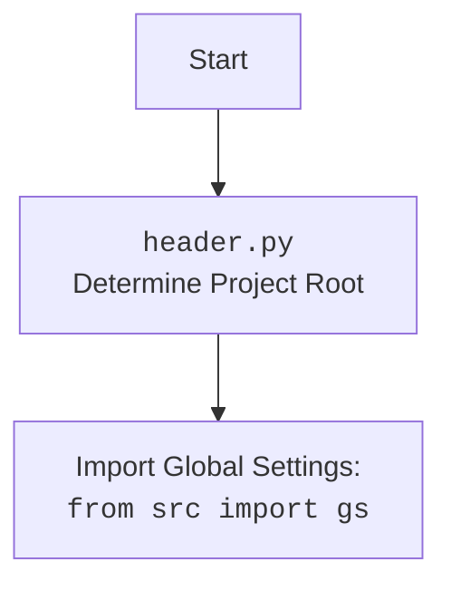

## Анализ кода `header.py`

### 1. <алгоритм>

**1. Определение корневой директории проекта (`set_project_root`):**

   - Функция `set_project_root` принимает на вход кортеж `marker_files` с именами файлов или директорий, которые будут служить маркерами корневой директории проекта. По умолчанию это `('__root__',)`.
   - Определяется путь к текущему файлу (`__file__`) и его родительская директория.
   - Перебираются все родительские директории, начиная от директории, где находится файл, двигаясь вверх.
   - Для каждой директории проверяется наличие любого из маркеров (`marker_files`).
   - Если маркер найден, то текущая директория считается корневой и цикл прерывается.
   - Если корневая директория не найдена, используется директория, где находится файл.
   - Корневая директория добавляется в `sys.path`, если ее там нет, чтобы обеспечить правильный импорт модулей проекта.
   - Функция возвращает путь к корневой директории `Path`.

   **Пример:**
    
    -   Предположим, что структура проекта выглядит так:
        ```
        project/
            src/
                endpoints/
                    prestashop/
                        api/
                            header.py
                __root__
            settings.json
        ```
    -   При вызове `set_project_root()` из `header.py`, поиск начнется с `project/src/endpoints/prestashop/api/`.
    -   Далее будет проверена директория `project/src/endpoints/prestashop/`.
    -   Затем `project/src/endpoints/`, `project/src/`, `project/`.
    -   На `project/src/` будет найден маркер `__root__`, и функция вернет путь `Path('project/src/')`.

**2. Загрузка настроек из файла `settings.json`:**
    
    -   После определения корневой директории, делается попытка открыть файл `settings.json` внутри `src`.
    -   Если файл открывается успешно, то его содержимое парсится как JSON и сохраняется в переменную `settings`.
    -   Если возникает ошибка `FileNotFoundError` или `json.JSONDecodeError`, то `settings` остается `None`.

    **Пример:**
    
    -   Предположим `settings.json` содержит:
        ```json
        {
            "project_name": "hypotez",
            "version": "1.0.0",
            "author": "John Doe",
            "copyrihgnt": "2024 John Doe",
            "cofee": "https://boosty.to/johndoe"
        }
        ```
    - Тогда после успешной загрузки `settings` будет словарем, представляющим данные из файла.

**3. Загрузка документации из файла `README.MD`:**
    
    -   После определения корневой директории, делается попытка открыть файл `README.MD` внутри `src`.
    -   Если файл открывается успешно, то его содержимое считывается и сохраняется в переменную `doc_str`.
    -   Если возникает ошибка `FileNotFoundError` или `json.JSONDecodeError`, то `doc_str` остается `None`.

   **Пример:**
    
   -  Предположим, `README.MD` содержит:
      ```markdown
        # Hypotez Project
        
        This is a sample project.
      ```
    - Тогда после успешной загрузки `doc_str` будет строкой, представляющей данные из файла.

**4. Инициализация глобальных переменных:**

   -   Используя данные из `settings`, а также `doc_str`, глобальные переменные инициализируются. 
   -  `__project_name__` получает значение из поля `project_name`, если оно есть в настройках, иначе `hypotez`.
   -  `__version__` получает значение из поля `version`, если оно есть в настройках, иначе пустую строку.
   -   `__doc__` получает значение из `doc_str`, если он есть, иначе пустую строку.
   -   `__details__` инициализируется пустой строкой.
   -   `__author__` получает значение из поля `author`, если оно есть в настройках, иначе пустую строку.
   -   `__copyright__` получает значение из поля `copyrihgnt`, если оно есть в настройках, иначе пустую строку.
   -   `__cofee__` получает значение из поля `cofee`, если оно есть в настройках, иначе ссылку по умолчанию.

### 2. <mermaid>

```mermaid
flowchart TD
    Start --> SetProjectRoot[<code>set_project_root()</code><br>Determine Project Root]
    SetProjectRoot -- Returns Project Root Path --> ProjectRoot[Project Root Path]
    ProjectRoot --> AddToSysPath{Add Project Root to <code>sys.path</code>?}
    AddToSysPath -- Yes --> ImportGS[Import Global Settings: <br><code>from src import gs</code>]
     AddToSysPath -- No --> ImportGS
    ImportGS --> LoadSettings[Try to Load Settings: <br><code>settings.json</code>]
    LoadSettings -- Success --> LoadDocStr[Try to Load Doc String: <br><code>README.MD</code>]
    LoadSettings -- Failure --> LoadDocStr
    LoadDocStr -- Success --> InitGlobalVars[Initialize Global Variables]
     LoadDocStr -- Failure --> InitGlobalVars
    InitGlobalVars --> End
    

    style SetProjectRoot fill:#f9f,stroke:#333,stroke-width:2px
    style ImportGS fill:#ccf,stroke:#333,stroke-width:2px
     style LoadSettings fill:#cfc,stroke:#333,stroke-width:2px
     style LoadDocStr fill:#ffc,stroke:#333,stroke-width:2px
     style InitGlobalVars fill:#cff,stroke:#333,stroke-width:2px
     
```

**Импортированные зависимости для диаграммы `mermaid`:**
-  `flowchart TD`: Определяет тип диаграммы как блок-схема (flowchart) и направление (Top to Down).
-  `-->`: Определяет стрелки, показывающие поток выполнения кода.
-  `{}`: Используется для отображения условий.
-  `[]`: Используется для отображения обычных операций.
-  `()`: Используется для отображения вызовов функций.
-  `style ... fill:...`: Задает стили заливки для блоков.

**Дополнительный блок mermaid для header.py:**



### 3. <объяснение>

**Импорты:**

-   `sys`: Используется для работы с системными переменными и функциями, в частности `sys.path` для добавления пути к корневой директории проекта.
-   `json`: Используется для работы с данными в формате JSON, включая загрузку настроек из файла `settings.json`.
-   `packaging.version.Version`: Используется для работы с версиями пакетов.
-  `pathlib.Path`: Используется для работы с путями к файлам и директориям.
-  `src`: Импортируется корневой пакет проекта, который содержит `gs` (глобальные настройки).

**Функции:**

-   `set_project_root(marker_files: tuple = ('__root__',)) -> Path`:
    -   **Аргументы:**
        -   `marker_files` (tuple, необязательный): Кортеж с именами файлов или директорий, которые используются для определения корневой директории. По умолчанию `('__root__',)`.
    -   **Возвращаемое значение:**
        -   `Path`: Объект `Path` к корневой директории проекта.
    -   **Назначение:**
        -   Определяет корневую директорию проекта путем поиска маркеров в родительских директориях.
        -   Добавляет корневую директорию в `sys.path` для правильной работы импортов.
    -   **Пример:**
        -  `project_root = set_project_root(('__root__', 'setup.py'))` вернет путь к директории, содержащей `__root__` или `setup.py`.

**Переменные:**

-   `__root__` (Path): Путь к корневой директории проекта. Определяется функцией `set_project_root`.
-   `settings` (dict): Словарь с настройками проекта, загруженный из файла `settings.json`. Может быть `None`, если файл не найден или произошла ошибка декодирования.
-    `doc_str` (str): Строка с документацией проекта, загруженная из файла `README.MD`. Может быть `None`, если файл не найден или произошла ошибка.
-   `__project_name__` (str): Имя проекта, берется из `settings` или равно `hypotez` по умолчанию.
-   `__version__` (str): Версия проекта, берется из `settings` или пустая строка по умолчанию.
-   `__doc__` (str): Документация проекта, берется из `doc_str` или пустая строка по умолчанию.
-   `__details__` (str): Пустая строка, предназначенная для дополнительных деталей проекта.
-   `__author__` (str): Автор проекта, берется из `settings` или пустая строка по умолчанию.
-   `__copyright__` (str): Информация об авторском праве, берется из `settings` или пустая строка по умолчанию.
-    `__cofee__` (str): Сообщение о кофе для разработчика, берется из `settings` или строка по умолчанию.

**Цепочка взаимосвязей с другими частями проекта:**

-   **`src`:** Модуль `header.py` импортирует `src` для доступа к глобальным настройкам проекта (`gs`). Это обеспечивает доступ к путям файлов.
-  **`settings.json`:** Файл используется для хранения общих настроек проекта.
-  **`README.MD`:** Файл используется для хранения документации проекта.

**Потенциальные ошибки и области для улучшения:**

-   **Обработка ошибок:**
    -   Обработка ошибок `FileNotFoundError` и `json.JSONDecodeError` для `settings.json` и `README.MD` довольно проста (просто присваивается `None`). Возможно, стоит добавить более информативное логирование ошибок или fallback значения по умолчанию.
-   **Использование `...` в `except`:**
    -   Использование `...` в `except` не является информативным. Лучше явно прописать `pass` или добавить логирование.
-   **Типизация:**
     -  В коде есть типизация, но ее можно расширить.

**Улучшения:**
1.  **Логирование:** Добавить логирование для отслеживания ошибок и процесса работы.
2.  **Явные `pass` или логирование:** Вместо `...` в блоках `except`, добавить явный `pass` или логирование для лучшей читаемости и отладки.
3. **Более подробная типизация:** Уточнить типы переменных.
4. **Конфигурирование параметров:** Предоставить возможность конфигурации маркеров корневой директории через переменные окружения или аргументы командной строки.