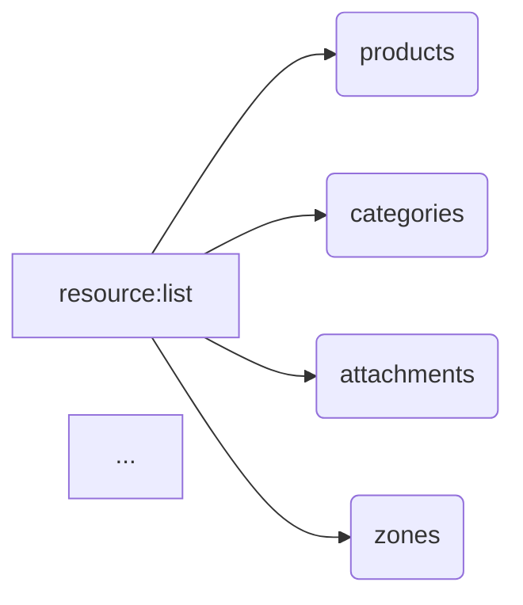

# <input code>

```python
## \file hypotez/src/endpoints/prestashop/api_schemas/api_resourses_list.py
# -*- coding: utf-8 -*-
#! venv/Scripts/python.exe
#! venv/bin/python/python3.12

"""
.. module: src.endpoints.prestashop.api_schemas 
	:platform: Windows, Unix
	:synopsis: Список всех доступных ресурсов для API вызовов

"""
MODE = 'dev'

resource:list = [
    'products', 
    'categories', 
    'attachments', 
    'addresses',  
    'carriers', 
    'cart_rules', 
    'carts',
    'countries',
    'content_management_system',
    'currencies', 
    'customer_messages', 
    'customer_threads',
    'customers',
    'customizations',
    'deliveries',
    'employees', 
    'groups', 
    'guests',
    'image_types',
    'customizations',
    'images',
    'languages', 
    'manufacturers', 
    'messages',
    'order_carriers',
    'order_cart_rules',
    'order_details',
    'order_histories', 
    'order_invoices', 
    'order_payments',
    'order_slip',
    'order_states',
    'orders',
    'price_ranges',
    'product_customization_fields',
    'product_feature_values',
    'product_features', 
    'product_option_values', 
    'product_options',
    'product_suppliers',
    'products',
    'search',
    'shop_groups',
    'shop_urls',
    'shops', 
    'specific_price_rules', 
    'specific_prices',
    'states',
    'stock_availables',
    'stock_movement_reasons',
    'stock_movements',
    'stocks',
    'stores',
    'suppliers', 
    'supply_order_details', 
    'supply_order_receipt_histories',
    'supply_order_states',
    'supply_orders',
    'tags',
    'tax_rule_groups',
    'tax_rules',
    'taxes',
    'translated_configurations',
    'warehouse_product_locations', 
    'warehouses', 
    'weight_ranges',
    'zones',
    ]
```

# <algorithm>

Этот код определяет список ресурсов, доступных для API.  Алгоритм прост:

1. **Определение списка:**  Создается список `resource` (типа `list`).
2. **Заполнение списка:** В список последовательно добавляются строки, представляющие названия ресурсов ('products', 'categories', и т.д.).


**Пример:**

```
resource = []
resource.append('products')
resource.append('categories')
# ... и так далее
```

Этот алгоритм не имеет сложных ветвлений или циклов, он просто выполняет последовательное добавление элементов в список.  Данные передаются исключительно между строками кода, не используя функции или методы.

# <mermaid>



**Объяснение диаграммы:**

Диаграмма представляет список `resource:list` как узел `A`.  От узла `A` идут стрелки к каждому элементу списка (узлы `B` до `Z`), представляющие добавление элементов в список.  Диаграмма отражает линейную структуру добавления данных в список. Нет вызовов функций, циклов, или сложных логических конструкций.  Зависимости здесь только внутри данного модуля.

# <explanation>

* **Импорты:** Нет импортов в этом файле.  Всё что используется, - встроенные типы Python (`list`). Файл `api_resourses_list.py` часть пакета `src.endpoints.prestashop.api_schemas`, что предполагает использование его в контексте сервиса Prestashop внутри приложения.
* **Классы:** Нет классов.
* **Функции:** Нет функций.
* **Переменные:**
    * `MODE`: Строковая переменная, скорее всего, используется для настройки режима работы (например, 'dev', 'prod').
    * `resource`: Список строк, содержащий названия доступных ресурсов API.  Это ключевой атрибут, который, скорее всего, используется для последующей обработки.  Тип `list` указывает на возможность перебора, поиска и манипуляции ресурсами.
* **Возможные ошибки или улучшения:**

    * **Недостаток типизации:**  Не указан тип элементов списка `resource`. Лучше было бы использовать `List[str]` для ясности.  Также было бы удобно использовать `enum` для хранения списка ресурсов, если это список не изменяется во время выполнения.
    * **Жестко заданные ресурсы:** Список `resource` содержит все возможные ресурсы API, что может быть проблемой, если список меняется часто или не поддерживается динамически. Добавление функции `load_resources()` которая загружает данные из файла или базы данных, будет лучше.
    * **Отсутствие документирования:** Хотя есть документация,  добавление более подробных комментариев для каждого ресурса будет полезно, особенно для понимания структуры данных для API.

**Цепочка взаимосвязей:**

Файл `api_resourses_list.py` является частью пакета для работы с API Prestashop.  Скорее всего, он используется в других частях проекта для получения информации о доступных ресурсах, построения запросов и обработки ответов API.  Например,  функции в других модулях будут использовать `resource` для динамической генерации запросов или отображения в пользовательском интерфейсе.