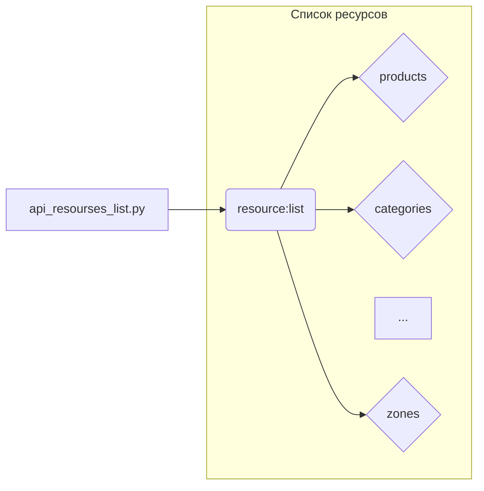

# <input code>

```python
## \file hypotez/src/endpoints/prestashop/api_schemas/api_resourses_list.py
# -*- coding: utf-8 -*-\
#! venv/Scripts/python.exe
#! venv/bin/python/python3.12

"""
.. module: src.endpoints.prestashop.api_schemas 
	:platform: Windows, Unix
	:synopsis: Список всех доступных ресурсов для API вызовов

"""
MODE = 'dev'

resource:list = [
    'products', 
    'categories', 
    'attachments', 
    'addresses',  
    'carriers', 
    'cart_rules', 
    'carts',
    'countries',
    'content_management_system',
    'currencies', 
    'customer_messages', 
    'customer_threads',
    'customers',
    'customizations',
    'deliveries',
    'employees', 
    'groups', 
    'guests',
    'image_types',
    'customizations',
    'images',
    'languages', 
    'manufacturers', 
    'messages',
    'order_carriers',
    'order_cart_rules',
    'order_details',
    'order_histories', 
    'order_invoices', 
    'order_payments',
    'order_slip',
    'order_states',
    'orders',
    'price_ranges',
    'product_customization_fields',
    'product_feature_values',
    'product_features', 
    'product_option_values', 
    'product_options',
    'product_suppliers',
    'products',
    'search',
    'shop_groups',
    'shop_urls',
    'shops', 
    'specific_price_rules', 
    'specific_prices',
    'states',
    'stock_availables',
    'stock_movement_reasons',
    'stock_movements',
    'stocks',
    'stores',
    'suppliers', 
    'supply_order_details', 
    'supply_order_receipt_histories',
    'supply_order_states',
    'supply_orders',
    'tags',
    'tax_rule_groups',
    'tax_rules',
    'taxes',
    'translated_configurations',
    'warehouse_product_locations', 
    'warehouses', 
    'weight_ranges',
    'zones',
    ]
```

# <algorithm>

Этот код представляет собой список строк, содержащих имена ресурсов API.  Алгоритм прост: он просто определяет список строк, являющихся именами ресурсов.  Передача данных не происходит, так как нет функций, которые принимают или возвращают данные.  Данные просто хранятся в виде списка.


# <mermaid>



# <explanation>

Этот файл (`api_resourses_list.py`) определяет список доступных ресурсов для API. Он используется, вероятно, для документации или управления ресурсами в API платформы PrestaShop.

* **Импорты:** Нет импортов. Файл содержит только константу `MODE` и список `resource`.

* **Классы:** Нет классов.

* **Функции:** Нет функций.

* **Переменные:**
    * `MODE`: Строковая переменная, хранящая значение 'dev'.  Вероятно, используется для обозначения режима работы (например, разработки, производства).
    * `resource`: Список (List) строк, где каждая строка представляет собой имя ресурса API (например, "products", "categories").

* **Возможные ошибки или области для улучшений:**

    * **Типизация:**  Несмотря на указание `resource:list`, в Python нет необходимости в явных объявлениях типов для переменных. Код может стать более читабельным с использованием аннотаций типов в Python 3.5+.
    * **Документация:** Несмотря на наличие docstrings, документация не содержит подробной информации о каждом ресурсе. В реальном проекте это было бы важно для лучшего понимания.
    * **Наименование:** `resource:list` в данном случае неудачное наименование. Вместо этого можно использовать более информативное название, например, `api_resources`.

* **Связь с другими частями проекта:**  Этот файл, скорее всего, используется в других частях проекта, например, в модулях, которые обрабатывают запросы к API Престашоп, для создания или обработки списков доступных ресурсов.


**Взаимосвязи с другими частями проекта:**

Этот файл определяет список возможных ресурсов для API.  Он будет использоваться в других частях проекта, которые отвечают за обработку запросов к API (например, в `endpoints/prestashop/api_endpoints.py` или подобных файлах) для выявления и обработки конкретных запросов к Престашоп-API.  Эти запросы должны соотноситься с ресурсами из `api_resourses_list.py`, чтобы гарантировать корректную обработку.