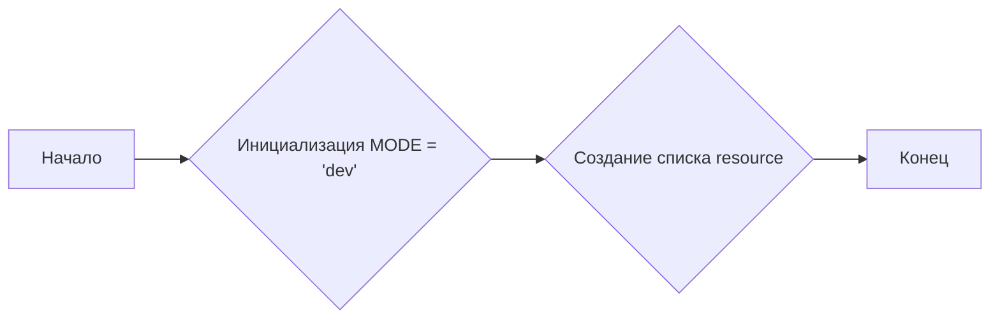
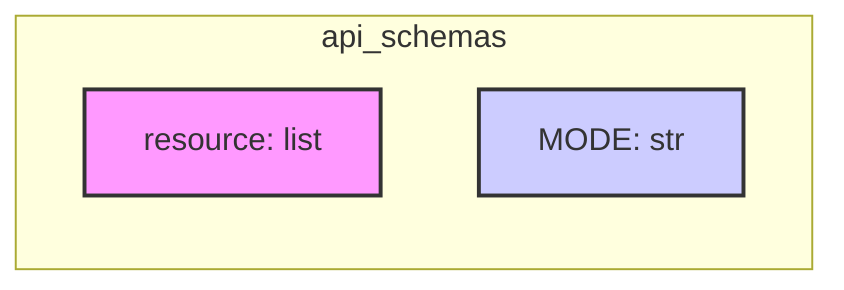

## Анализ кода `api_resourses_list.py`

### 1. <алгоритм>

**Описание:**

1. **Инициализация переменной `MODE`**: Устанавливается режим работы (например, 'dev' для разработки).
   *   Пример: `MODE = 'dev'`
2. **Создание списка `resource`**: Определяется список строк, представляющих доступные ресурсы API PrestaShop.
   *   Пример: `resource = ['products', 'categories', 'customers', ...]`

**Блок-схема:**



### 2. <mermaid>



**Описание зависимостей:**

*   Диаграмма показывает, что файл `api_resourses_list.py` содержит две переменные: `resource`, которая является списком, и `MODE`, которая является строкой. `resource` хранит список всех доступных ресурсов API PrestaShop, а `MODE` определяет текущий режим работы (например, 'dev' для разработки).
*   Нет внешних зависимостей от других модулей, все переменные определены внутри текущего файла.

### 3. <объяснение>

#### Импорты:

*   В данном коде отсутствуют импорты. Это означает, что код не зависит от других модулей или пакетов, кроме стандартных возможностей Python.

#### Переменные:

*   `MODE`:
    *   Тип: `str` (строка).
    *   Назначение: Определяет режим работы приложения, в данном случае установлен в `'dev'` (разработка).
    *   Использование: Может использоваться для условной логики в других частях проекта, например, для вывода отладочной информации или переключения между разными настройками.
*   `resource`:
    *   Тип: `list` (список строк).
    *   Назначение: Хранит список всех доступных ресурсов API PrestaShop.
    *   Использование: Этот список используется для формирования запросов к API, например, для определения доступных конечных точек.
    *   Значение: Список содержит строки, каждая из которых является названием API ресурса PrestaShop (например, 'products', 'categories', 'customers' и т.д.)

#### Классы и функции:

*   В данном файле нет классов и функций. Файл содержит только определение переменных.

#### Потенциальные ошибки и области для улучшения:

*   **Отсутствие описания:**  Отсутствует docstring для модуля, можно добавить описание назначения модуля.
*   **Жестко заданный список:** Список ресурсов задан жестко в коде.  Изменения в API PrestaShop могут потребовать ручной правки этого списка. Было бы лучше загружать список ресурсов из файла конфигурации или динамически, из ответа API PrestaShop.
*   **Отсутствие обработки ошибок:** В текущем коде отсутствуют механизмы обработки ошибок, если, например, список `resource` не будет определен или будет иметь неверный формат.
*    **Типы данных**: Типы данных у переменных можно сделать более строгими с помощью type hints.
*    **Дублирование в `resource`**: Присутсвует дублирование `customizations`.

#### Взаимосвязи с другими частями проекта:

*   Этот файл, вероятно, используется другими частями проекта (например, модулями для выполнения API-запросов к PrestaShop) для определения списка доступных ресурсов. Этот список может быть импортирован и использован для формирования URL-адресов для API-запросов, например в `src.endpoints.prestashop.api_client.py`

**Пример использования списка `resource` в других частях проекта:**

```python
# Пример использования
from src.endpoints.prestashop.api_schemas.api_resourses_list import resource
from src.endpoints.prestashop.api_client import ApiClient # воображаемый класс

api = ApiClient(api_url="https://example.com/api", api_key="YOUR_API_KEY")

for res in resource:
    try:
        response = api.get_resource(res)
        print(f"Получены данные для ресурса: {res}")
    except Exception as e:
        print(f"Ошибка при получении данных для ресурса: {res}, Ошибка: {e}")
```

**Общее заключение:**

Код представляет собой простой список доступных ресурсов PrestaShop API, используемый для настройки API-клиента. Код легко читается и понятен, но нуждается в улучшении в плане поддержки динамических изменений списка ресурсов, обработки ошибок и большей гибкости.