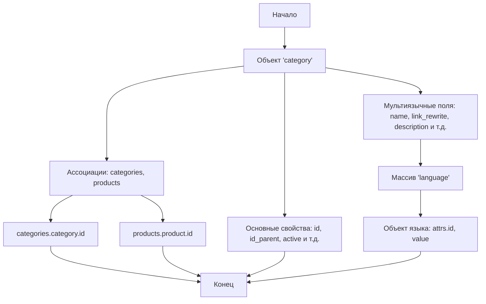

## АНАЛИЗ JSON СХЕМЫ КАТЕГОРИИ PRESTASHOP

### 1. <алгоритм>

1.  **Начало**: JSON описывает структуру данных для категории в PrestaShop.
2.  **Объект `category`**:
    *   Содержит ключевые свойства категории, такие как `id`, `id_parent`, `active` и т.д.
    *   Эти свойства — строки, которые вероятно, будут заполняться строковыми представлениями чисел или булевых значений.
        *   Пример: `id: "123"`
        *   Пример: `active: "true"`
3.  **Поля с мультиязычной поддержкой**:
    *   `name`, `link_rewrite`, `description`, `meta_title`, `meta_description`, `meta_keywords` и `description_long`
    *   Имеют структуру объекта с полем `language`, которое является массивом объектов.
    *   Каждый объект в массиве `language` представляет перевод для конкретного языка.
        *   `attrs.id`: Идентификатор языка (например, "1" для английского, "2" для французского, "3" для русского)
        *   `value`: Текстовое значение на этом языке.
        *   Пример:
        ```json
        "name": {
          "language": [
            { "attrs": { "id": "1" }, "value": "Home" },
            { "attrs": { "id": "2" }, "value": "Accueil" },
            { "attrs": { "id": "3" }, "value": "Главная" }
          ]
        }
        ```
4.  **Ассоциации**:
    *   Содержит поля `associations.categories` и `associations.products` для связи с другими категориями и продуктами.
    *   Структура:
        *   `categories.category.id`: Идентификатор связанной категории.
            *   Пример:
            ```json
            "associations": {
                "categories": {
                     "category": { "id": "456" }
                },
                "products": {
                     "product": { "id": "789" }
                }
            }
            ```
        *    `products.product.id`: Идентификатор связанного продукта.
5.  **Конец**: Схема описывает структуру данных, которая будет использоваться для представления и обмена информацией о категориях в PrestaShop API.

### 2. <mermaid>



**Объяснение диаграммы `mermaid`:**

*   `Start`: Начало процесса, представляющее начало анализа структуры JSON.
*   `CategoryObject`: Представляет собой корневой объект JSON, описывающий категорию.
*   `CategoryProperties`: Узел, представляющий основные свойства категории, такие как `id`, `id_parent`, `active`, и т.д. Эти свойства хранят информацию о самой категории и, как правило, являются простыми строковыми значениями.
*   `MultiLanguageFields`: Узел, который представляет все поля категории, имеющие мультиязычную поддержку.
*   `LanguageArray`: Представляет собой массив объектов `language` внутри каждого мультиязычного поля (например, `name`, `description`).
*   `LanguageObject`: Представляет собой отдельный объект в массиве `language`, содержащий атрибут `id` языка и значение `value` для этого языка.
*  `Associations`: Узел, представляющий ассоциации категории с другими категориями и продуктами.
*  `CategoriesAssociation`:  Узел, представляющий связь с другими категориями по полю `categories.category.id`.
*  `ProductsAssociation`: Узел, представляющий связь с продуктами по полю `products.product.id`.
* `End`: Конец процесса.

**Зависимости, используемые при создании диаграммы:**

*   Нет внешних зависимостей. Диаграмма mermaid описывает структуру данных JSON, которая является самодостаточной.

### 3. <объяснение>

**Импорты:**

*   В предоставленном коде нет импортов. Это JSON схема, которая не требует импортов, поскольку это просто формат данных, а не исполняемый код.

**Классы:**

*   В предоставленном коде нет классов. Это JSON схема, определяющая структуру данных.

**Функции:**

*   В предоставленном коде нет функций. Это JSON схема, определяющая структуру данных.

**Переменные:**

*   **`category`**: Объект, представляющий данные о категории PrestaShop.
    *   Тип: Объект
    *   Использование: Структурирует всю информацию о категории, включая основные атрибуты, мультиязычные поля и ассоциации.
*   **`id`, `id_parent`, `active`, `id_shop_default`, `is_root_category`, `position`, `date_add`, `date_upd`**: Основные атрибуты категории.
    *   Тип: Строка
    *   Использование: Идентификаторы, статус, позиция и даты создания/обновления категории.
*   **`name`, `link_rewrite`, `description`, `meta_title`, `meta_description`, `meta_keywords`, `description_long`**: Мультиязычные поля.
    *   Тип: Объект, содержащий поле `language`
    *   Использование: Содержат переводы для различных языков.
*   **`language`**: Массив объектов с переводами.
    *   Тип: Массив
    *   Использование: Хранит переводы для каждого языка, где каждый объект содержит `attrs.id` языка и его текстовое `value`.
*   **`attrs.id`**: Идентификатор языка.
    *   Тип: Строка
    *   Использование: Позволяет определить, к какому языку относится конкретный перевод.
*   **`value`**: Текстовое значение для определенного языка.
    *   Тип: Строка
    *   Использование: Содержит текст на соответствующем языке для данного поля категории.
*   **`associations`**: Объект с ассоциациями категории.
    *   Тип: Объект
    *   Использование: Содержит связи с другими категориями и продуктами.
*    **`categories.category.id`**: Идентификатор связанной категории.
     *    Тип: Строка
     *    Использование:  Определяет связь с другими категориями.
*    **`products.product.id`**: Идентификатор связанного продукта.
      *    Тип: Строка
      *    Использование: Определяет связь с продуктами.

**Объяснение:**

*   Эта JSON-схема описывает структуру данных, которая используется для представления категории PrestaShop API.
*   Схема включает основные атрибуты категории, а также поля для мультиязычной поддержки и ассоциации с другими категориями и продуктами.
*   Каждое мультиязычное поле содержит массив `language`, где каждый элемент имеет атрибут `id`, указывающий на язык, и атрибут `value`, содержащий перевод.
*   Поля с мультиязычной поддержкой, такие как `name`, `description`, `meta_title`, и т.д., позволяют хранить и обрабатывать информацию на разных языках, что важно для международных онлайн-магазинов.

**Потенциальные ошибки и области для улучшения:**

*   **Типы данных**: Все значения, включая числовые идентификаторы, хранятся как строки. Это может привести к ошибкам при обработке данных. Лучше использовать соответствующие типы данных (числа, булевы значения), если это возможно.
*   **Валидация**: Отсутствует явная валидация значений. Необходимо предусмотреть валидацию данных (например, проверка, что идентификаторы — это числа).
*   **Пустые строки**: Большинство полей имеют пустые строки по умолчанию. Это нормально для схемы, но требует заполнения при использовании данных.
*   **Отсутствие примеров**: Добавление примеров для каждого поля сделало бы схему более понятной и полезной.

**Цепочка взаимосвязей с другими частями проекта:**

*   Эта схема используется в PrestaShop API для обмена данными о категориях.
*   Она будет использоваться для сериализации (преобразования данных в JSON) и десериализации (преобразования JSON в данные) данных категорий.
*   В рамках проекта `hypotez` эта схема, скорее всего, используется для работы с API PrestaShop, для создания запросов и обработки ответов связанных с категориями. Это позволяет автоматизировать создание, чтение, обновление и удаление категорий.
*  Эта схема является частью `api_schemas`, что указывает на её использование в качестве основы для обмена данными с API PrestaShop.