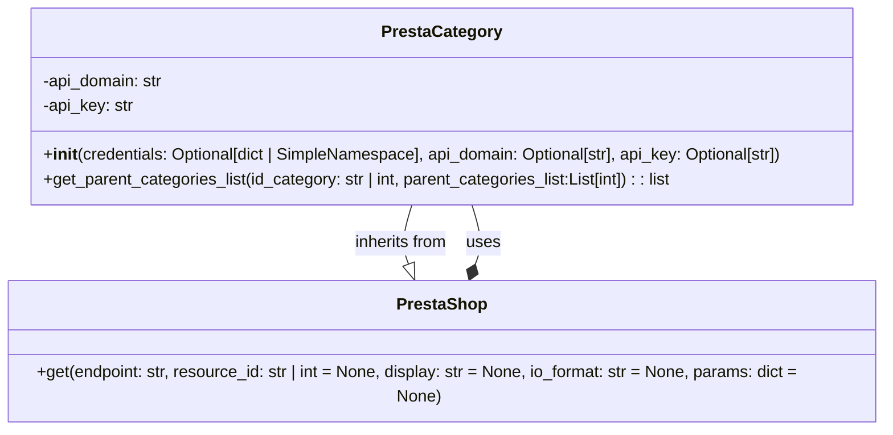

## Анализ кода `hypotez/src/endpoints/prestashop/category.py`

### 1. <алгоритм>

**Описание работы класса `PrestaCategory`:**

Класс `PrestaCategory` предназначен для взаимодействия с категориями в PrestaShop через API. Он наследует функциональность от класса `PrestaShop` (из `src.endpoints.prestashop.api`), предоставляя методы для получения, добавления, обновления и удаления категорий, а также для получения списка родительских категорий.

**Блок-схема `get_parent_categories_list`:**

```mermaid
graph LR
    A[Начало: get_parent_categories_list(id_category, parent_categories_list)] --> B{id_category is None or empty?};
    B -- Да --> C[Лог: Ошибка, нет id категории];
    C --> D[Возврат: parent_categories_list];
    B -- Нет --> E[Получение категории из PrestaShop API: get('categories', resource_id=id_category)];
    E --> F{category is None?};
    F -- Да --> G[Лог: Ошибка, что-то не так с категориями];
     G --> H[Возврат: None];
    F -- Нет --> I[Извлечение id родительской категории: _parent_category = category['id_parent']];
    I --> J[Добавление _parent_category в parent_categories_list];
    J --> K{_parent_category <= 2?};
    K -- Да --> L[Возврат: parent_categories_list];
    K -- Нет --> M[Рекурсивный вызов: get_parent_categories_list(_parent_category, parent_categories_list)];
    M --> N[Возврат: Результат рекурсии]
```

**Пример работы `get_parent_categories_list`:**

1.  **Вход:** `id_category = 11259`, `parent_categories_list = []`.
2.  **Шаг 1:** `id_category` не пустой.
3.  **Шаг 2:** Запрос к API PrestaShop для получения категории с `id = 11259`. API возвращает: `{'category': {'id': 11259, 'id_parent': '11248', ...}}`.
4.  **Шаг 3:** Извлекаем `_parent_category = 11248`.
5.  **Шаг 4:** Добавляем `11248` в `parent_categories_list`: `parent_categories_list = [11248]`.
6.  **Шаг 5:** `_parent_category (11248) > 2`, рекурсивный вызов `get_parent_categories_list(11248, [11248])`.
7.  **Рекурсия:**
    *   **Вход:** `id_category = 11248`, `parent_categories_list = [11248]`.
    *   Запрос к API для категории `id=11248`. API возвращает: `{'category': {'id': 11248, 'id_parent': '11240', ...}}`.
    *   Извлекаем `_parent_category = 11240`.
    *   Добавляем `11240` в `parent_categories_list`: `parent_categories_list = [11248, 11240]`.
    *   `_parent_category (11240) > 2`, рекурсивный вызов `get_parent_categories_list(11240, [11248, 11240])`.
    *   Продолжается, пока `_parent_category` не станет меньше или равна `2`.
8.  **Выход:** Возвращает список родительских категорий (например, `[11248, 11240, 11200, 2]`).

### 2. <mermaid>



**Описание зависимостей в диаграмме `mermaid`:**

*   **`PrestaCategory`**: Класс, представляющий логику работы с категориями PrestaShop.
    *   **Атрибуты**: `api_domain` (строка, домен API) и `api_key` (строка, ключ API).
    *   **Методы**:
        *   `__init__`: конструктор для инициализации объекта, принимает учетные данные, домен и ключ API.
        *   `get_parent_categories_list`: рекурсивный метод для получения списка родительских категорий.
*   **`PrestaShop`**: Класс (описан в `src.endpoints.prestashop.api.py`, но на диаграмме представлен как отдельный класс), предоставляющий базовую функциональность для работы с API PrestaShop.
    *   **Методы**:
        *   `get`: метод для выполнения GET-запросов к API PrestaShop.
*   **Зависимости**:
    *   `PrestaCategory` наследует функциональность от `PrestaShop` (обозначено `PrestaCategory --|> PrestaShop : inherits from`).
    *   `PrestaCategory` использует класс `PrestaShop` для API запросов (обозначено `PrestaCategory --* PrestaShop : uses`).

### 3. <объяснение>

**Импорты:**

*   `requests`: Используется для выполнения HTTP-запросов к API PrestaShop (хотя напрямую в коде не используется, но, предположительно, используется в родительском классе `PrestaShop`).
*   `attr`, `attrs`: Из библиотеки `attr`, используются для определения классов с автоматической генерацией методов, но в предоставленном коде не используется.
*   `pathlib.Path`: Используется для работы с путями к файлам и директориям (не используется напрямую в данном фрагменте, но может использоваться в других частях проекта).
*   `typing.List`, `typing.Dict`: Используются для аннотации типов данных.
*   `types.SimpleNamespace`: Позволяет создавать объекты с произвольными атрибутами (используется для передачи параметров).
*   `header`: Импортируется модуль `header`, но его назначение неясно без контекста, возможно, для работы с заголовками HTTP запросов.
*   `src.gs`: Импортируется модуль `gs` из пакета `src`, назначение неясно без контекста.
*   `src.utils.jjson.j_loads`: Импортируется функция `j_loads` из модуля `jjson`, предположительно, для загрузки JSON-данных.
*   `src.endpoints.prestashop.api.PrestaShop`: Импортируется класс `PrestaShop`, который является родительским классом для `PrestaCategory`.
*   `src.logger.logger.logger`: Импортируется логгер для записи информации о работе программы.
*   `typing.Optional`: Используется для аннотации необязательных аргументов.

**Классы:**

*   **`PrestaCategory`**:
    *   **Роль**:  Представляет собой класс для работы с категориями PrestaShop.
    *   **Атрибуты**:
        *   `api_domain` (str): Домен API PrestaShop.
        *   `api_key` (str): Ключ API PrestaShop.
    *   **Методы**:
        *   `__init__`: Инициализирует объект класса, принимает учетные данные (словарь или `SimpleNamespace`), домен и ключ API.
        *   `get_parent_categories_list`: Рекурсивно получает список родительских категорий для заданной категории.

    *   **Взаимодействие**:
        *   Наследует от `PrestaShop` (из `src.endpoints.prestashop.api`) для взаимодействия с API PrestaShop.
        *   Использует логгер `src.logger.logger.logger` для записи ошибок и отладочной информации.

**Функции:**

*   **`__init__(self, credentials=None, api_domain=None, api_key=None, *args, **kwards)`:**
    *   **Аргументы**:
        *   `credentials` (Optional[dict | SimpleNamespace]): Словарь или объект `SimpleNamespace` с ключами `api_domain` и `api_key`.
        *   `api_domain` (Optional[str]): Домен API PrestaShop.
        *   `api_key` (Optional[str]): Ключ API PrestaShop.
        *   `*args`, `**kwards`: Произвольные позиционные и именованные аргументы для родительского класса.
    *   **Возвращаемое значение**: None (конструктор).
    *   **Назначение**: Инициализирует объект класса `PrestaCategory`. Проверяет, переданы ли необходимые `api_domain` и `api_key`, используя `credentials`, если они переданы.
    *   **Пример**:

        ```python
        prestacategory = PrestaCategory(api_domain="https://yourshop.com", api_key="YOUR_API_KEY")
        # or
        prestacategory = PrestaCategory(credentials={"api_domain":"https://yourshop.com", "api_key":"YOUR_API_KEY"})
        ```

*   **`get_parent_categories_list(self, id_category, parent_categories_list=[])`**:
    *   **Аргументы**:
        *   `id_category` (str | int): ID категории, для которой нужно получить родительские категории.
        *   `parent_categories_list` (List[int]): Список родительских категорий (по умолчанию пустой список).
    *   **Возвращаемое значение**: `list`: Список родительских категорий.
    *   **Назначение**: Рекурсивно получает список родительских категорий для заданной категории, используя API PrestaShop.
    *   **Пример**:

        ```python
        prestacategory = PrestaCategory(api_domain="https://yourshop.com", api_key="YOUR_API_KEY")
        parent_categories = prestacategory.get_parent_categories_list(11259)
        print(parent_categories) # -> [11248, 11240, 11200, 2]
        ```

**Переменные:**

*   `MODE`:  Строка `dev`, определяющая режим работы (возможно для отладки).

**Потенциальные ошибки и области для улучшения:**

*   **Обработка ошибок API**: Код обрабатывает только общую ошибку получения категорий (`if not category:`). Необходимо добавить более точную обработку HTTP ошибок API (например, 404, 500 и т.д.).
*   **Проверка типа `id_category`**: Код не проверяет тип аргумента `id_category`. Лучше явно конвертировать его в `int` или строку, в зависимости от типа.
*   **Отсутствует обработка несуществующей категории**: в коде есть `@todo`, о том, что необходимо обрабатывать ситуацию, кода у клиента нет такой категории.
*   **Логирование**: Добавить более подробное логирование для отладки.
*   **Обработка пустых ответов**: Код не обрабатывает ситуации, когда API возвращает пустой или некорректный JSON ответ (например если поле `id_parent` отсутствует).
*   **Использование `attr`**: Библиотека `attr` импортируется, но не используется. Если она не нужна, импорт можно удалить.
*   **Неясно назначение `header`, `gs`, `j_loads`**: назначение этих модулей не ясно из представленного кода и требуют дополнительного анализа.
*   **Ограничение на 2**: жестко заданное ограничение в `if _parent_category <= 2` может быть не универсальным, лучше сделать его настраиваемым или сделать проверку на корневую категорию.
*   **Ограничение рекурсии**: в функции есть коментарий `@param dept` но он не используется. Можно добавить ограничение рекурсии по глубине, во избежание переполнения стека.

**Цепочка взаимосвязей с другими частями проекта:**

1.  **`PrestaCategory`** зависит от **`PrestaShop`** (из `src.endpoints.prestashop.api.py`) для выполнения API-запросов к PrestaShop.
2.  **`PrestaShop`**, в свою очередь, может использовать **`requests`** для выполнения HTTP-запросов (не отображено в данном коде, но предположительно используется в `src.endpoints.prestashop.api.py`).
3.  Используется **`src.logger.logger.logger`** для логирования, что связывает с модулем логирования проекта.
4.  Импортируются **`src.gs`** и **`src.utils.jjson`** но взаимосвязь не ясна, может быть используется в других частях проекта.

Этот анализ предоставляет подробное объяснение функциональности кода, его структуры и связей с другими компонентами проекта.