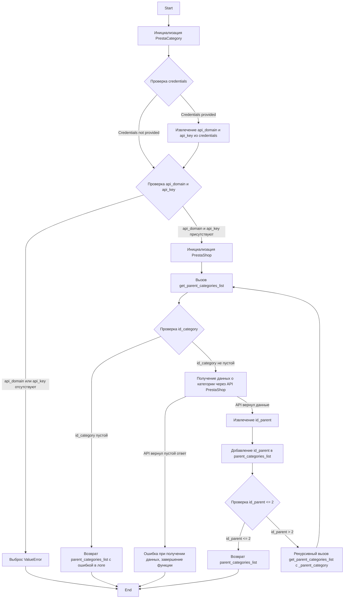
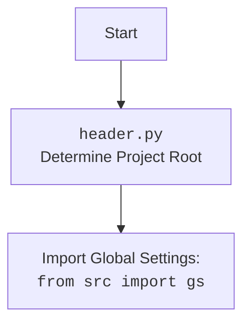

## ИНСТРУКЦИЯ:

Анализируй предоставленный код подробно и объясни его функциональность. Ответ должен включать три раздела:  

1. **<алгоритм>**: Опиши рабочий процесс в виде пошаговой блок-схемы, включая примеры для каждого логического блока, и проиллюстрируй поток данных между функциями, классами или методами.  
2. **<mermaid>**: Напиши код для диаграммы в формате `mermaid`, проанализируй и объясни все зависимости, 
    которые импортируются при создании диаграммы. 
    **ВАЖНО!** Убедитесь, что все имена переменных, используемые в диаграмме `mermaid`, 
    имеют осмысленные и описательные имена. Имена переменных вроде `A`, `B`, `C`, и т.д., не допускаются!  
    
    **Дополнительно**: Если в коде есть импорт `import header`, добавьте блок `mermaid` flowchart, объясняющий `header.py`:\
    ```mermaid
    flowchart TD
        Start --> Header[<code>header.py</code><br> Determine Project Root]
    
        Header --> import[Import Global Settings: <br><code>from src import gs</code>] 
    ```

3. **<объяснение>**: Предоставьте подробные объяснения:  
   - **Импорты**: Их назначение и взаимосвязь с другими пакетами `src.`.  
   - **Классы**: Их роль, атрибуты, методы и взаимодействие с другими компонентами проекта.  
   - **Функции**: Их аргументы, возвращаемые значения, назначение и примеры.  
   - **Переменные**: Их типы и использование.  
   - Выделите потенциальные ошибки или области для улучшения.  

Дополнительно, постройте цепочку взаимосвязей с другими частями проекта (если применимо).  

Это обеспечивает всесторонний и структурированный анализ кода.
## Формат ответа: `.md` (markdown)
**КОНЕЦ ИНСТРУКЦИИ**
```
## <алгоритм>

**1. Инициализация `PrestaCategory`:**

   - При создании экземпляра `PrestaCategory` (например, `prestacategory = PrestaCategory(credentials={'api_domain': 'example.com', 'api_key': '123'})`) вызывается метод `__init__`.
   - Проверяется наличие `credentials`, `api_domain` и `api_key`.
     - Если `credentials` предоставлены, `api_domain` и `api_key` берутся из них. 
     - Если `api_domain` или `api_key` отсутствуют (или оба), выбрасывается исключение `ValueError`.
     - Вызывается конструктор родительского класса `PrestaShop` с полученными параметрами.
   
    **Пример:**
   ```python
   prestacategory = PrestaCategory(credentials={'api_domain': 'my_shop.com', 'api_key': 'my_key'})
   ```
   
    **Логика:**
    -   Проверка наличия необходимых параметров для доступа к API PrestaShop.
    -   Инициализация родительского класса для базовой работы с API.

**2. Получение списка родительских категорий (`get_parent_categories_list`):**
   -   Метод принимает `id_category` (идентификатор категории) и `parent_categories_list` (список для накопления id родительских категорий).
   -   Если `id_category` пуст, возвращает текущий `parent_categories_list` (с ошибкой в логе).
    
    **Пример:**
    ```python
    parent_categories = prestacategory.get_parent_categories_list(11259)
    ```
    
    **Логика:**
    -   Проверка на валидный id категории.
    -   Обработка случая некорректного ввода.
   
   - Запрос к PrestaShop API для получения информации о категории по `id_category`. Используется метод `get` родительского класса `PrestaShop`, который вызывает запрос к API PrestaShop.
        - Если запрос вернул пустой ответ, выводится сообщение об ошибке и функция завершается.
    **Пример ответа API (JSON):**
        ```json
        {
            "category": {
                "id": 11259,
                "id_parent": "11248",
                "level_depth": "5",
                "nb_products_recursive": -1,
                "active": "1",
                "id_shop_default": "1",
                "is_root_category": "0",
                "position": "0",
                "date_add": "2023-07-25 11:58:08",
                ...
           }
        }
        ```
    -   Из ответа извлекается `id_parent` (идентификатор родительской категории) и добавляется в `parent_categories_list`.
   
   - Проверка условия выхода рекурсии: если `_parent_category` <= 2, то возвращает накопленный список родительских категорий (`parent_categories_list`). 
   - В противном случае (если `_parent_category` > 2), метод рекурсивно вызывает сам себя с новым `_parent_category` и обновленным `parent_categories_list`.
   
    **Логика:**
    -   Получение родительской категории текущей категории.
    -   Добавление id родительской категории в список.
    -   Условие остановки рекурсии, когда достигнута корневая категория или её предок.

## <mermaid>



**Зависимости (импорты) в коде и диаграмме:**

- `requests`: Используется для выполнения HTTP-запросов к API PrestaShop.
- `attr`, `attrs`: Используется для создания классов с атрибутами.
- `pathlib.Path`: Используется для работы с путями файловой системы.
- `typing.List`, `typing.Dict`, `typing.Optional`: Используются для аннотации типов.
- `types.SimpleNamespace`: Используется для создания простых объектов с атрибутами (в `__init__`).
- `header`: Содержит код для определения корневой директории проекта и инициализации глобальных настроек.
- `src.gs`: Глобальные настройки проекта (полученные после обработки `header`).
- `src.utils.jjson.j_loads`: Функция для загрузки JSON.
- `.api.PrestaShop`: Базовый класс для работы с API PrestaShop (родительский класс для `PrestaCategory`).
- `src.logger.logger.logger`: Логгер для записи сообщений.

**Объяснение `header.py`**

- `header.py` отвечает за определение корневой директории проекта. Это нужно для того, чтобы другие модули внутри `src` могли правильно получать доступ к общим ресурсам, таким как конфигурационные файлы и т.д.
- После определения корневой директории `header.py` импортирует глобальные настройки из `src.gs`, что позволяет другим частям проекта использовать общую конфигурацию.

## <объяснение>

**Импорты:**

- `requests`: Используется для отправки HTTP-запросов к PrestaShop API.
- `attr` и `attrs` из `attr`: Используются для создания классов с атрибутами, но в данном коде не применяются.
- `Path` из `pathlib`: Работа с путями к файлам. В данном коде не используется.
- `List`, `Dict`, `Optional` из `typing`: Используются для аннотации типов переменных.
- `SimpleNamespace` из `types`: Создание простых объектов, для передачи конфигурации в конструктор.
- `header`: Модуль, отвечающий за инициализацию проекта, определяет корневую директорию и загружает глобальные настройки.
- `gs` из `src`: Объект с глобальными настройками проекта.
- `j_loads` из `src.utils.jjson`: Функция для загрузки JSON.
- `PrestaShop` из `.api`: Базовый класс для работы с PrestaShop API.
- `logger` из `src.logger.logger`: Объект для логирования событий.

**Классы:**

- `PrestaCategory`:
  - **Роль:** Предназначен для работы с категориями PrestaShop.
  - **Атрибуты:** Отсутствуют (кроме унаследованных от `PrestaShop`).
  - **Методы:**
    - `__init__(self, credentials: Optional[dict | SimpleNamespace] = None, api_domain: Optional[str] = None, api_key: Optional[str] = None, *args, **kwards)`: Конструктор класса. Принимает либо словарь `credentials`, либо отдельные `api_domain` и `api_key`, которые используются для инициализации родительского класса `PrestaShop`.
    - `get_parent_categories_list(self, id_category: str | int, parent_categories_list: List[int] = []) -> list`: Рекурсивный метод для получения списка родительских категорий.

**Функции:**

- `__init__`:
  - **Аргументы:** `credentials` (словарь или `SimpleNamespace`), `api_domain` (строка), `api_key` (строка), `*args`, `**kwards`
  - **Возвращает:** Ничего.
  - **Назначение:** Инициализирует экземпляр класса `PrestaCategory`, проверяя наличие необходимых учетных данных для подключения к API PrestaShop и вызывая конструктор родительского класса `PrestaShop`.

- `get_parent_categories_list`:
  - **Аргументы:** `id_category` (идентификатор категории), `parent_categories_list` (список).
  - **Возвращает:** `list` (список родительских категорий).
  - **Назначение:** Рекурсивно получает список родительских категорий для заданной категории.

**Переменные:**
- ``: Определяет режим работы приложения (в данном случае, режим разработки).
- `id_category` (в `get_parent_categories_list`): Идентификатор категории, для которой нужно найти родительские категории.
- `parent_categories_list` (в `get_parent_categories_list`): Список, в котором накапливаются идентификаторы родительских категорий.
- `category` (в `get_parent_categories_list`): Словарь, содержащий информацию о категории, полученную из API PrestaShop.
- `_parent_category` (в `get_parent_categories_list`): Идентификатор родительской категории.

**Потенциальные ошибки и области для улучшения:**

- **Обработка ошибок:** В коде есть базовая обработка ошибок, но можно добавить более детальную обработку исключений, специфичных для API PrestaShop. Например, обработка ошибок при неверном `api_key` или отсутствующей категории.
- **Кэширование:** Для оптимизации можно добавить кэширование результатов запросов к API PrestaShop, особенно при частом вызове `get_parent_categories_list`.
- **Валидация данных:** Добавить валидацию входных данных (например, проверка типа `id_category`).
- **Условие выхода из рекурсии:** Условие `if _parent_category <= 2:` предполагает, что `2` является корневой категорией. Это может быть не всегда верно и должно быть вынесено в конфигурацию или проверку.
- **Логирование:** Необходимо добавить больше информативного логирования.

**Взаимосвязи с другими частями проекта:**

- **`header.py`**: Зависимость от `header` для получения глобальных настроек (например, для доступа к API PrestaShop).
- **`src.gs`**: Зависимость от глобальных настроек, полученных от `header.py`.
- **`src.utils.jjson`**: Используется `j_loads` для парсинга JSON-ответов от API.
- **`.api.PrestaShop`**: Класс `PrestaCategory` наследуется от `PrestaShop`, который отвечает за базовую работу с API PrestaShop.
- **`src.logger.logger`**: Используется для логирования событий и ошибок.

**Цепочка взаимосвязей:**

1.  `header.py` определяет корень проекта и загружает глобальные настройки (`gs`).
2.  `PrestaCategory` импортирует `gs` и использует его настройки для доступа к API PrestaShop.
3.  `PrestaCategory` наследуется от `PrestaShop`, который выполняет низкоуровневые HTTP-запросы.
4.  `PrestaCategory` использует `j_loads` для обработки JSON-ответов.
5.  `PrestaCategory` использует `logger` для записи событий.