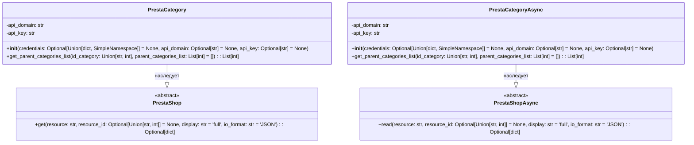

## ИНСТРУКЦИЯ:

Анализируй предоставленный код подробно и объясни его функциональность. Ответ должен включать три раздела:  

1. **<алгоритм>**: Опиши рабочий процесс в виде пошаговой блок-схемы, включая примеры для каждого логического блока, и проиллюстрируй поток данных между функциями, классами или методами.  
2. **<mermaid>**: Напиши код для диаграммы в формате `mermaid`, проанализируй и объясни все зависимости, 
    которые импортируются при создании диаграммы. 
    **ВАЖНО!** Убедитесь, что все имена переменных, используемые в диаграмме `mermaid`, 
    имеют осмысленные и описательные имена. Имена переменных вроде `A`, `B`, `C`, и т.д., не допускаются!  
    
    **Дополнительно**: Если в коде есть импорт `import header`, добавьте блок `mermaid` flowchart, объясняющий `header.py`:\
    ```mermaid\
    flowchart TD\
        Start --> Header[<code>header.py</code><br> Determine Project Root]\
    
        Header --> import[Import Global Settings: <br><code>from src import gs</code>] \
    ```

3. **<объяснение>**: Предоставьте подробные объяснения:  
   - **Импорты**: Их назначение и взаимосвязь с другими пакетами `src.`.  
   - **Классы**: Их роль, атрибуты, методы и взаимодействие с другими компонентами проекта.  
   - **Функции**: Их аргументы, возвращаемые значения, назначение и примеры.  
   - **Переменные**: Их типы и использование.  
   - Выделите потенциальные ошибки или области для улучшения.  

Дополнительно, постройте цепочку взаимосвязей с другими частями проекта (если применимо).  

Это обеспечивает всесторонний и структурированный анализ кода.
## Формат ответа: `.md` (markdown)
**КОНЕЦ ИНСТРУКЦИИ**
```

## <алгоритм>

**1. `PrestaCategory` Класс (Синхронный)**

   * **Инициализация (`__init__`)**:
      * Принимает `credentials` (словарь или `SimpleNamespace`), `api_domain`, `api_key`.
      * Если `credentials` предоставлены, извлекает `api_domain` и `api_key`.
      * Проверяет, что `api_domain` и `api_key` не пустые.
      * Инициализирует родительский класс `PrestaShop` с `api_domain` и `api_key`.
      * Пример:
         ```python
         category_sync = PrestaCategory(credentials={'api_domain': 'example.com', 'api_key': 'testkey'})
         ```

   * **Получение списка родительских категорий (`get_parent_categories_list`)**:
     * Принимает `id_category` (строка или целое число), `parent_categories_list` (список целых чисел, по умолчанию пустой).
     * Если `id_category` пуст, возвращает `parent_categories_list` и логирует ошибку.
     * Вызывает метод `get` родительского класса `PrestaShop` для получения данных категории из PrestaShop API.
     * Извлекает `id_parent` (идентификатор родительской категории) из ответа API.
     * Добавляет `_parent_category` в `parent_categories_list`.
     * Если `_parent_category` меньше или равно 2, возвращает `parent_categories_list` (достигнута корневая категория).
     * В противном случае, рекурсивно вызывает себя же, передавая `_parent_category` и текущий `parent_categories_list`.
     * Пример:
       ```python
       category_sync.get_parent_categories_list(id_category=10) # Возвращает список идентификаторов родительских категорий [2, 5, 10]
       ```

**2. `PrestaCategoryAsync` Класс (Асинхронный)**

   * **Инициализация (`__init__`)**:
      * Аналогично `PrestaCategory.__init__`, но инициализирует `PrestaShopAsync`.

   * **Асинхронное получение списка родительских категорий (`get_parent_categories_list`)**:
     * Принимает `id_category`, `parent_categories_list`.
     * Если `id_category` пуст, возвращает `parent_categories_list` и логирует ошибку.
     * Вызывает асинхронный метод `read` родительского класса `PrestaShopAsync` для получения данных категории из PrestaShop API.
     * Извлекает `id_parent` из ответа API (с учетом структуры JSON).
     * Добавляет `_parent_category` в `parent_categories_list`.
     * Если `_parent_category` меньше или равно 2, возвращает `parent_categories_list`.
     * В противном случае, рекурсивно вызывает себя же, используя `await`.
     * Пример:
       ```python
       async def main():
           category_async = PrestaCategoryAsync(credentials={'api_domain': 'example.com', 'api_key': 'testkey'})
           result = await category_async.get_parent_categories_list(id_category=10) # Возвращает список идентификаторов родительских категорий [2, 5, 10]
           print(result)

       asyncio.run(main())
       ```

## <mermaid>


Диаграмма классов `mermaid` показывает иерархию классов и их методы.
* `PrestaCategory` и `PrestaCategoryAsync` являются классами, предназначенными для управления категориями в PrestaShop.
* Оба они наследуют от абстрактных классов `PrestaShop` и `PrestaShopAsync` соответственно, получая методы для взаимодействия с API.
* `PrestaShop` и `PrestaShopAsync` представляют собой базовые классы для синхронного и асинхронного API-взаимодействия с PrestaShop.
* `PrestaCategory` содержит метод `get_parent_categories_list`, который извлекает список родительских категорий синхронно.
* `PrestaCategoryAsync` имеет аналогичный метод `get_parent_categories_list`, но асинхронный.
* Все классы имеют метод `__init__` для инициализации объекта с необходимыми учетными данными и параметрами.

## <объяснение>

**Импорты:**

* `typing`:
  * `List`, `Dict`, `Optional`, `Union`: Используются для аннотации типов, делая код более читаемым и понятным для инструментов проверки типов.
* `types`:
  * `SimpleNamespace`: Класс для создания простых объектов с атрибутами, используется для альтернативного способа передачи параметров.
* `asyncio`:
    *  Используется для асинхронного программирования.
* `src.logger.logger`:
    *  `logger`: Модуль для логирования ошибок и другой отладочной информации.
* `src.utils.jjson`:
  * `j_loads`, `j_dumps`: Модуль для работы с JSON, с возможностью обработки специальных ситуаций (например, работа с `Decimal`).
* `src.endpoints.prestashop.api`:
  * `PrestaShop`, `PrestaShopAsync`: Абстрактные классы для работы с API PrestaShop (синхронно и асинхронно).

**Классы:**

* `PrestaCategory`:
  * **Роль:** Управляет категориями PrestaShop синхронно.
  * **Атрибуты:**
    *  `api_domain`: Домен PrestaShop API.
    *  `api_key`: API ключ PrestaShop.
  * **Методы:**
      * `__init__(self, credentials, api_domain, api_key)`: Инициализирует объект с данными для подключения к API.
      * `get_parent_categories_list(self, id_category, parent_categories_list)`: Рекурсивно получает список родительских категорий для заданной категории.
  * **Взаимодействие:** Наследует от `PrestaShop` для использования общих API методов.
* `PrestaCategoryAsync`:
  * **Роль:** Управляет категориями PrestaShop асинхронно.
  * **Атрибуты:**
    * `api_domain`: Домен PrestaShop API.
    * `api_key`: API ключ PrestaShop.
  * **Методы:**
      * `__init__(self, credentials, api_domain, api_key)`: Инициализирует объект с данными для подключения к API.
      * `get_parent_categories_list(self, id_category, parent_categories_list)`: Асинхронно получает список родительских категорий для заданной категории.
  * **Взаимодействие:** Наследует от `PrestaShopAsync` для использования общих асинхронных API методов.

**Функции:**

* `PrestaCategory.__init__`:
    * **Аргументы:**
        *  `credentials`: `Optional[Union[dict, SimpleNamespace]]` – Словарь или SimpleNamespace с учетными данными API.
        *  `api_domain`: `Optional[str]` – Домен PrestaShop API.
        * `api_key`: `Optional[str]` – API ключ PrestaShop.
    * **Возвращаемое значение:** None.
    * **Назначение:** Инициализирует класс `PrestaCategory` с учетными данными API. Проверяет, что `api_domain` и `api_key` предоставлены, иначе вызывает `ValueError`.
* `PrestaCategory.get_parent_categories_list`:
    * **Аргументы:**
        * `id_category`: `Union[str, int]` - Идентификатор категории, для которой нужно получить список родительских категорий.
        * `parent_categories_list`: `List[int]` - Список, в который добавляются идентификаторы родительских категорий. По умолчанию пустой список.
    * **Возвращаемое значение:** `List[int]` - Список идентификаторов родительских категорий.
    * **Назначение:** Рекурсивно получает список родительских категорий.
    * **Пример:**
      ```python
      category_instance = PrestaCategory(api_domain="example.com", api_key="testkey")
      parents = category_instance.get_parent_categories_list(id_category=20)
      print(parents) # Выведет [10, 5, 2] (пример)
      ```
* `PrestaCategoryAsync.__init__`:
    * Аналогично `PrestaCategory.__init__`, но для `PrestaCategoryAsync`.
* `PrestaCategoryAsync.get_parent_categories_list`:
    * Аналогично `PrestaCategory.get_parent_categories_list`, но является асинхронной функцией и использует `await` для вызова `read` родительского класса.

**Переменные:**
* `credentials` : `Optional[Union[dict, SimpleNamespace]]` -  Переменная для хранения словаря или объекта SimpleNamespace с учетными данными (api_domain, api_key).
* `api_domain`: `Optional[str]` - Домен PrestaShop API, может передаваться как параметр или извлекаться из credentials.
* `api_key`: `Optional[str]` - API ключ PrestaShop, может передаваться как параметр или извлекаться из credentials.
* `id_category` : `Union[str, int]` - Идентификатор категории, для которой нужно получить список родительских категорий.
* `parent_categories_list`: `List[int]` - Список, в который добавляются идентификаторы родительских категорий.
* `category`: `Optional[dict]` - Словарь, содержащий данные о категории, полученные из API.
* `_parent_category`: `int` - Идентификатор родительской категории.

**Потенциальные ошибки и области для улучшения:**

*   **Обработка ошибок API:** Код не обрабатывает ошибки, которые могут возникнуть при запросе к API, например, ошибки HTTP.
*   **Валидация API ответов:** Не проверяется структура и валидность ответов API.
*   **Использование `j_loads` и `j_dumps`:** В данном коде эти методы не используются напрямую, но их импорт может быть обусловлен логикой обработки данных в родительских классах `PrestaShop` и `PrestaShopAsync`.
*   **Улучшение документации:** Было бы полезно добавить больше документации к коду, включая docstrings для классов и методов.
*   **Ограничение рекурсии:** Не установлен лимит на глубину рекурсии в `get_parent_categories_list`, что может привести к ошибке переполнения стека.

**Взаимосвязи с другими частями проекта:**

*   **`src.logger.logger`**: Используется для логирования, что позволяет отслеживать ошибки и события в коде.
*   **`src.utils.jjson`**: Используется для работы с JSON, гарантирует правильное преобразование данных при работе с API PrestaShop.
*   **`src.endpoints.prestashop.api`**: Предоставляет абстрактные классы для взаимодействия с PrestaShop API, обеспечивая согласованность и повторное использование кода.

Таким образом, данный код предоставляет классы для синхронного и асинхронного получения списка родительских категорий в PrestaShop, используя API PrestaShop. Он использует общие компоненты проекта для логирования, работы с JSON и взаимодействия с API.