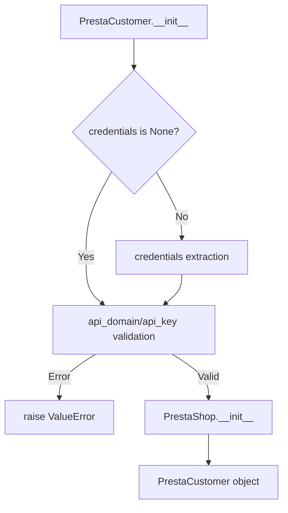

```MD
# <input code>

```python
## \file hypotez/src/endpoints/prestashop/customer.py
# -*- coding: utf-8 -*-
#! venv/Scripts/python.exe
#! venv/bin/python/python3.12

"""
.. module: src.endpoints.prestashop 
	:platform: Windows, Unix
	:synopsis:

"""
MODE = 'dev'


import sys
import os
from attr import attr, attrs
from pathlib import Path
from typing import Union, Optional
from types import SimpleNamespace

import header
from src import gs
from src.logger import logger
from src.utils.jjson import j_loads as j_loads
from .api import PrestaShop
from src.logger import logger
from src.logger.exceptions import PrestaShopException

class PrestaCustomer(PrestaShop):
    """    
    Класс для работы с клиентами в PrestaShop.

    Пример использования класса:

    .. code-block:: python

        prestacustomer = PrestaCustomer(API_DOMAIN=API_DOMAIN, API_KEY=API_KEY)
        prestacustomer.add_customer_PrestaShop('John Doe', 'johndoe@example.com')
        prestacustomer.delete_customer_PrestaShop(3)
        prestacustomer.update_customer_PrestaShop(4, 'Updated Customer Name')
        print(prestacustomer.get_customer_details_PrestaShop(5))
    """

    def __init__(self, 
                 credentials: Optional[dict | SimpleNamespace] = None, 
                 api_domain: Optional[str] = None, 
                 api_key: Optional[str] = None, 
                 *args, **kwards):
        """Инициализация клиента PrestaShop.

        Args:
            credentials (Optional[dict | SimpleNamespace], optional): Словарь или объект SimpleNamespace с параметрами `api_domain` и `api_key`. Defaults to None.
            api_domain (Optional[str], optional): Домен API. Defaults to None.
            api_key (Optional[str], optional): Ключ API. Defaults to None.
        """

        if credentials is not None:
            api_domain = credentials.get('api_domain', api_domain)
            api_key = credentials.get('api_key', api_key)

        if not api_domain or not api_key:
            raise ValueError('Необходимы оба параметра: api_domain и api_key.')

        super().__init__(api_domain, api_key, *args, **kwards)
```

# <algorithm>

**Шаг 1:** Инициализация класса `PrestaCustomer`.
* Принимает необязательные аргументы `credentials`, `api_domain`, `api_key`.
* Если `credentials` задан, берет значения `api_domain` и `api_key` из него.
* Проверяет, что `api_domain` и `api_key` заданы.  Если нет, выбрасывает исключение `ValueError`.
* Вызывает метод `__init__` родительского класса `PrestaShop` с переданными `api_domain`, `api_key`, остальными аргументами `*args, **kwards`.


**Пример:**

```
credentials = {'api_domain': 'example.com', 'api_key': 'secret_key'}
prestacustomer = PrestaCustomer(credentials=credentials)
```


# <mermaid>



**Объяснение диаграммы:**

* **`PrestaCustomer.__init__`**: Инициализирующий метод класса `PrestaCustomer`.
* **`credentials is None?`**: Проверка, заданы ли данные аутентификации через аргумент `credentials`.
* **`credentials extraction`**: Извлечение значений `api_domain` и `api_key` из словаря или объекта `credentials`.
* **`api_domain/api_key validation`**: Проверка, что `api_domain` и `api_key` не пустые.
* **`raise ValueError`**: Выброс исключения, если значения не валидны.
* **`PrestaShop.__init__`**: Вызов метода инициализации родительского класса `PrestaShop` для настройки подключения к API PrestaShop.
* **`PrestaCustomer object`**: Объект класса `PrestaCustomer` после инициализации.

**Зависимости:**

* `PrestaCustomer` зависит от `PrestaShop`, т.к. наследуется от него.
* `PrestaShop` отвечает за работу с API PrestaShop (вероятно, включает в себя настройки запросов и обработку ответов).
* `logger`, `j_loads` и другие классы из `src.*` используются для логирования и обработки JSON данных.


# <explanation>

**Импорты:**

* `sys`, `os`, `pathlib`: Стандартные модули для работы с системой, файлами и путями.
* `attr`, `typing`, `types`: Модули для аннотаций типов и работы с типами данных.
* `header`, `gs`, `logger`: Импортированные из пакета `src`, предполагают модули для логирования, работы с внешними сервисами, и возможно, других вспомогательных функций.
* `PrestaShop`:  Импортируется из текущего пакета (`./api`), что указывает на класс для работы с основным API PrestaShop.
* `PrestaShopException`: Класс исключений, вероятно, специфичный для PrestaShop.
* `j_loads`:  Функция для парсинга JSON (из `src.utils.jjson`).

**Классы:**

* `PrestaCustomer`: Наследуется от `PrestaShop`, предназначен для работы с клиентами в PrestaShop.  Обладает методами для работы с клиентами (добавление, удаление, обновление, получение деталей).
* `PrestaShop`: Родительский класс, вероятно, содержит методы для базовой работы с API PrestaShop. (в том числе, аутентификацию).

**Функции:**

* `__init__`:  Конструктор класса. Принимает аргументы для инициализации подключения к API (credentials, api_domain, api_key). Важно валидировать api_domain и api_key.

**Переменные:**

* `MODE`: Строковая переменная, вероятно, для определения режима работы (dev, prod).
* `credentials`, `api_domain`, `api_key`: Переменные, хранящие данные для аутентификации с API PrestaShop.

**Возможные ошибки и улучшения:**

* Не хватает обработки возможных исключений, возникающих при взаимодействии с API Престашоп.
* Добавьте обработку случаев, когда API возвращает ошибку или не ожидаемый формат данных.
* Добавьте документацию для методов `add_customer_PrestaShop`, `delete_customer_PrestaShop`, `update_customer_PrestaShop`, `get_customer_details_PrestaShop`.

**Цепочка взаимосвязей:**

Код `PrestaCustomer` зависит от `PrestaShop`, который, в свою очередь, зависит от сервисов для работы с API PrestaShop (включая аутентификацию).  Зависимости от `logger`, `gs`, и `jjson` для логирования, хранения данных и работы с JSON-данными.