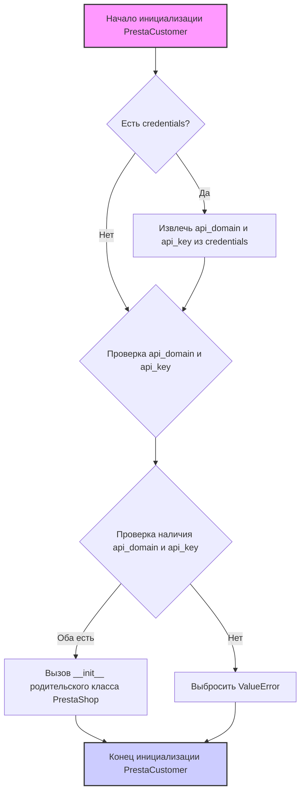
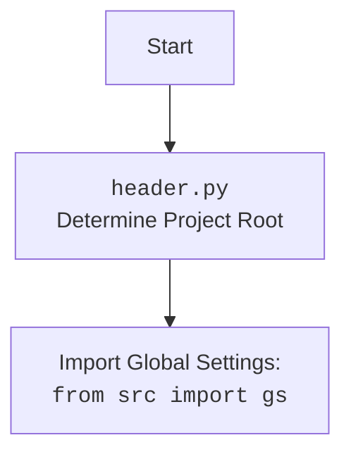

## ИНСТРУКЦИЯ:

Анализируй предоставленный код подробно и объясни его функциональность. Ответ должен включать три раздела:  

1. **<алгоритм>**: Опиши рабочий процесс в виде пошаговой блок-схемы, включая примеры для каждого логического блока, и проиллюстрируй поток данных между функциями, классами или методами.  
2. **<mermaid>**: Напиши код для диаграммы в формате `mermaid`, проанализируй и объясни все зависимости, 
    которые импортируются при создании диаграммы. 
    **ВАЖНО!** Убедитесь, что все имена переменных, используемые в диаграмме `mermaid`, 
    имеют осмысленные и описательные имена. Имена переменных вроде `A`, `B`, `C`, и т.д., не допускаются!  
    
    **Дополнительно**: Если в коде есть импорт `import header`, добавьте блок `mermaid` flowchart, объясняющий `header.py`:\
    ```mermaid
    flowchart TD
        Start --> Header[<code>header.py</code><br> Determine Project Root]
    
        Header --> import[Import Global Settings: <br><code>from src import gs</code>] 
    ```

3. **<объяснение>**: Предоставьте подробные объяснения:  
   - **Импорты**: Их назначение и взаимосвязь с другими пакетами `src.`.  
   - **Классы**: Их роль, атрибуты, методы и взаимодействие с другими компонентами проекта.  
   - **Функции**: Их аргументы, возвращаемые значения, назначение и примеры.  
   - **Переменные**: Их типы и использование.  
   - Выделите потенциальные ошибки или области для улучшения.  

Дополнительно, постройте цепочку взаимосвязей с другими частями проекта (если применимо).  

Это обеспечивает всесторонний и структурированный анализ кода.
## Формат ответа: `.md` (markdown)
**КОНЕЦ ИНСТРУКЦИИ**

### <алгоритм>
1.  **Инициализация `PrestaCustomer`**:
    *   Начало работы с классом `PrestaCustomer`.
    *   Принимает на вход `credentials` (словарь или SimpleNamespace), `api_domain`, и `api_key` как параметры, либо все параметры в `credentials`.
    *   Если `credentials` предоставлены, пытается извлечь `api_domain` и `api_key` оттуда.
    *   Проверяет, что `api_domain` и `api_key` установлены. Если нет, вызывает исключение `ValueError`.
    *   Вызывает конструктор родительского класса `PrestaShop`, передавая ему `api_domain` и `api_key`.
        *   **Пример**:
            ```python
            prestacustomer = PrestaCustomer(api_domain="your_domain", api_key="your_key")
            ```
            или
            ```python
            credentials = {"api_domain": "your_domain", "api_key": "your_key"}
            prestacustomer = PrestaCustomer(credentials=credentials)
            ```

### <mermaid>




### <объяснение>

**Импорты:**

*   `sys`: Предоставляет доступ к некоторым переменным и функциям, которые взаимодействуют с интерпретатором Python.
*   `os`: Предоставляет функции для взаимодействия с операционной системой, такие как управление файлами и директориями.
*   `attr, attrs`: Из библиотеки `attr`, которая используется для создания классов с меньшим количеством шаблонного кода. `attr` используется как декоратор, а `attrs` для создания класса.
*   `pathlib.Path`: Представляет путь к файлу или каталогу и упрощает операции с путями.
*   `typing.Union`: Позволяет указывать, что переменная может иметь один из нескольких типов.
*   `types.SimpleNamespace`: Создает простой объект, к атрибутам которого можно обращаться как к обычным атрибутам.
*   `header`:  Предположительно, файл `header.py`, который выполняет предварительную настройку проекта, например, определение корневой директории.
*   `src`: Пакет, включающий модули `gs`, `logger`, `utils`, и др. `src.gs` предоставляет глобальные настройки. `src.logger.logger` - модуль для логирования, `src.utils.jjson` - для работы с JSON.
*   `src.logger.exceptions`: Определяет кастомные исключения, например, `PrestaShopException`.
*   `src.endpoints.prestashop.api`: Содержит класс `PrestaShop` для взаимодействия с API PrestaShop.

**Классы:**

*   `PrestaCustomer(PrestaShop)`:
    *   Наследуется от `PrestaShop`.
    *   Предназначен для работы с клиентами в PrestaShop.
    *   Содержит методы для добавления, удаления, обновления и получения информации о клиентах.
    *   `__init__(self, credentials=None, api_domain=None, api_key=None, *args, **kwards)`:
        *   Инициализирует экземпляр класса.
        *   Принимает `credentials`, `api_domain`, `api_key`. Если `credentials` передается, пытается извлечь `api_domain` и `api_key` из него.
        *   Вызывает конструктор базового класса `PrestaShop` для настройки соединения с API.

**Функции:**

*   `__init__`: Конструктор класса `PrestaCustomer`, инициализирующий объект.
    *   Аргументы:
        *   `credentials`: `Optional[dict | SimpleNamespace]` - Словарь или объект SimpleNamespace с параметрами `api_domain` и `api_key`.
        *    `api_domain`: `Optional[str]` - Домен API PrestaShop.
        *   `api_key`: `Optional[str]` - Ключ API PrestaShop.
        *   `*args, **kwards`: Дополнительные аргументы, которые передаются в конструктор родительского класса.
    *   Возвращаемое значение: `None`.
    *   Назначение: Инициализирует объект `PrestaCustomer`, устанавливая api_domain и api_key, проверяя их наличие, и настраивает подключение к API PrestaShop через родительский класс.
*   `j_loads`: Функция из `src.utils.jjson` для загрузки JSON из строки.

**Переменные:**

*   ``: Указывает режим работы приложения (здесь установлен в 'dev').
*   `credentials` :  Словарь или SimpleNamespace, содержащий `api_domain` и `api_key`.
*   `api_domain`: Строка, представляющая домен API PrestaShop.
*   `api_key`: Строка, представляющая ключ API PrestaShop.

**Потенциальные ошибки и области для улучшения:**

*   Использование `` в глобальном пространстве модуля может быть не лучшей практикой, если требуется более гибкое управление окружением. Лучше использовать переменные окружения.
*   Отсутствуют проверки на корректность данных в `credentials` (например, проверка типа `dict` или `SimpleNamespace`).
*   Необходимо предусмотреть обработку исключений при обращении к API PrestaShop.
*   Следует реализовать методы для добавления, удаления, обновления и получения данных о клиентах, используя API PrestaShop.
*   У класса `PrestaCustomer` нет явных методов для отправки запросов и обработки ответов от PrestaShop API. Эти методы должны быть либо в `PrestaShop`, либо в `PrestaCustomer`

**Взаимосвязи с другими частями проекта:**
*  `header.py`: Используется для определения корневой директории проекта и импорта глобальных настроек.
*  `src.gs`: Содержит глобальные настройки проекта, которые могут использоваться при инициализации класса `PrestaCustomer`.
*  `src.logger.logger`: Используется для логирования различных действий и ошибок, возникающих при работе с API PrestaShop.
* `src.utils.jjson`: Используется для обработки данных в формате JSON.
* `src.endpoints.prestashop.api.PrestaShop`: Базовый класс для `PrestaCustomer`, предоставляет методы для взаимодействия с PrestaShop API.