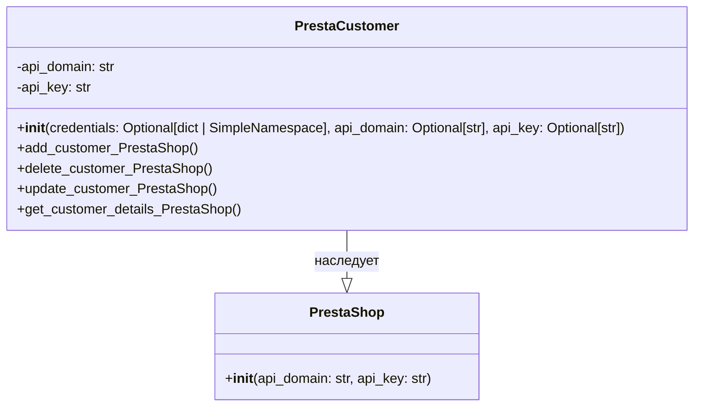

## hypotez/src/endpoints/prestashop/customer.py

### <алгоритм>

1.  **Инициализация `PrestaCustomer`**:
    *   При создании экземпляра `PrestaCustomer` вызывается метод `__init__`.
    *   Метод принимает параметры `credentials` (словарь или `SimpleNamespace`), `api_domain` и `api_key`. Если `credentials` предоставлены, `api_domain` и `api_key` могут быть получены из него.
    *   Если `api_domain` или `api_key` не переданы или не найдены в `credentials`, выбрасывается исключение `ValueError`.
    *   Вызывается конструктор родительского класса `PrestaShop` с переданными параметрами `api_domain`, `api_key` и дополнительными аргументами.

    *Пример:*

        ```python
        credentials = {'api_domain': 'example.com', 'api_key': 'test_key'}
        customer = PrestaCustomer(credentials=credentials)
        # Или
        customer = PrestaCustomer(api_domain='example.com', api_key='test_key')
        ```

2.  **Родительский класс `PrestaShop`**:
    *   Конструктор родительского класса `PrestaShop` (не показан в коде) предположительно устанавливает соединение с API PrestaShop с использованием `api_domain` и `api_key`.

3.  **Методы для работы с клиентами (не показаны в коде)**:
    *   Класс `PrestaCustomer` должен содержать методы, такие как `add_customer_PrestaShop`, `delete_customer_PrestaShop`, `update_customer_PrestaShop` и `get_customer_details_PrestaShop`.
    *   Эти методы используют установленное соединение с API PrestaShop для выполнения операций над данными клиентов.

### <mermaid>



**Объяснение зависимостей:**

*   `PrestaCustomer` наследует от `PrestaShop`, что указывает на то, что `PrestaCustomer` расширяет или специализирует функциональность `PrestaShop`.
*   `PrestaShop` представляет собой базовый класс для работы с API PrestaShop, предоставляя основные методы для взаимодействия.
*   `PrestaCustomer` добавляет специфическую логику для работы с клиентами, используя методы и соединения `PrestaShop`.
*   Диаграмма показывает, что `PrestaCustomer` зависит от `PrestaShop` для подключения к API PrestaShop.
*   Переменные `api_domain` и `api_key` определены как приватные (-), т.к. к ним нет доступа извне класса.

### <объяснение>

**Импорты:**

*   `sys`, `os`: Стандартные модули Python для взаимодействия с системой. Здесь могут быть использованы для различных целей, например, для управления путями или системными операциями, но в представленном коде они явно не используются.
*   `attr`, `attrs`: Библиотека `attrs` (вероятно, `attr`) используется для более лаконичного создания классов. В представленном коде не используется.
*   `pathlib.Path`: Модуль для работы с путями файлов. Здесь не используется.
*   `typing.Union`: Используется для определения типов переменных, которые могут принимать несколько типов (не используется в данном фрагменте, но может быть использовано в других частях модуля).
*   `types.SimpleNamespace`: Удобный способ для создания объектов, которые могут содержать произвольные атрибуты.
*   `header`: Предполагается, что это кастомный модуль, но его содержимое и назначение не известны.
*   `src.gs`: Предполагается, что это внутренний модуль проекта, возможно, для глобальных настроек или данных.
*   `src.logger.logger`: Модуль для логирования.
*   `src.utils.jjson`: Модуль для работы с JSON.
*   `.api.PrestaShop`: Локальный модуль, содержащий класс `PrestaShop`, который используется как базовый класс для `PrestaCustomer`.
*    `src.logger.exceptions.PrestaShopException`: Модуль для обработки кастомных исключений.
*   `typing.Optional`: Используется для обозначения переменных, которые могут быть либо определенного типа, либо `None`.

**Классы:**

*   `PrestaCustomer`:
    *   **Роль**: Класс для работы с клиентами в PrestaShop.
    *   **Атрибуты**: `api_domain`, `api_key` — параметры для аутентификации в PrestaShop API.
    *   **Методы**:
        *   `__init__`: Конструктор класса, принимает параметры для подключения к API (через `credentials` или отдельные `api_domain` и `api_key`).
    *   **Взаимодействие**: Наследует от `PrestaShop` и использует его методы для взаимодействия с API. Класс также должен иметь методы для добавления, удаления, обновления и получения деталей клиентов (не показаны в предоставленном коде).

**Функции:**

*   `__init__(self, credentials: Optional[dict | SimpleNamespace] = None, api_domain: Optional[str] = None, api_key: Optional[str] = None, *args, **kwards)`:
    *   **Аргументы**:
        *   `credentials` (опционально): Словарь или `SimpleNamespace`, содержащий `api_domain` и `api_key`.
        *   `api_domain` (опционально): Домен API.
        *   `api_key` (опционально): Ключ API.
        *   `*args`, `**kwards`: Дополнительные аргументы и ключевые слова, передаваемые конструктору родительского класса `PrestaShop`.
    *   **Возвращаемые значения**: Нет.
    *   **Назначение**: Инициализация объекта `PrestaCustomer`, проверка наличия параметров для доступа к API, инициализация родительского класса `PrestaShop`.

**Переменные:**

*   `MODE`: Строковая константа, устанавливающая режим работы (здесь `'dev'`).

**Потенциальные ошибки или области для улучшения:**

*   В коде не реализованы методы для работы с клиентами (add, delete, update, get details).
*   Не хватает валидации данных, полученных от `credentials`.
*   Взаимодействие с API PrestaShop через `PrestaShop` не показано, и код не может быть запущен.

**Цепочка взаимосвязей с другими частями проекта:**

*   `PrestaCustomer` зависит от `PrestaShop` для доступа к API PrestaShop.
*   Использует `src.logger.logger` для логирования,  `src.utils.jjson` для работы с JSON.
*   Может использовать `src.gs` для глобальных настроек.
*   Взаимодействие с `header` неясно.

В итоге, представленный код является частью модуля, ответственного за работу с клиентами в PrestaShop API. `PrestaCustomer` обеспечивает интерфейс для операций с клиентами, опираясь на функциональность, предоставляемую классом `PrestaShop`.