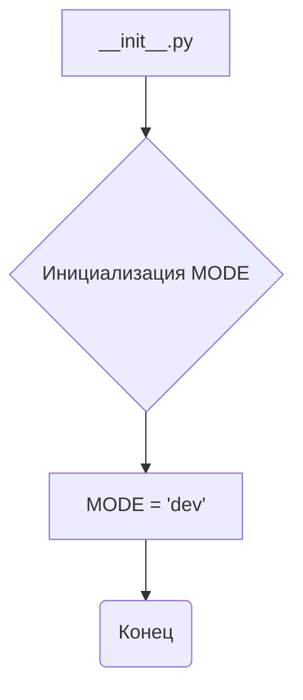
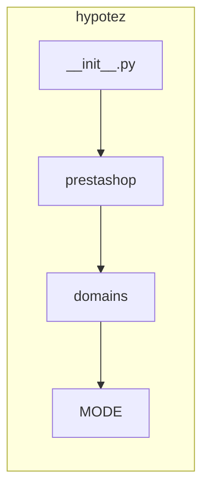

1. **<input code>**

```python
## \file hypotez/src/endpoints/prestashop/domains/__init__.py
# -*- coding: utf-8 -*-
#! venv/Scripts/python.exe
#! venv/bin/python/python3.12

"""
.. module: src.endpoints.prestashop.domains 
	:platform: Windows, Unix
	:synopsis:

"""
MODE = 'dev'

"""
	:platform: Windows, Unix
	:synopsis:

"""


"""
	:platform: Windows, Unix
	:synopsis:

"""


"""
  :platform: Windows, Unix

"""
"""
  :platform: Windows, Unix
  :platform: Windows, Unix
  :synopsis:
"""MODE = 'dev'
  
""" module: src.endpoints.prestashop.domains """

```

2. **<algorithm>**

Этот файл `__init__.py` — это инициализирующий файл для пакета `domains` внутри модуля `prestashop` в проекте `hypotez`.  Алгоритм его работы — это *инициализация*.  В нём нет сложной логики, он просто объявляет переменную `MODE`.

В данном случае блок-схема будет очень простой:



Пример: При импорте модуля `prestashop.domains` из другого модуля, эта инициализация будет выполнена.


3. **<mermaid>**



Эта диаграмма показывает, что файл `__init__.py` внутри пакета `domains` устанавливает переменную `MODE` в `'dev'` внутри проекта `hypotez`.

4. **<explanation>**

* **Импорты:**  В файле нет импортов. Он определяет переменную конфигурации `MODE`.

* **Классы:** Нет классов.

* **Функции:** Нет функций.

* **Переменные:** `MODE`: строковая переменная, вероятно, используемая для определения режима работы (например, `dev`, `prod`).  Значение `'dev'` установлено по умолчанию.

* **Возможные ошибки или области для улучшений:**

    * **Недостаток документации:**  Комментарии  `"""Docstrings"""` не приносят никакой практической пользы, если в них нет информации о функциональности.  Было бы полезно объяснить, для чего нужна переменная `MODE`.
    * **Избыточные `"""Docstrings"""`:** Большинство комментариев в docstrings повторяют одно и то же, и фактически не несут никакой смысловой нагрузки.
    * **Непонятная структура директорий:** Непонятно, как этот файл будет использоваться в остальной части проекта.  Для чего нужна переменная `MODE` и в каких частях кода она будет использоваться?  Без этого трудно судить о том, как этот файл взаимодействует с другими частями проекта.
    * **Возможная неоптимизированность:** Избыточные комментарии снижают читабельность, но, в целом, это довольно простой и краткий файл.


**Взаимосвязь с другими частями проекта:**

Переменная `MODE` может использоваться в других частях проекта `hypotez` для условного выполнения кода, настройки конфигурации или выбора разных вариантов поведения системы в зависимости от фазы (разработка, продакшен).  Например, она может определять, какие данные будут загружаться, или какие настройки будут применяться.  Без дополнительной информации, сложно сказать, как именно она используется.  Необходимо изучить остальные файлы пакета, чтобы понять назначение и контекст.