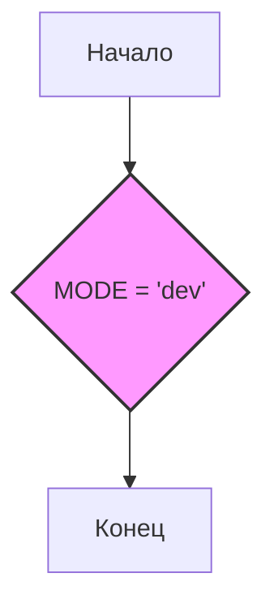

## Анализ кода `hypotez/src/endpoints/prestashop/domains/__init__.py`

### <алгоритм>

1.  **Инициализация:**
    *   Начало работы скрипта.
    *   Устанавливается переменная `MODE` в значение `'dev'`.
    *   Комментарии в начале файла и после объявления переменной `MODE` указывают на наличие документации, но отсутствуют какие-либо операторы или логика.

2.  **Конец работы скрипта:**
    *   Завершение выполнения файла, не выполняя никаких дополнительных действий.

**Примеры:**

*   При запуске скрипта в самом начале будет инициализирована переменная `MODE = 'dev'`.
*   После инициализации скрипт завершится.

### <mermaid>

**Объяснение зависимостей:**

Диаграмма показывает простую последовательность из трех шагов:
1.  **A (Начало)**: Точка входа в скрипт.
2.  **B (MODE = 'dev')**: Присвоение значения `'dev'` переменной `MODE`. Это единственная выполняемая операция в скрипте.
3.  **C (Конец)**: Завершение выполнения скрипта.

### <объяснение>

**Импорты:**
*   В данном файле нет импортов. Это является особенностью файла `__init__.py`, который часто используется для объявления пакета и инициализации его переменных, а не для импорта модулей.

**Классы:**
*   В данном файле нет классов.

**Функции:**
*   В данном файле нет функций.

**Переменные:**

*   `MODE`: Строковая переменная, установленная в значение `'dev'`. Она может быть использована для определения режима работы приложения (например, dev, test, prod) в других модулях этого пакета или других частях проекта.

**Детальное объяснение:**

Файл `__init__.py` в Python используется для того, чтобы интерпретатор рассматривал директорию как пакет. В данном случае, файл `hypotez/src/endpoints/prestashop/domains/__init__.py` делает директорию `domains` пакетом в контексте Python. Внутри этого файла:
*   Устанавливается переменная `MODE = 'dev'`, что может сигнализировать о том, что этот пакет или модуль по умолчанию будет работать в режиме разработки (development).

**Потенциальные ошибки и области для улучшения:**

*   **Отсутствие логики:** Файл содержит только определение переменной и ряд комментариев. Это означает, что его функциональность минимальна. Для более сложных пакетов в `__init__.py` могут быть дополнительные инициализации, настройки или импорты.
*   **Дублирование комментариев:**  Множество повторяющихся комментариев ("""\n\t:platform: Windows, Unix\n\t:synopsis:\n\n""") не несут никакой пользы и должны быть удалены.
*   **Отсутствие докстрингов:** Хотя и есть комментарии, которые выглядят как докстринги, они не оформлены корректно. Не хватает описания модуля в начале файла. Нужно добавить нормальный docstring для пакета.
*   **Использование `#!` на разных строках:** Строки `#! venv/Scripts/python.exe` и `#! venv/bin/python/python3.12` не несут функциональной нагрузки, так как в Python комментарии начинаются с `#`, а не `#!`.
*   **Повторное определение MODE:** Переменная `MODE = 'dev'` повторяется дважды, что является избыточным и должно быть устранено.

**Цепочка взаимосвязей с другими частями проекта:**

*   Файл является частью пакета `domains` внутри более крупной структуры `hypotez/src/endpoints/prestashop`. Он может использоваться для настройки или объявления общих переменных, которые используются в других модулях внутри `domains` или `prestashop`.
*   Значение переменной `MODE` может влиять на логику работы других модулей в проекте, например, включение режима отладки или использование определенных параметров конфигурации в зависимости от текущего окружения (dev, test, prod).

**Рекомендации по улучшению:**
1.  Удалить дублирующиеся комментарии и исправить некорректное использование `#!`.
2.  Добавить docstring в начало файла для описания пакета.
3.  Удалить повторное определение `MODE`.
4.  Рассмотреть возможность добавления других инициализаций или импортов, если они необходимы для функционирования пакета.