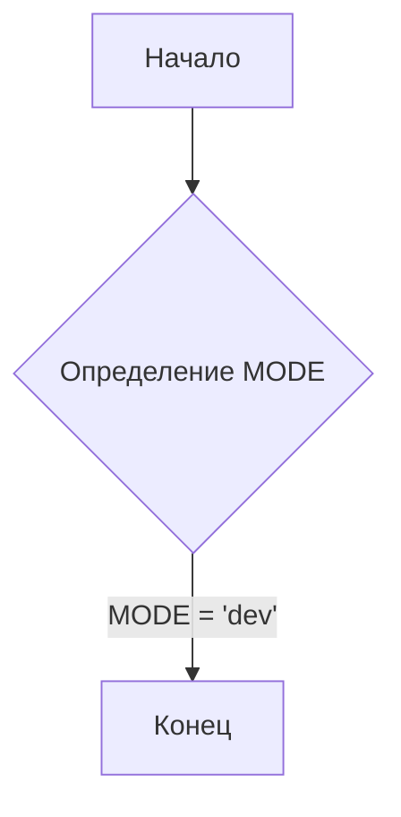
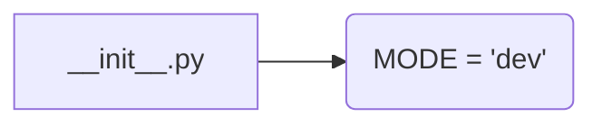

# <input code>

```python
## \file hypotez/src/endpoints/prestashop/domains/ecat_co_il/__init__.py
# -*- coding: utf-8 -*-
#! venv/Scripts/python.exe
#! venv/bin/python/python3.12

"""
.. module: src.endpoints.prestashop.domains.ecat_co_il 
	:platform: Windows, Unix
	:synopsis:

"""
MODE = 'dev'

"""
	:platform: Windows, Unix
	:synopsis:

"""


"""
	:platform: Windows, Unix
	:synopsis:

"""


"""
  :platform: Windows, Unix

"""
"""
  :platform: Windows, Unix
  :platform: Windows, Unix
  :synopsis:
"""MODE = 'dev'
  
""" module: src.endpoints.prestashop.domains.ecat_co_il """


"""    Client's websites
@namespace src: pestashop.domains
\file __init__.py
 @section libs imports:
Author(s):
  - Created by [Name] [Last Name] on 07.11.2023 .
"""
```

# <algorithm>

Этот файл `__init__.py` - это инициализирующий модуль для пакета `ecat_co_il`. Он, по всей видимости, предназначен для определения констант, импорта других модулей или создания объектов, которые будут использоваться другими модулями в этом пакете.

Поскольку файл содержит только комментарии и константу `MODE`, алгоритм работы тривиален и сводится к простому определению константы, без циклов или сложных операций.

**Блок-схема:**




# <mermaid>



# <explanation>

**Импорты:**

В данном файле отсутствуют импорты.  Это скорее всего файл-конфигурация, который определяет константу `MODE` и содержит комментарии к этому модулю, а также к другим функциям и классам, которые могут быть в следующих файлах.

**Классы:**

Нет классов.

**Функции:**

Нет функций.

**Переменные:**

`MODE`: Строковая переменная, хранящая значение 'dev'.  Скорее всего, это константа, используемая для выбора режима работы (например, 'dev', 'test', 'prod')  в дальнейшем.


**Возможные ошибки и улучшения:**

* **Неявное использование:**  Файл `__init__.py`  используется имплицитно,  но не реализует ни одной функции, следовательно, нет явных вызовов других модулей. Непонятно, как будет использована константа `MODE`. Для этого нужна дополнительная информация о контексте.
* **Недостающие комментарии:**  Не хватает комментариев, которые описывают, как и где  будет использована константа `MODE`. Непонятно, как будут использоваться другие части проекта.
* **Дополнительно:**  Стилирование кода (PEP 8) может быть улучшено. Необходимо добавление более информативных документационных строк.

**Цепочка взаимосвязей:**

Константа `MODE`  может использоваться в других модулях пакета `ecat_co_il` или даже в других частях приложения для настройки поведения. Без понимания того, как этот пакет используется в других местах, сложно дать точную картину взаимосвязей. Например, в файлах, содержащих функции для работы с API (Prestashop), `MODE` может определять режим работы с API (различные URL, ключи и т. д.).

**Вывод:**

Файл `__init__.py` в текущем состоянии представляет собой простую конфигурационную запись.  Для полного понимания функциональности необходимо проанализировать другие файлы пакета `ecat_co_il` и окружающую среду.