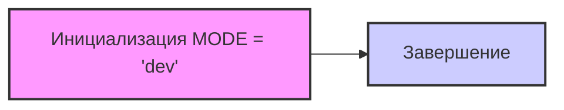

## Анализ кода `hypotez/src/endpoints/prestashop/domains/ecat_co_il/__init__.py`

### 1. <алгоритм>

1. **Инициализация**:
   - Устанавливается глобальная переменная `MODE` в значение `'dev'`. 
   - Этот шаг выполняется при загрузке модуля.
   - *Пример:* `MODE = 'dev'`

2. **Завершение**:
    - Код завершается после инициализации переменной `MODE`.  
    - Дальнейший код в этом модуле отсутствует, так что никаких дополнительных действий или возвращаемых значений нет.
    - *Пример*: Код не выполняет никаких дополнительных действий.

### 2. <mermaid>

**Объяснение диаграммы `mermaid`**:

- `A`:  Блок `Инициализация MODE = 'dev'` представляет собой начальную точку, где глобальная переменная `MODE` устанавливается в значение `'dev'`.
- `B`: Блок `Завершение` указывает на конец выполнения модуля после инициализации переменной.
- Стрелка `-->` показывает порядок выполнения операций: сначала происходит инициализация, затем завершение модуля.
- `style`  используется для стилизации блоков на диаграмме.

В данной диаграмме не используется импорт, так как код не производит никаких импортов.

### 3. <объяснение>

**Импорты**:
   - В данном коде отсутствуют какие-либо импорты. Это означает, что модуль не зависит от других модулей или библиотек.

**Классы**:
   - В данном коде нет классов. Это простой модуль, который в основном служит для определения переменных и, возможно, для маркировки некоторой функциональности в проекте.

**Функции**:
   - В данном коде нет функций.

**Переменные**:
   - `MODE`:
     - Тип: Строка (str).
     - Значение: `'dev'`.
     - Назначение: Эта переменная, вероятно, используется для обозначения текущего режима работы приложения. Значение `'dev'` обычно указывает на режим разработки. Ее использование предполагает, что в других частях проекта значение `MODE` может использоваться для определения различного поведения программы (например, вывод отладочных сообщений, использование тестовых данных и т.д.).

**Цепочка взаимосвязей с другими частями проекта:**

-  `MODE` может использоваться в других частях проекта для переключения между различными конфигурациями или режимами работы. Например, в `src/config.py` или в других частях проекта, которые импортируют этот модуль.  Значение этой переменной определяет, как приложение будет работать в разных условиях.

**Потенциальные ошибки или области для улучшения:**

1. **Отсутствие документации:** 
   - Модуль содержит множество пустых комментариев-заполнителей (например, `"""\n\t:platform: Windows, Unix\n\t:synopsis:\n\n"""`). Это не несет смысловой нагрузки и должно быть либо заполнено, либо удалено.
   -  Файл не содержит документацию о том, как и где использовать этот модуль, что может усложнить работу с ним.

2. **Неполнота функциональности:**
   -  Модуль содержит только одну переменную, что может указывать на то, что он еще не завершен или, возможно, является только частью более крупной системы.
    
3. **Не используется `__all__`**:
   - В файле `__init__.py`  не указано `__all__`. Если в этом пакете будут другие модули, то их импорт может быть неочевиден. Рекомендуется использовать `__all__` для контроля над тем, что экспортируется из пакета.

**Дополнительные замечания:**

- Код содержит shebang `#! venv/Scripts/python.exe` и `#! venv/bin/python/python3.12`, но так как это файл `__init__.py`, эти shebang не имеют смысла, и их необходимо удалить. 
- Данный `__init__.py` файл не инициирует никаких пакетов и по сути является простой переменной, доступной в текущем пространстве имен модуля.

**Рекомендации по улучшению:**
1.  Удалить пустые docstring.
2. Добавить описание для `MODE`.
3.  Указать `__all__` для управления импортом пакета.
4.  Удалить shebang.