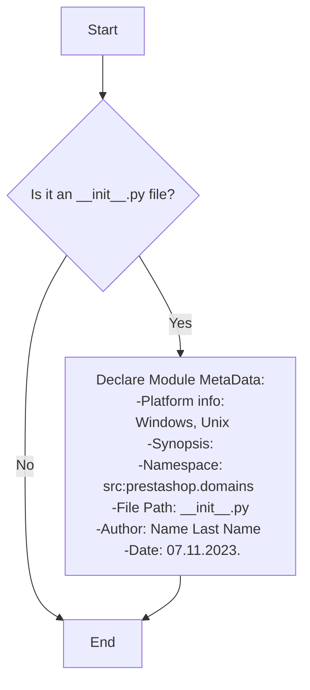
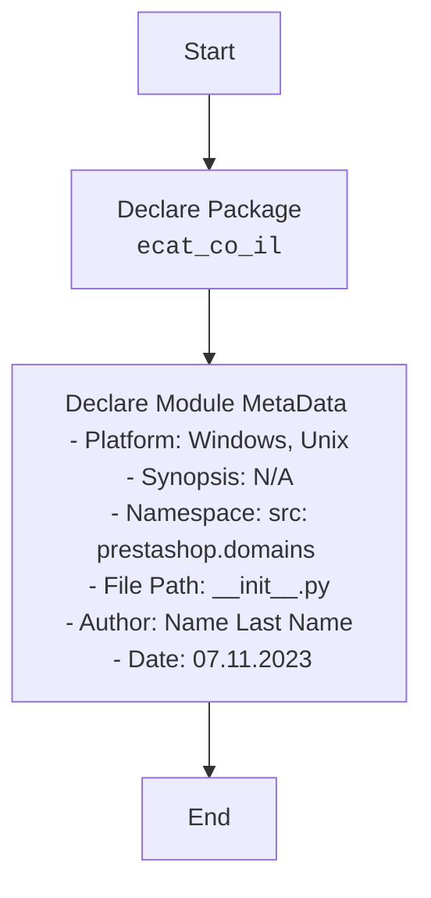

## ИНСТРУКЦИЯ:

Анализируй предоставленный код подробно и объясни его функциональность. Ответ должен включать три раздела:  

1. **<алгоритм>**: Опиши рабочий процесс в виде пошаговой блок-схемы, включая примеры для каждого логического блока, и проиллюстрируй поток данных между функциями, классами или методами.  
2. **<mermaid>**: Напиши код для диаграммы в формате `mermaid`, проанализируй и объясни все зависимости, 
    которые импортируются при создании диаграммы. 
    **ВАЖНО!** Убедитесь, что все имена переменных, используемые в диаграмме `mermaid`, 
    имеют осмысленные и описательные имена. Имена переменных вроде `A`, `B`, `C`, и т.д., не допускаются!  
    
    **Дополнительно**: Если в коде есть импорт `import header`, добавьте блок `mermaid` flowchart, объясняющий `header.py`:\
    ```mermaid
    flowchart TD
        Start --> Header[<code>header.py</code><br> Determine Project Root]
    
        Header --> import[Import Global Settings: <br><code>from src import gs</code>] 
    ```

3. **<объяснение>**: Предоставьте подробные объяснения:  
   - **Импорты**: Их назначение и взаимосвязь с другими пакетами `src.`.  
   - **Классы**: Их роль, атрибуты, методы и взаимодействие с другими компонентами проекта.  
   - **Функции**: Их аргументы, возвращаемые значения, назначение и примеры.  
   - **Переменные**: Их типы и использование.  
   - Выделите потенциальные ошибки или области для улучшения.  

Дополнительно, постройте цепочку взаимосвязей с другими частями проекта (если применимо).  

Это обеспечивает всесторонний и структурированный анализ кода.
## Формат ответа: `.md` (markdown)
**КОНЕЦ ИНСТРУКЦИИ**

## <алгоритм>

Файл `__init__.py` в Python обычно используется для того, чтобы пометить директорию как пакет Python. В данном случае, файл  `hypotez/src/endpoints/prestashop/domains/ecat_co_il/__init__.py` делает директорию `ecat_co_il` пакетом Python. 
Этот файл, предоставленный для анализа, в основном содержит документацию и не имеет исполняемого кода. Его основной функционал заключается в предоставлении метаданных о пакете и его назначении в проекте.

Блок-схема:



**Примеры:**
* **Start:** Начало интерпретации файла.
* **Is it an `__init__.py` file?**: Проверка, является ли текущий файл `__init__.py`.
* **Declare Module Metadata:** Если да, то документ отмечает метаданные, включая сведения о платформе, краткое описание, пространстве имен и авторе.
* **End:** Завершение интерпретации файла.

## <mermaid>



**Объяснение:**

1. `Start`: Начало процесса, обозначает точку входа анализа файла.
2. `PackageDeclaration`: Указывает, что директория, в которой находится этот файл (`ecat_co_il`), объявлена как пакет Python.
3. `MetaData`: Указывает на то, что в файле `__init__.py` содержится метаинформация о пакете, такая как платформа, краткое описание, пространство имен и информация об авторе. Эта метадата используется для документации и может быть использована инструментами разработчика.
4.  `End`: Окончание процесса, означает завершение обработки `__init__.py`.

## <объяснение>

**Импорты:**

В данном файле нет явных импортов, что является распространенным явлением для файлов `__init__.py`, которые часто используются для объявления пакетов и не всегда содержат исполняемый код.  В данном случае, отсутствие импортов означает, что этот файл не зависит от других модулей или пакетов. Однако, он неявно импортирует функционал  `__init__.py` для объявления текущей директории как пакет.

**Классы:**

В этом файле не определены классы.  Файл `__init__.py`  в основном предназначен для инициализации пакета, а не для определения классов.

**Функции:**

В этом файле нет определения функций.  Файлы `__init__.py` не обязательно должны содержать функции, и часто содержат только документацию и объявление пакета.

**Переменные:**

В коде нет переменных. Обычно переменные в `__init__.py` используются для инициализации пакета, но в данном примере этого не происходит.

**Дополнительные замечания:**

1. **Роль файла `__init__.py`**:  Файл `__init__.py` играет ключевую роль в структуре пакетов Python. Его наличие делает каталог `ecat_co_il` пакетом, что позволяет импортировать модули и подпакеты внутри него, используя Python’s import system.
2. **Отсутствие кода**: В предоставленном коде нет исполняемого кода, кроме комментариев и строк документации. Это типично для простых `__init__.py` файлов, которые используются для объявления пакета и предоставления метаданных.
3. **Области улучшения**: В данный момент, файл содержит только строки документации. Для более продвинутого использования пакета, можно добавить инициализационный код, например, импорт часто используемых модулей из пакета или создание переменных, которые будут доступны при импорте пакета.
4. **Связь с другими частями проекта**: Файл  является частью структуры проекта hypotez, он находится в пути `hypotez/src/endpoints/prestashop/domains/ecat_co_il/`. Это означает, что другие модули, находящиеся в более высоких уровнях директории, могут импортировать  пакет `ecat_co_il` используя  систему импорта Python (например `from src.endpoints.prestashop.domains import ecat_co_il`). Это создаёт иерархию в  проекте, позволяя структурировать и организовывать код.
5.  **Потенциальные ошибки:** В текущем виде,  ошибки маловероятны, так как файл почти пустой. Внесение изменений в  структуру директории может привести к проблемам с импортами.

В заключение, файл `__init__.py` в `ecat_co_il` представляет собой базовый элемент, который обозначает каталог как пакет Python и предоставляет основную метаинформацию, но не содержит исполняемого кода.