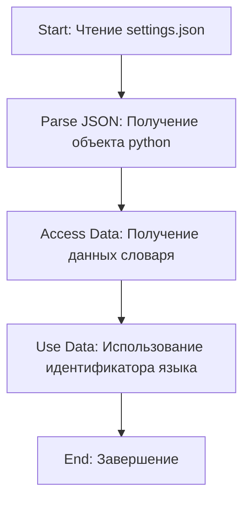

## АНАЛИЗ КОДА: `hypotez/src/endpoints/prestashop/domains/ecat_co_il/settings.json`

### 1. <алгоритм>

**Описание:**

Файл `settings.json` представляет собой JSON-объект, содержащий конфигурационные параметры. В данном случае, он определяет соответствие между языковыми кодами (например, "en", "he", "ru") и их числовыми идентификаторами. Этот файл используется, вероятно, для определения языка и его идентификатора в контексте приложения, обрабатывающего многоязычный контент.

**Блок-схема:**

1. **Старт**: Чтение файла `settings.json`.
   
   ```
   Пример: {"langs": {"en": 1, "he": 2, "ru": 3}}
   ```
2. **Парсинг JSON**: Преобразование содержимого файла в объект (словарь) Python.
    
   ```
   Пример: {'langs': {'en': 1, 'he': 2, 'ru': 3}} 
   ```
3. **Доступ к данным**: Получение доступа к данным, например, для определения идентификатора языка "he".
   
   ```
   Пример: {'langs': {'en': 1, 'he': 2, 'ru': 3}}['langs']['he'] -> 2 
   ```
4. **Использование данных**: Использование полученного идентификатора языка в приложении. Например, для выбора нужного набора строк или перевода.
   
   ```
   Пример: Использование идентификатора 2 для отображения контента на иврите.
   ```
5. **Конец**: Завершение работы с конфигурацией.

### 2. <mermaid>



**Объяснение:**

Диаграмма описывает простейший процесс использования файла `settings.json`.

-   **Start**: Начало процесса, заключающегося в чтении файла.
-   **ParseJSON**: Происходит парсинг JSON, в результате которого мы получаем объект в python.
-   **AccessData**: Далее из словаря полученного из json извлекаются необходимые данные.
-   **UseData**: Полученные данные используются в логике приложения.
-   **End**: Завершение процесса обработки файла.

### 3. <объяснение>

**Общая структура:**
   - Файл `settings.json` представляет собой словарь JSON, который содержит объект `langs`.
   - Объект `langs` содержит в себе вложенный словарь, где ключи — это языковые коды (например, "en", "he", "ru"), а значения — это числовые идентификаторы, соответствующие языкам.

**Импорты:**

   - В данном случае нет импортов, так как это файл конфигурации JSON, который используется при чтении и парсинге внутри программы на python. 

**Классы:**
   - В этом файле нет классов. Это просто файл данных.

**Функции:**
   - Данный файл не содержит функций.

**Переменные:**
   - `langs` (словарь): Содержит языковые коды как ключи и их идентификаторы как значения.
   - `"en"` (ключ, строка): Английский язык.
   - `1` (значение, число): Идентификатор английского языка.
   - `"he"` (ключ, строка): Иврит.
   - `2` (значение, число): Идентификатор иврита.
   - `"ru"` (ключ, строка): Русский язык.
   - `3` (значение, число): Идентификатор русского языка.

**Пример использования (на Python):**

```python
import json

def get_language_id(lang_code):
    with open('settings.json', 'r') as f:
        settings = json.load(f)
    return settings['langs'].get(lang_code)

english_id = get_language_id('en')
hebrew_id = get_language_id('he')
russian_id = get_language_id('ru')
print(f"English ID: {english_id}") # Output: English ID: 1
print(f"Hebrew ID: {hebrew_id}")  # Output: Hebrew ID: 2
print(f"Russian ID: {russian_id}") # Output: Russian ID: 3

```

**Потенциальные ошибки и области для улучшения:**
   - **Отсутствие обработки ошибок:** При чтении файла и доступе к данным, возможно возникновение `FileNotFoundError` или `KeyError`. В производственном коде необходимо предусмотреть обработку этих исключений.
   - **Жестко заданные пути:** Путь к файлу `settings.json` может быть задан явно. Лучше использовать относительные пути или переменные окружения.
   - **Нерасширяемость:**  Для добавления новых языков потребуется изменять этот файл. Можно рассмотреть вариант хранения настроек в базе данных или другом формате, более подходящем для динамического изменения.
   - **Отсутствие валидации:** Не проверяется корректность структуры JSON, например, что в `langs` находятся именно числа в качестве значений. Это можно сделать, используя схему json schema.

**Связи с другими частями проекта:**

- Файл `settings.json` используется для обеспечения многоязычности в приложении. Это позволяет различным частям проекта определять язык и его идентификатор для корректного отображения контента.
- Данный файл может использоваться совместно с кодом, который занимается локализацией, чтобы выбрать соответствующие строки или переводы для конкретного языка.

Этот файл используется в качестве статического хранилища данных конфигураций.