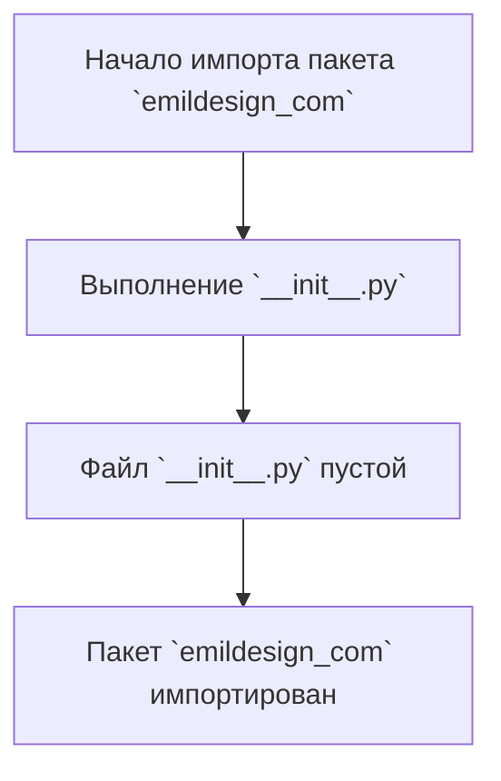

## АНАЛИЗ КОДА: `hypotez/src/endpoints/prestashop/domains/emildesign_com/__init__.py`

### 1. <алгоритм>

Файл `__init__.py` в Python является файлом инициализации пакета. В данном случае, он находится в директории `hypotez/src/endpoints/prestashop/domains/emildesign_com/`. 

**Блок-схема:**

1.  **Начало**: Запуск интерпретатора Python.
2.  **Инициализация пакета**:
    *   Файл `__init__.py` выполняется автоматически при импорте пакета `emildesign_com`.
    *   В данном случае, файл `__init__.py` **пустой** (содержит только комментарии и пустые строки), то есть никакой фактической инициализации не происходит.
3.  **Завершение**: Пакет `emildesign_com` считается импортированным и доступен для использования.

**Пример:**

```python
# Предположим, что есть файл 'test.py' в директории 'hypotez/src/endpoints/prestashop/'.
# Содержимое файла 'test.py':
from domains import emildesign_com

# Поскольку __init__.py в 'emildesign_com' пустой, импорт выполнится без проблем,
# но не произведёт никаких дополнительных действий.
print("Пакет 'emildesign_com' импортирован.")
```

### 2. <mermaid>



**Объяснение зависимостей `mermaid`:**

*   `Start`: Начальная точка, обозначающая начало процесса импорта пакета `emildesign_com`.
*   `InitFile`: Обозначает выполнение файла `__init__.py`, который находится внутри пакета `emildesign_com`.
*   `EmptyInit`: Указывает, что содержимое файла `__init__.py` пустое (не содержит никакого исполняемого кода, кроме комментариев).
*  `End`: Конечная точка, показывающая успешное завершение импорта пакета `emildesign_com`.

### 3. <объяснение>

#### Импорты:

В данном файле `__init__.py` **нет импортов**. Это означает, что пакет `emildesign_com` не зависит напрямую от других пакетов или модулей на данном уровне.

#### Классы:

В файле **нет классов**. Поскольку файл пустой, он не определяет никаких классов, атрибутов или методов.

#### Функции:

В файле **нет функций**. Аналогично классам, файл не содержит никаких функций.

#### Переменные:

В файле **нет переменных**.

#### Подробное объяснение:

Файл `__init__.py` служит для инициализации пакета в Python. Когда импортируется пакет, Python в первую очередь выполняет код, содержащийся в файле `__init__.py`. Если этого файла нет, пакет считается пустым.
В данном случае, файл `__init__.py` пустой. Это означает, что при импорте пакета `emildesign_com` ничего не произойдет. По сути, это просто маркер, что директория `emildesign_com` является пакетом Python.
Этот подход часто используется, когда нет необходимости выполнять какую-либо инициализацию при импорте пакета.

#### Потенциальные ошибки и области для улучшения:

1.  **Отсутствие документации**: Файл содержит комментарии `"""` без конкретного описания, которое можно улучшить добавив описание пакета.
2. **Отсутствие логики**: В текущем состоянии файл никак не влияет на функциональность приложения. Он существует только для того, чтобы Python распознал директорию как пакет. В будущем этот файл может быть расширен для добавления логики инициализации, например импорта подмодулей, объявления общих переменных или конфигурации.
3.  **Ненужные комментарии**: Большое количество комментариев вроде  `""" module: src.endpoints.prestashop.domains.emildesign_com """`,  `"""  :platform: Windows, Unix  :platform: Windows, Unix  :synopsis: """`, являются избыточными и могут быть удалены.

#### Цепочка взаимосвязей:

Файл `__init__.py` является частью пакета `emildesign_com`, который, в свою очередь, является частью более крупной структуры `src.endpoints.prestashop.domains`.

*   `src`: Корневой пакет проекта.
*   `src.endpoints`: Пакет, представляющий собой конечные точки приложения.
*   `src.endpoints.prestashop`: Пакет, отвечающий за взаимодействие с PrestaShop.
*   `src.endpoints.prestashop.domains`: Пакет, вероятно содержащий различные домены PrestaShop.
*   `src.endpoints.prestashop.domains.emildesign_com`: Конкретный пакет, относящийся к домену `emildesign_com`.

В целом, данный файл `__init__.py` в его текущем виде не является проблемным, но его можно улучшить, добавив конкретную документацию или логику инициализации, если это необходимо в будущем.