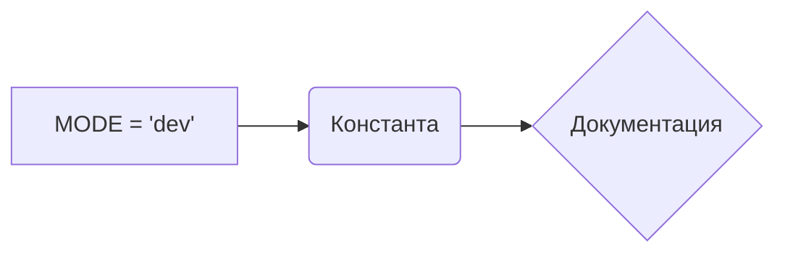

# <input code>

```python
## \file hypotez/src/endpoints/prestashop/domains/sergey_mymaster_co_il/__init__.py
# -*- coding: utf-8 -*-
#! venv/Scripts/python.exe
#! venv/bin/python/python3.12

"""
.. module: src.endpoints.prestashop.domains.sergey_mymaster_co_il 
	:platform: Windows, Unix
	:synopsis:

"""
MODE = 'dev'

"""
	:platform: Windows, Unix
	:synopsis:

"""


"""
	:platform: Windows, Unix
	:synopsis:

"""


"""
  :platform: Windows, Unix

"""
"""
  :platform: Windows, Unix
  :platform: Windows, Unix
  :synopsis:
"""MODE = 'dev'
  
""" module: src.endpoints.prestashop.domains.sergey_mymaster_co_il """


"""    Client's websites
@namespace src: pestashop.domains
\file __init__.py
 @section libs imports:
Author(s):
  - Created by [Name] [Last Name] on 07.11.2023 .
"""
```

# <algorithm>

Этот файл `__init__.py` - это инициализирующий файл для модуля `sergey_mymaster_co_il`.  Он, скорее всего, содержит конфигурацию или импорты для последующего использования в других частях проекта.  Поскольку код содержит только константу MODE и многочисленные строки документации, алгоритм работы не выполняет каких-либо вычислений или манипуляций с данными.  Алгоритм работы сводится к определению константы `MODE`, содержащей строку `'dev'`.

**Пошаговая блок-схема:**

1. **Определение константы:**  `MODE = 'dev'` -  задается значение константы.
2. **Комментарии:**  Многострочные комментарии описывают назначение и контекст модуля.  Они не влияют на алгоритм, но важны для документации.


# <mermaid>



**Объяснение диаграммы:**

* **A:**  Представляет операцию присваивания значения 'dev' переменной MODE.
* **B:** Представляет объявление константы MODE в коде.
* **C:** Описывает блок комментариев, которые документируют модуль, но не участвуют в алгоритмической работе.

**Зависимости:**

Файл `__init__.py`  зависит от базовой структуры проекта, предоставляющей доступ к `venv/Scripts` и `venv/bin/python`.  Влияние на другие части проекта будет опосредованным, через какие-либо функции или классы, которые этот модуль будет экспортировать.

# <explanation>

**Импорты:**

Нет явных импортов.  Файл содержит только определения констант и комментарии.  Это значит, что этот `__init__.py` не подключает модули из других частей проекта `src`.

**Классы:**

Нет классов.

**Функции:**

Нет функций.

**Переменные:**

`MODE`:  Строковая переменная, вероятно, определяющая режим работы (например, 'dev', 'prod').

**Возможные ошибки или области для улучшений:**

* **Непонятно назначение:** Без каких-либо функций или методов в файле `__init__.py` неясно, для чего именно предназначен этот модуль.  Важно добавить описание, как и где будет использоваться эта константа MODE. Например, в каком месте кода это значение будет  использовано для управления поведением.
* **Комментарии:**  Комментарии могут быть улучшены: добавление более детальной информации о том, как эта константа используется в коде, или зачем она определена здесь, повысило бы понимание.
* **Потенциальные изменения:**  Неясно, как эта константа `MODE` используется в других частях проекта.  Можно предположить, что она будет использоваться для выбора различных конфигураций при запуске, но это не ясно из представленного фрагмента.

**Цепочка взаимосвязей:**

Этот модуль `__init__.py` скорее всего является частью инфраструктуры системы. Он определяет конфигурационные значения, которые используются в других частях проекта.  Для того, чтобы проанализировать полную взаимосвязь, необходимо увидеть код, который использует эту константу `MODE`.