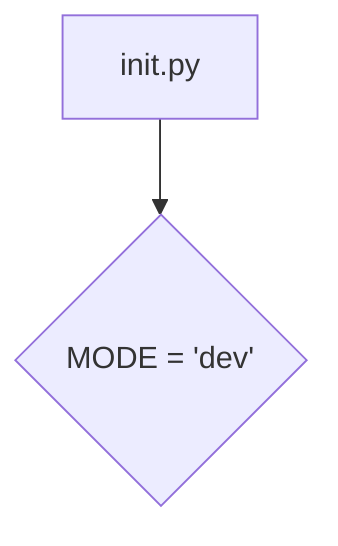

# <input code>

```python
## \file hypotez/src/endpoints/prestashop/domains/sergey_mymaster_co_il/__init__.py
# -*- coding: utf-8 -*-
#! venv/Scripts/python.exe
#! venv/bin/python/python3.12

"""
.. module: src.endpoints.prestashop.domains.sergey_mymaster_co_il 
	:platform: Windows, Unix
	:synopsis:

"""
MODE = 'dev'

"""
	:platform: Windows, Unix
	:synopsis:

"""


"""
	:platform: Windows, Unix
	:synopsis:

"""


"""
  :platform: Windows, Unix

"""
"""
  :platform: Windows, Unix
  :platform: Windows, Unix
  :synopsis:
"""MODE = 'dev'
  
""" module: src.endpoints.prestashop.domains.sergey_mymaster_co_il """


"""    Client's websites
@namespace src: pestashop.domains
\file __init__.py
 @section libs imports:
Author(s):
  - Created by [Name] [Last Name] on 07.11.2023 .
"""
```

# <algorithm>

Этот файл `__init__.py` — это инициализирующий модуль для пакета `sergey_mymaster_co_il`.  Он, по сути, не содержит логики выполнения.  Он определяет константу `MODE` со значением 'dev'. В этом контексте, `MODE` вероятно указывает на режим работы (например, 'dev' — режим разработки, 'prod' — режим производства).  Далее идут многочисленные строковые комментарии, которые, вероятно, использовались при документации или генерации документации, но не имеют прямого влияния на исполнение.



# <mermaid>


# <explanation>

* **Импорты**:  В этом файле отсутствуют импорты.  Это инициализирующий модуль, поэтому импорты обычно располагаются в самих модулях, которые будут использоваться этим пакетом.  Например, модули, содержащие классы, обрабатывающие запросы, или дополнительные функции, относящиеся к сайту `sergey_mymaster_co_il`.

* **Классы**: Нет ни одного класса.

* **Функции**: Нет ни одной функции.

* **Переменные**: Единственная переменная — `MODE`, которая определяет строковое значение 'dev'.  Предполагается, что эта переменная будет использоваться в других частях проекта для условного выполнения кода в зависимости от режима работы.


* **Возможные ошибки и улучшения**:

    * **Недостаток логики**: Файл `__init__.py` фактически пустой.  Это может быть проблематично, если ожидается, что он будет содержать важные инициализации, например, импорт необходимых модулей или регистрацию обработчиков.
    * **Неиспользуемые комментарии**:  Многочисленные строки комментариев не приносят никакой практической пользы, если не обрабатываются инструментами автоматической генерации документации.
    * **Неясная цель**:  Нет ясного назначения файла без функций или классов.


* **Взаимосвязь с другими частями проекта**: Этот файл, вероятно, является частью более крупного проекта, связанного с PrestaShop и управлением веб-сайтами.  Его взаимодействие будет происходить через вызовы функций из других модулей, которые импортированы в других модулях. Обычно инициализирующий файл содержит переменные окружения, конфигурации, или импорты необходимых библиотек.   Следующие шаги разработки будут включать импорт модулей, разработку классов и функций, которые будут использоваться для обработки запросов, взаимодействия с PrestaShop API, и выполнения необходимых бизнес-логик.


**В заключение**: Этот файл представляет собой заготовку для будущего модуля, и его функциональность пока очень ограничена.  Дополнительные детали нужны для более глубокого анализа.