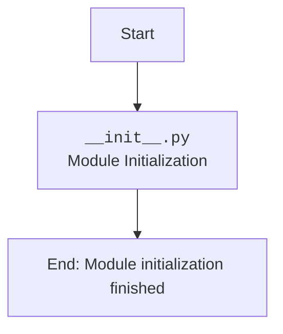

## Анализ кода `hypotez/src/endpoints/prestashop/domains/sergey_mymaster_co_il/__init__.py`

### <алгоритм>

1.  **Начало**: Файл `__init__.py` выполняется при импорте пакета `src.endpoints.prestashop.domains.sergey_mymaster_co_il`.

2.  **Комментарии и Docstring**: Файл содержит комментарии и docstring, описывающие назначение модуля.

3.  **Импорт**: Файл не содержит явных операторов `import`. Это означает, что он не импортирует какие-либо другие модули или пакеты.

4. **Конец**: Так как код не содержит никакого выполняемого кода кроме комментариев, то на этом выполнение заканчивается.

### <mermaid>

**Объяснение диаграммы:**

-   **`Start`**: Начало выполнения файла `__init__.py`.
-   **`ModuleInit`**:  Файл `__init__.py` инициализирует модуль `src.endpoints.prestashop.domains.sergey_mymaster_co_il`. В данном случае, основная функция - предоставление информации о модуле через docstring и комментарии. Он не выполняет никаких действий, требующих дополнительных зависимостей.
-   **`End`**: Завершение выполнения файла `__init__.py`.
    
### <объяснение>

**Импорты:**

-   В данном файле отсутствуют импорты каких-либо модулей или пакетов. Это значит, что модуль `src.endpoints.prestashop.domains.sergey_mymaster_co_il` на данном этапе не зависит от каких-либо внешних библиотек или внутренних модулей.

**Классы:**

-   В данном файле не определены классы.

**Функции:**

-   В данном файле не определены функции.

**Переменные:**

-   В данном файле не используются переменные, кроме задокументированных строк внутри docstring.

**Детальное объяснение:**

-   `__init__.py` — это специальный файл в Python, который указывает, что каталог должен рассматриваться как пакет.
-   Файл `__init__.py` может быть пустым, содержать код инициализации для пакета или другие переменные.
-   В данном случае файл содержит только комментарии и docstring, описывающие назначение пакета.
-   Основная цель этого файла — сделать директорию `sergey_mymaster_co_il` пакетом, который может быть импортирован в другие части проекта.
-   В этом пакете будут храниться модули, специфичные для домена `sergey_mymaster.co.il` в рамках интеграции с PrestaShop.

**Потенциальные ошибки и области для улучшения:**

-   В текущей версии файл не выполняет никакой реальной работы. Он лишь заявляет, что данный каталог является пакетом.
-   В дальнейшем, по мере развития проекта, в этом файле могут быть добавлены импорты и код для инициализации специфичных для домена модулей.
-   Необходимо добавить модули с логикой, если это предполагается в будущем.

**Взаимосвязь с другими частями проекта:**

-   Данный пакет `src.endpoints.prestashop.domains.sergey_mymaster_co_il` является частью более крупной структуры `src.endpoints.prestashop.domains`.
-   Он предоставляет пространство имен (namespace) для кода, специфичного для домена `sergey_mymaster.co.il`.
-   Этот пакет будет использоваться, когда потребуется специфическая логика для этого домена в рамках интеграции с PrestaShop.