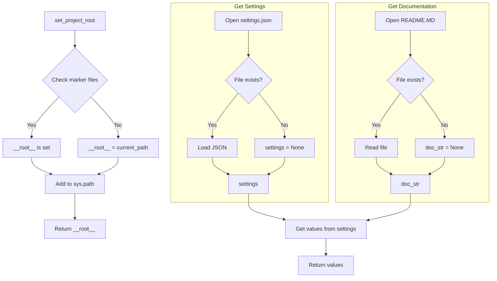

# <input code>

```python
## \file hypotez/src/logger/header.py
# -*- coding: utf-8 -*-
#! venv/Scripts/python.exe
#! venv/bin/python/python3.12

"""
module: src.logger 
	:platform: Windows, Unix
	:synopsis: Модуль определяющий корневой путь к проекту. Все импорты строятся относительно этого пути.
    :TODO: В дальнейшем перенести в системную переменную"""
MODE = 'dev'

import sys
import json
from packaging.version import Version

from pathlib import Path
def set_project_root(marker_files=('pyproject.toml', 'requirements.txt', '.git')) -> Path:
    """
    Finds the root directory of the project starting from the current file's directory,
    searching upwards and stopping at the first directory containing any of the marker files.

    Args:
        marker_files (tuple): Filenames or directory names to identify the project root.
    
    Returns:
        Path: Path to the root directory if found, otherwise the directory where the script is located.
    """
    __root__:Path
    current_path:Path = Path(__file__).resolve().parent
    __root__ = current_path
    for parent in [current_path] + list(current_path.parents):
        if any((parent / marker).exists() for marker in marker_files):
            __root__ = parent
            break
    if __root__ not in sys.path:
        sys.path.insert(0, str(__root__))
    return __root__


# Get the root directory of the project
__root__ = set_project_root()
"""__root__ (Path): Path to the root directory of the project"""

from src import gs

settings:dict = None
try:
    with open(gs.path.root / 'src' /  'settings.json', 'r') as settings_file:
        settings = json.load(settings_file)
except (FileNotFoundError, json.JSONDecodeError):
    ...

doc_str:str = None
try:
    with open(gs.path.root / 'src' /  'README.MD', 'r') as settings_file:
        doc_str = settings_file.read()
except (FileNotFoundError, json.JSONDecodeError):
    ...


__project_name__ = settings.get("project_name", 'hypotez') if settings  else 'hypotez'
__version__: str = settings.get("version", '')  if settings  else ''
__doc__: str = doc_str if doc_str else ''
__details__: str = ''
__author__: str = settings.get("author", '')  if settings  else ''
__copyright__: str = settings.get("copyrihgnt", '')  if settings  else ''
__cofee__: str = settings.get("cofee", "Treat the developer to a cup of coffee for boosting enthusiasm in development: https://boosty.to/hypo69")  if settings  else "Treat the developer to a cup of coffee for boosting enthusiasm in development: https://boosty.to/hypo69"
```

# <algorithm>

**Шаг 1:** Функция `set_project_root`:
   - Принимает кортеж `marker_files` с именами файлов, которые указывают на корень проекта.
   - Начинает поиск корня проекта с текущего файла (`__file__`).
   - Итерируется по родительским каталогам текущего файла.
   - Проверяет, существует ли какой-либо из файлов `marker_files` в текущем родительском каталоге.
   - Если такой файл найден, то устанавливает `__root__` в значение родительской директории и прерывает цикл.
   - Если корень не найден, возвращает директорию текущего файла.
   - Добавляет корневую директорию в `sys.path` для корректного импорта модулей из других директорий.
   - Возвращает `__root__`.
   
**Пример:** Если `__file__` находится в `/home/user/project/hypotez/src/logger/header.py`, и `pyproject.toml` существует в `/home/user/project`, `__root__` будет `/home/user/project`.


**Шаг 2:** Получение корневого каталога:
   - Вызывается функция `set_project_root()`.
   - Результат присваивается переменной `__root__`.

**Шаг 3:** Чтение настроек:
    - Используется модуль `gs` для доступа к корневой директории.
    - Открывается файл `settings.json` в корневом каталоге проекта.
    - Если файл существует и содержит корректный JSON, его содержимое загружается в `settings`.
    - Если файл не существует или содержимое не валидный JSON, то переменная `settings` остается `None`.
    
**Шаг 4:** Чтение документации:
    - Аналогично шагу 3, но открывается файл `README.MD` для чтения документации.

**Шаг 5:** Получение информации из настроек:
    - Получаются значения из `settings` по ключам `project_name`, `version`, `author`, `copyright`, `cofee` с значениями по умолчанию.
    - Значения сохраняются в соответствующие переменные.

**Шаг 6:** Возврат значений:
    - Возвращаются переменные `__project_name__`, `__version__`, `__doc__`, `__details__`, `__author__`, `__copyright__`, `__cofee__`.

# <mermaid>



# <explanation>

**Импорты:**

- `sys`: Модуль для взаимодействия с системными переменными, в частности, для добавления корневого каталога в `sys.path`.
- `json`: Модуль для работы с JSON-файлами (чтения и записи).
- `packaging.version`: Модуль для работы с версиями программного обеспечения.
- `pathlib`: Модуль для работы с путями к файлам и директориям (преимущественно `Path`).
- `gs`:  Вероятно, пользовательский модуль, содержащий информацию о пути к корневой директории проекта (`gs.path.root`).  Необходимо посмотреть код `gs` для более точного анализа.


**Классы:**

Нет классов в данном фрагменте кода.


**Функции:**

- `set_project_root(marker_files)`: Находит корневой каталог проекта, начиная с текущего файла.  Аргумент `marker_files` позволяет указать файлы или директории, которые должны присутствовать в корневом каталоге.  Возвращает `Path` к корневой директории.


**Переменные:**

- `__root__`:  `Path`-объект, содержащий путь к корневому каталогу проекта.
- `settings`: `dict`, содержащий настройки проекта, загруженные из файла `settings.json`.  Инициализируется как `None` и заполняется только если файл успешно прочитан и содержит валидный JSON.
- `doc_str`: `str`, содержащий контент файла `README.MD`.
- `__project_name__`, `__version__`, `__doc__`, `__details__`, `__author__`, `__copyright__`, `__cofee__`: Строковые переменные, содержащие значения, полученные из настроек.


**Возможные ошибки и улучшения:**

- **Обработка ошибок:**  Используются `try...except` блоки для обработки ошибок `FileNotFoundError` и `json.JSONDecodeError`, но эти блоки могли бы быть более ясными. Возможно, стоит добавить логгирование (если используете систему логгирования) или более подробное сообщение об ошибке.
- **Валидация данных:** Проверка на корректность данных в `settings.json` (например, проверка типов и наличия необходимых полей).
- **Глобальные переменные:** Использование глобальных переменных `__root__`, `__project_name__`, и т.д. может быть избыточным. Рассмотрите возможность их обертки в класс.
- **Модуль gs:** Необходимо более глубокое понимание структуры проекта.  Без понимания `gs` трудно оценить весь контекст и потенциальные зависимости.


**Взаимосвязи с другими частями проекта:**

Код явно использует модуль `gs`, который вероятно отвечает за работу с путями и другими ресурсами проекта.  Без доступа к коду `gs` невозможно полностью определить все взаимосвязи.