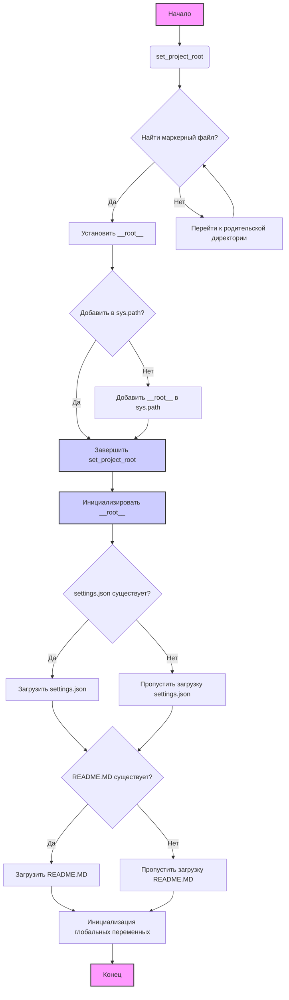

## Анализ кода `hypotez/src/logger/header.py`

### <алгоритм>

1.  **`set_project_root(marker_files)`**:
    *   Начало: Получает путь к текущему файлу и его родительскую директорию.
    *   Пример: Если текущий файл находится в `/home/user/hypotez/src/logger/header.py`, то `current_path` будет `/home/user/hypotez/src/logger`.
    *   Итерация по родительским директориям: Перебирает текущую директорию и все её родительские директории.
    *   Пример: Для `/home/user/hypotez/src/logger` родительские директории будут: `/home/user/hypotez/src/logger`, `/home/user/hypotez/src`, `/home/user/hypotez`, `/home/user`, `/home`, `/`.
    *   Проверка наличия маркерных файлов: Для каждой директории проверяет наличие любого файла из `marker_files` (`pyproject.toml`, `requirements.txt`, `.git`).
    *   Пример: Если файл `pyproject.toml` найден в `/home/user/hypotez`, то эта директория будет установлена как корневая.
    *   Установка корневой директории: Если маркерный файл найден, то текущая директория становится корневой, и цикл завершается.
    *   Добавление корневой директории в `sys.path`: Если корневая директория еще не добавлена в пути поиска модулей, то добавляется.
    *   Возврат: Возвращает путь к корневой директории.
2.  **Инициализация `__root__`**:
    *   Вызов `set_project_root()`: Вызывает функцию для определения корневой директории проекта.
    *   Пример: Если корневой директорией является `/home/user/hypotez`, то `__root__` будет `/home/user/hypotez`.
3.  **Загрузка `settings.json`**:
    *   Попытка чтения файла `settings.json`: Пытается открыть и прочитать файл `/home/user/hypotez/src/settings.json` (путь формируется на основе `__root__`).
    *   Пример: Если файл найден и является корректным JSON, то его содержимое загружается в переменную `settings` как словарь.
    *   Обработка ошибок: Если файл не найден или JSON не корректен, то ошибки игнорируются.
4.  **Загрузка `README.MD`**:
    *   Попытка чтения файла `README.MD`: Пытается открыть и прочитать файл `/home/user/hypotez/src/README.MD` (путь формируется на основе `__root__`).
    *   Пример: Если файл найден, то его содержимое загружается в переменную `doc_str` как строку.
    *   Обработка ошибок: Если файл не найден или ошибка чтения, то ошибки игнорируются.
5.  **Инициализация глобальных переменных**:
    *   `__project_name__`: Получает значение из `settings.get("project_name", 'hypotez')`, если `settings` загружен, в противном случае устанавливается значение по умолчанию `'hypotez'`.
    *   `__version__`: Получает значение из `settings.get("version", '')`, если `settings` загружен, в противном случае устанавливается значение по умолчанию `''`.
    *   `__doc__`: Присваивает значение `doc_str`, если он не `None`, иначе `''`.
    *   `__details__`: Устанавливается в `''`.
    *   `__author__`: Получает значение из `settings.get("author", '')`, если `settings` загружен, в противном случае устанавливается значение по умолчанию `''`.
    *   `__copyright__`: Получает значение из `settings.get("copyrihgnt", '')`, если `settings` загружен, в противном случае устанавливается значение по умолчанию `''`.
    *   `__cofee__`: Получает значение из `settings.get("cofee", "...")`, если `settings` загружен, в противном случае устанавливается значение по умолчанию.

### <mermaid>

**Описание зависимостей `mermaid`:**

*   **`A` (Начало)**: Начальная точка выполнения скрипта.
*   **`B` (`set_project_root`)**: Функция для определения корневой директории проекта.
*   **`C` (Найти маркерный файл?)**: Условный блок, проверяющий наличие маркерных файлов в текущей директории.
*   **`D` (Установить `__root__`)**: Устанавливает корневую директорию.
*   **`E` (Перейти к родительской директории)**: Переход к родительской директории для поиска маркерных файлов.
*    **`F` (Добавить в `sys.path`?)**: Проверяет, нужно ли добавить корневую директорию в список путей поиска модулей.
*   **`G` (Добавить `__root__` в `sys.path`)**: Добавляет корневую директорию в `sys.path`.
*   **`H` (Завершить `set_project_root`)**: Завершает выполнение функции `set_project_root`.
*    **`I` (Инициализировать `__root__`)**: Присваивает результат вызова `set_project_root` переменной `__root__`.
*   **`J` (`settings.json` существует?)**: Проверяет, существует ли файл `settings.json`.
*   **`K` (Загрузить `settings.json`)**: Загружает данные из `settings.json` в переменную `settings`.
*   **`L` (Пропустить загрузку `settings.json`)**: Пропускает загрузку `settings.json` в случае ошибки.
*   **`M` (`README.MD` существует?)**: Проверяет, существует ли файл `README.MD`.
*   **`N` (Загрузить `README.MD`)**: Загружает данные из `README.MD` в переменную `doc_str`.
*   **`O` (Пропустить загрузку `README.MD`)**: Пропускает загрузку `README.MD` в случае ошибки.
*   **`P` (Инициализация глобальных переменных)**: Инициализирует глобальные переменные с использованием данных из `settings` и `doc_str`.
*   **`Q` (Конец)**: Конечная точка выполнения скрипта.

### <объяснение>

**Импорты:**

*   `sys`:  Модуль `sys` используется для взаимодействия с интерпретатором Python. В данном коде используется для добавления пути к корневой директории проекта в `sys.path`, чтобы модули проекта можно было импортировать корректно.
*   `json`: Модуль `json` используется для работы с JSON-данными. В данном коде используется для загрузки конфигурационных данных из файла `settings.json`.
*   `packaging.version.Version`: Из модуля `packaging.version` импортируется класс `Version`, который используется для управления версиями, однако в этом файле не используется, что является излишним импортом.
*   `pathlib.Path`:  Класс `Path` из модуля `pathlib` используется для представления путей к файлам и директориям в виде объектов. Он предоставляет удобные методы для манипуляции путями.

**Классы:**

В данном коде классы не используются.

**Функции:**

*   **`set_project_root(marker_files: tuple) -> Path`**:
    *   **Аргументы**:
        *   `marker_files` (tuple): Кортеж с именами файлов или директорий, которые используются для определения корневой директории проекта. По умолчанию `('pyproject.toml', 'requirements.txt', '.git')`.
    *   **Возвращаемое значение**:
        *   `Path`: Объект `Path`, представляющий корневую директорию проекта.
    *   **Назначение**: Функция определяет корневую директорию проекта путем поиска родительских директорий, пока не найдет директорию, содержащую один из маркерных файлов.
    *  **Примеры**:
         * Если маркерные файлы `pyproject.toml` или `requirements.txt` находятся в корне проекта `/home/user/project`, то функция вернет `Path('/home/user/project')`
         * Если ни один из маркерных файлов не найден, то функция вернет путь до директории текущего исполняемого файла.
*   **Переменные:**
    *   `MODE` (str): Определяет режим работы программы. Сейчас установлен в `'dev'`.
    *   `__root__` (Path):  Путь к корневой директории проекта, определяется функцией `set_project_root`.
    *    `settings` (dict): Словарь, загруженный из `settings.json`, если файл существует и содержит корректные JSON-данные.
    *    `doc_str` (str): Содержимое файла `README.MD`, если файл существует.
    *   `__project_name__` (str):  Имя проекта, полученное из `settings.json` или значение по умолчанию `'hypotez'`.
    *    `__version__` (str): Версия проекта, полученная из `settings.json` или по умолчанию `''`.
    *   `__doc__` (str): Содержимое `README.MD`, или по умолчанию `''`.
    *    `__details__` (str): Дополнительная информация о проекте. По умолчанию `''`.
    *   `__author__` (str): Имя автора проекта, полученное из `settings.json` или значение по умолчанию `''`.
    *    `__copyright__` (str): Информация о копирайте, полученная из `settings.json` или значение по умолчанию `''`.
    *   `__cofee__` (str): Сообщение с предложением поддержать разработчика, полученное из `settings.json` или значение по умолчанию.

**Цепочка взаимосвязей с другими частями проекта:**

1.  **`src.gs`**: Этот модуль импортируется для доступа к переменной `gs.path.root`, которая, предположительно, является корневым путем проекта, используемым для доступа к файлам `settings.json` и `README.MD`. Этот модуль, вероятно, тоже как-то связан с `header.py`, что может привести к циклической зависимости, однако в данном примере этого не происходит.
2. **`src.settings.json`**: Используется для загрузки основных параметров проекта
3. **`src.README.MD`**:  Используется для загрузки документации проекта.

**Потенциальные ошибки и области для улучшения:**

*   **Отсутствие обработки исключений при обращении к settings**: Если `settings.json` отсутствует, то все последующие обращения к `settings.get(...)` будут возвращать значения по умолчанию. Это может привести к непредвиденному поведению, если какие-то из этих параметров обязательны.
*   **Излишний импорт**: Импорт `packaging.version.Version` не используется в коде, его можно удалить.
*   **Смешивание логики инициализации с импортами**: Логика определения `__root__` и загрузки настроек выполняется в глобальной области видимости. Возможно, стоит перенести эту логику в отдельную функцию, чтобы сделать код более модульным.
*   **Жестко заданный путь к настройкам и документации**: Путь к `settings.json` и `README.MD` жестко задан как `src/`. Возможно, стоит сделать эти пути более гибкими, например, через переменные окружения или другие настройки.
* **Возможная циклическая зависимость**:  Импорт `src.gs` может вызвать циклическую зависимость, если `src.gs` импортирует `header.py`.

**Дополнительные замечания:**

*   Код выполняет важную роль - определение корневой директории проекта, что является важным для модульности и переносимости.
*   Использование маркерных файлов для определения корня проекта является хорошей практикой.
*   Чтение конфигурации и документации в начале работы проекта - это обычный подход для инициализации.