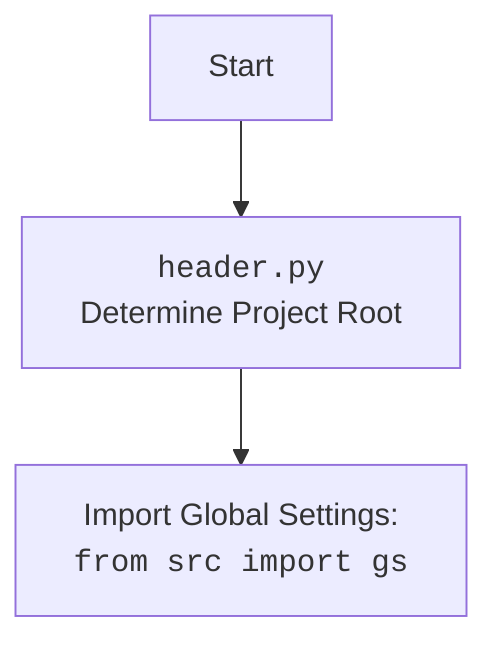

## Анализ кода `hypotez/src/endpoints/prestashop/header.py`

### <алгоритм>

1.  **Инициализация**:
    *   Устанавливается переменная `MODE` в значение `'dev'`.
    *   Импортируются модули `sys`, `json`, `Version` из `packaging.version`, `Path` из `pathlib`.
    *   Объявляется функция `set_project_root` для определения корневой директории проекта.
    
2.  **Функция `set_project_root`**:
    *   Принимает кортеж `marker_files` (по умолчанию `('__root__')`) для поиска корневой директории.
    *   Определяет текущую директорию файла как `current_path`.
    *   Инициализирует `__root__` как `current_path`.
    *   Итерируется по родительским директориям `current_path`.
        *   Проверяет, существует ли какой-либо из `marker_files` в текущей родительской директории.
        *   Если маркер найден, обновляет `__root__` и прерывает цикл.
    *   Если `__root__` не в `sys.path`, добавляет его в начало.
    *   Возвращает `__root__` как `Path`.
    *   *Пример*: Если текущий файл находится в `hypotez/src/endpoints/prestashop/header.py`, и файл `__root__` находится в `hypotez`, то `__root__` будет `hypotez`.

3.  **Определение корневой директории**:
    *   Вызывает `set_project_root()` и сохраняет результат в `__root__`.
    
4.  **Загрузка настроек**:
    *   Импортируется `gs` из `src`.
    *   Пытается открыть и загрузить `settings.json` из `src` в корневой директории.
    *   Если файл не найден или произошла ошибка JSON, перехватывается исключение и `settings` остается `None`.
    *   *Пример*: Если `settings.json` существует и содержит `{"project_name": "hypotez", "version": "1.0.0"}`, то `settings` будет соответствующим словарем.
    
5. **Загрузка README.MD:**
    * Пытается открыть и загрузить `README.MD` из `src` в корневой директории.
    * Если файл не найден или произошла ошибка JSON, перехватывается исключение и `doc_str` остается `None`.

6. **Инициализация переменных**:
    *   Если `settings` загружены, `__project_name__`, `__version__`, `__author__`, `__copyright__` берутся из словаря `settings` с дефолтами. Если `settings` не загружены, переменным присваиваются значения по умолчанию.
    *   `__doc__` присваивается значение `doc_str`, если `doc_str` не равен `None`, иначе `__doc__` равен `''`
    *   `__details__` устанавливается в `''`.
    *   `__cofee__` устанавливается из словаря `settings`, иначе используется строка по умолчанию.
    *    *Пример*: Если `settings` содержит `{"project_name": "hypotez_new", "version": "1.1.0"}`, то `__project_name__` будет `hypotez_new`, а `__version__` будет `1.1.0`.

### <mermaid>

```mermaid
flowchart TD
    Start --> SetProjectRoot[set_project_root(marker_files: tuple) <br> Find Project Root]
    
    SetProjectRoot --> InitCurrentPath[current_path = Path(__file__).resolve().parent]
    InitCurrentPath --> InitRoot[__root__ = current_path]
    InitRoot --> LoopParents[for parent in [current_path] + list(current_path.parents)]
    LoopParents --> CheckMarker[if any((parent / marker).exists() for marker in marker_files)]
    CheckMarker -- Yes --> UpdateRoot[__root__ = parent]
    UpdateRoot --> BreakLoop[break]
    CheckMarker -- No --> LoopParents
    LoopParents --> CheckRootInSysPath[if __root__ not in sys.path]
    CheckRootInSysPath -- Yes --> InsertRootInSysPath[sys.path.insert(0, str(__root__))]
    InsertRootInSysPath --> ReturnRoot[return __root__]
    CheckRootInSysPath -- No --> ReturnRoot
    
    ReturnRoot --> SetGlobalRoot[__root__ = set_project_root()]
    
    SetGlobalRoot --> ImportGS[import gs from src]
    
    ImportGS --> LoadSettings[Load settings.json]
    LoadSettings --> OpenSettingsFile[open(gs.path.root / 'src' / 'settings.json', 'r')]
    OpenSettingsFile --> ReadSettingsFile[settings = json.load(settings_file)]
    ReadSettingsFile --> HandleSettingsError[Exception: FileNotFoundError, json.JSONDecodeError]
    HandleSettingsError -- SettingsError --> SettingsNone[settings = None]
    ReadSettingsFile -- No Error --> LoadDoc[Load README.MD]
    SettingsNone --> LoadDoc
    
    LoadDoc --> OpenDocFile[open(gs.path.root / 'src' /  'README.MD', 'r')]
    OpenDocFile --> ReadDocFile[doc_str = settings_file.read()]
    ReadDocFile --> HandleDocError[Exception: FileNotFoundError, json.JSONDecodeError]
    HandleDocError -- DocError --> DocNone[doc_str = None]
    ReadDocFile -- No Error --> SetProjectVariables[Set project variables]
    DocNone --> SetProjectVariables
    
    SetProjectVariables --> SetProjectName[__project_name__ = settings.get("project_name", 'hypotez') if settings else 'hypotez']
    SetProjectName --> SetVersion[__version__ = settings.get("version", '') if settings else '']
    SetVersion --> SetDoc[__doc__ = doc_str if doc_str else '']
    SetDoc --> SetDetails[__details__ = '']
    SetDetails --> SetAuthor[__author__ = settings.get("author", '') if settings else '']
    SetAuthor --> SetCopyright[__copyright__ = settings.get("copyrihgnt", '') if settings else '']
    SetCopyright --> SetCofee[__cofee__ = settings.get("cofee", "...") if settings else "..."]
    SetCofee --> End
    
    
    
```



### <объяснение>

**Импорты:**

*   **`sys`**:  Используется для работы с системными переменными и путями, в частности для добавления корневой директории проекта в `sys.path`, что позволяет импортировать модули из других частей проекта.
*   **`json`**: Используется для загрузки данных из файла `settings.json` в формате JSON в словарь Python.
*   **`packaging.version.Version`**:  Этот импорт, хотя и присутствует, не используется в коде. Возможно, он был задуман для дальнейшей работы с версиями проекта.
*   **`pathlib.Path`**: Используется для представления путей к файлам и директориям в виде объектов, что упрощает работу с файловой системой.

**Функция `set_project_root`:**

*   **Аргументы**:
    *   `marker_files` (tuple, optional): Кортеж имен файлов или директорий, которые используются для определения корневой директории проекта. По умолчанию ('`__root__`').
*   **Возвращаемое значение**:
    *   `Path`: Объект `pathlib.Path`, представляющий корневую директорию проекта.
*   **Назначение**: Функция динамически определяет корневую директорию проекта, перемещаясь вверх по структуре каталогов от текущего файла, пока не найдет маркерный файл. Это позволяет запускать скрипты из любой точки проекта, не меняя пути импорта.
*  **Примеры**:
    *   Если файл `__root__` находится в `hypotez`, то при вызове из `hypotez/src/endpoints/prestashop/header.py` функция вернет `hypotez`.
    *   Если файла `__root__` не будет найдено, то функция вернет путь до папки, в которой находится сам файл.

**Переменные:**

*   `MODE`: Переменная, которая устанавливает режим работы приложения. Значение по умолчанию `'dev'`.
*   `__root__`: Глобальная переменная типа `Path`, которая хранит путь к корневой директории проекта. Она устанавливается путем вызова функции `set_project_root()`.
*    `settings`: Словарь, содержащий настройки проекта, загруженные из файла `settings.json`. Может быть `None`, если файл не найден или не удалось его прочитать.
*  `doc_str`: Строка, содержащая текст из файла `README.MD`. Может быть `None`, если файл не найден или не удалось его прочитать.
*   `__project_name__`, `__version__`, `__details__`, `__author__`, `__copyright__`, `__cofee__`: Глобальные переменные, содержащие информацию о проекте. Они либо берутся из `settings`, либо устанавливаются в значения по умолчанию.
    *   `__project_name__`: Строка, имя проекта.
    *   `__version__`: Строка, версия проекта.
    *   `__doc__`: Строка, содержимое `README.MD`.
    *   `__details__`: Строка, дополнительные сведения о проекте. По умолчанию пустая строка.
    *   `__author__`: Строка, автор проекта.
    *   `__copyright__`: Строка, авторские права.
    *   `__cofee__`: Строка, сообщение с просьбой угостить разработчика кофе.
**Классы:**

*  **Нет классов**

**Взаимосвязь с другими частями проекта:**

*   **`src.gs`**: Импорт `from src import gs` подразумевает, что модуль `gs` (global settings) содержит глобальные настройки, включая путь к корневой директории, и используется для доступа к файлам настроек проекта.

**Потенциальные ошибки и области для улучшения:**

*   **Обработка ошибок**:  Обработка исключений при загрузке `settings.json` и `README.MD` является базовой. Возможно, стоит добавить логирование ошибок или более детальную обработку в зависимости от ситуации.
*   **`packaging.version.Version`**: Импорт не используется.
*   **`settings`**: Структура настроек может быть более сложной, и в этом случае можно было бы использовать классы для представления настроек.
*   **Константа `MODE`**:  Константа MODE должна быть определена до объявления `__root__`.

**Цепочка взаимосвязей с другими частями проекта:**

1.  `header.py` определяет корневую директорию проекта и добавляет ее в `sys.path`, позволяя остальным модулям проекта импортироваться.
2.  `header.py` использует `src.gs` для доступа к глобальным настройкам.
3.  `header.py` загружает настройки из `settings.json` и `README.MD` которые могут использоваться в других частях проекта.
4.  `header.py` устанавливает метаданные проекта, такие как название и версию, которые также могут быть использованы в других модулях.