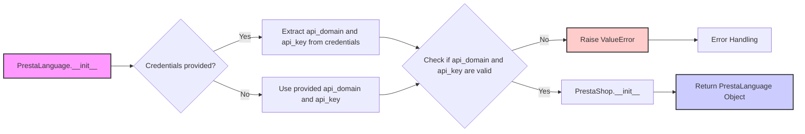

## <алгоритм>

1.  **Инициализация `PrestaLanguage`**:
    *   При создании экземпляра `PrestaLanguage` вызывается конструктор `__init__`.
    *   Конструктор принимает `credentials` (словарь или `SimpleNamespace` с `api_domain` и `api_key`), `api_domain`, `api_key` и произвольные `*args`, `**kwargs`.
    *   Если `credentials` предоставлены, он пытается извлечь `api_domain` и `api_key` из `credentials`, используя их как значения по умолчанию, если они не были предоставлены напрямую.
    *   Проверяется наличие `api_domain` и `api_key`. Если они отсутствуют, выбрасывается исключение `ValueError`.
    *   Вызывается конструктор родительского класса `PrestaShop` с передачей `api_domain`, `api_key`, `*args` и `**kwargs` для завершения инициализации.

    ```python
    # Пример инициализации с credentials
    credentials = SimpleNamespace(api_domain="example.com", api_key="test_key")
    language_obj = PrestaLanguage(credentials=credentials)
    
    # Пример инициализации с api_domain и api_key
    language_obj = PrestaLanguage(api_domain="example.com", api_key="test_key")
    
    # Пример неверной инициализации
    try:
        language_obj = PrestaLanguage()
    except ValueError as e:
        print(f"Ошибка: {e}") # Ошибка: Необходимы оба параметра: api_domain и api_key.
    ```

## <mermaid>



**Зависимости в `mermaid` диаграмме:**

*   `PrestaLanguage.__init__`: Инициализация объекта `PrestaLanguage`, где происходит основная логика инициализации.
*   `Credentials provided?`: Условие проверяющее, предоставлены ли учетные данные через аргумент `credentials`.
*   `Extract api_domain and api_key from credentials`: Извлечение `api_domain` и `api_key` из аргумента `credentials`, если он предоставлен.
*    `Use provided api_domain and api_key`: Использование непосредственно переданных `api_domain` и `api_key`.
*   `Check if api_domain and api_key are valid`: Проверка на наличие значений для `api_domain` и `api_key`.
*   `Raise ValueError`: Выбрасывание исключения, если `api_domain` или `api_key` отсутствуют.
*   `PrestaShop.__init__`: Инициализация базового класса `PrestaShop`.
*   `Return PrestaLanguage Object`: Возвращение созданного и проинициализированного объекта `PrestaLanguage`.
*    `Error Handling`: Логика обработки возникающей ошибки.

## <объяснение>

**Импорты:**

*   `from types import SimpleNamespace`: Импортируется класс `SimpleNamespace` для создания простых объектов с атрибутами, к которым можно обращаться через точку (например, `obj.attribute`). Используется для представления параметров аутентификации.
*   `from .api import PrestaShop`: Импортируется класс `PrestaShop` из модуля `api` в текущем пакете. `PrestaShop` является родительским классом для `PrestaLanguage` и предоставляет базовую функциональность для взаимодействия с API PrestaShop.
*   `from src import gs`: Импортируется модуль `gs` из пакета `src`. Назначение этого модуля не ясно из предоставленного кода, но обычно `gs` может содержать глобальные настройки или общие утилиты проекта.
*   `from src.utils.printer import pprint`: Импортируется функция `pprint` для красивого вывода данных. Вероятно, используется для отладки и просмотра ответов от API PrestaShop.
*   `import header`: Импортируется модуль `header`. Назначение не ясно из предоставленного кода, вероятно, предоставляет заголовки для API запросов.
*   `from src.logger.logger import logger`: Импортируется объект `logger` для логирования событий в приложении.
*   `from src.logger.exceptions import PrestaShopException`: Импортируется пользовательское исключение `PrestaShopException`, вероятно, для обработки специфических ошибок, связанных с API PrestaShop.
*   `from typing import Optional`: Импортируется `Optional` из модуля `typing` для указания, что переменная может иметь значение `None`.

**Классы:**

*   `class PrestaLanguage(PrestaShop)`:
    *   **Роль**: Класс `PrestaLanguage` наследуется от `PrestaShop` и предоставляет функциональность для управления языками в PrestaShop.
    *   **Атрибуты**: Не объявлены явно в коде, но наследуются от `PrestaShop` (например, `api_domain`, `api_key`).
    *   **Методы**:
        *   `__init__(self, credentials: Optional[dict | SimpleNamespace] = None, api_domain: Optional[str] = None, api_key: Optional[str] = None, *args, **kwards)`: Конструктор класса, который:
            *   Принимает учетные данные (словарь или `SimpleNamespace`), домен API и ключ API.
            *   Если `credentials` переданы, то `api_domain` и `api_key` извлекаются оттуда, иначе используются переданные явно.
            *   Проверяет наличие `api_domain` и `api_key`, и выбрасывает `ValueError`, если они отсутствуют.
            *   Вызывает конструктор родительского класса `PrestaShop` для инициализации базового API.
            *   `*args, **kwargs`: Позволяют передавать дополнительные параметры в конструктор родительского класса.
    *   **Взаимодействие**:
        *   Наследует функциональность от `PrestaShop`.
        *   Использует `SimpleNamespace` для представления параметров.
        *   Может взаимодействовать с API PrestaShop через методы, унаследованные от `PrestaShop`.

**Функции:**

*   `__init__`:  Конструктор класса `PrestaLanguage`.
    *   **Аргументы**:
        *   `credentials` (Optional[dict | SimpleNamespace]): Словарь или `SimpleNamespace`, содержащие `api_domain` и `api_key`.
        *   `api_domain` (Optional[str]): Домен API PrestaShop.
        *   `api_key` (Optional[str]): Ключ API PrestaShop.
        *   `*args`: Позиционные аргументы.
        *   `**kwargs`: Именованные аргументы.
    *   **Возвращаемые значения**: Нет. Инициализирует объект.
    *   **Назначение**: Инициализирует объект `PrestaLanguage`, устанавливая параметры для подключения к API PrestaShop.
    *   **Примеры**:
        *   `prestalanguage = PrestaLanguage(api_domain="example.com", api_key="test_key")`
        *   `credentials = SimpleNamespace(api_domain="example.com", api_key="test_key")`
        *   `prestalanguage = PrestaLanguage(credentials=credentials)`

**Переменные:**

*   `MODE = 'dev'`:  Глобальная переменная, вероятно, определяющая режим работы приложения. Значение `'dev'` указывает на то, что приложение находится в режиме разработки.
*   `api_domain`: Строка, представляющая домен API.
*    `api_key`: Строка, представляющая ключ API.
*    `credentials`: Может быть словарем или `SimpleNamespace` для хранения `api_domain` и `api_key`.

**Потенциальные ошибки и области для улучшения:**

*   **Отсутствие обработки исключений**: В коде отсутствует обработка исключений при взаимодействии с API PrestaShop.
*   **Недостаточно комментариев**: В коде отсутствуют комментарии для некоторых участков, например, использование  `gs` и модуля `header`.
*   **Жестко закодированный режим**:  Переменная `MODE = 'dev'` жестко закодирована, и ее значение не меняется.
*   **Отсутствие методов**: В классе `PrestaLanguage` не определены методы для конкретных действий, которые могут быть необходимы.

**Цепочка взаимосвязей:**

*   `PrestaLanguage` зависит от `PrestaShop` через наследование.
*   `PrestaLanguage` может использовать `gs`, `logger`, `pprint`, `header` для выполнения своих задач.
*   `PrestaLanguage` использует `SimpleNamespace` для хранения настроек, а также может использовать `dict` для хранения тех же настроек.
*   `PrestaLanguage` импортирует исключение `PrestaShopException` для обработки ошибок.

В целом, предоставленный код определяет класс `PrestaLanguage`, предназначенный для взаимодействия с API PrestaShop, при этом инициализация объекта `PrestaLanguage` производится через конструктор, который обрабатывает переданные  `credentials`, `api_domain`, `api_key` либо, если `credentials` передан, извлекает параметры  `api_domain`, `api_key` из него. Класс наследует функциональность от `PrestaShop`, а также использует модули `gs`, `logger`, `pprint`, `header`.