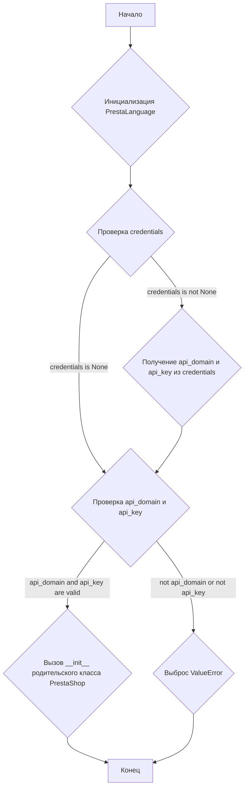
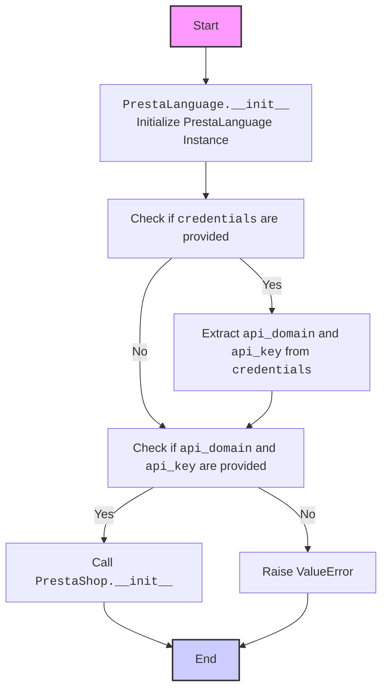
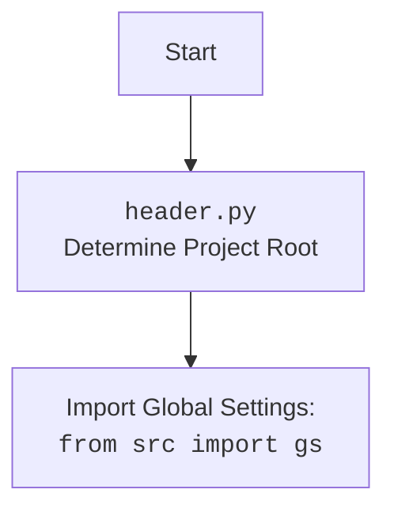

## ИНСТРУКЦИЯ:

Анализируй предоставленный код подробно и объясни его функциональность. Ответ должен включать три раздела:  

1. **<алгоритм>**: Опиши рабочий процесс в виде пошаговой блок-схемы, включая примеры для каждого логического блока, и проиллюстрируй поток данных между функциями, классами или методами.  
2. **<mermaid>**: Напиши код для диаграммы в формате `mermaid`, проанализируй и объясни все зависимости, 
    которые импортируются при создании диаграммы. 
    **ВАЖНО!** Убедитесь, что все имена переменных, используемые в диаграмме `mermaid`, 
    имеют осмысленные и описательные имена. Имена переменных вроде `A`, `B`, `C`, и т.д., не допускаются!  
    
    **Дополнительно**: Если в коде есть импорт `import header`, добавьте блок `mermaid` flowchart, объясняющий `header.py`:\
    ```mermaid
    flowchart TD
        Start --> Header[<code>header.py</code><br> Determine Project Root]
    
        Header --> import[Import Global Settings: <br><code>from src import gs</code>] 
    ```

3. **<объяснение>**: Предоставьте подробные объяснения:  
   - **Импорты**: Их назначение и взаимосвязь с другими пакетами `src.`.  
   - **Классы**: Их роль, атрибуты, методы и взаимодействие с другими компонентами проекта.  
   - **Функции**: Их аргументы, возвращаемые значения, назначение и примеры.  
   - **Переменные**: Их типы и использование.  
   - Выделите потенциальные ошибки или области для улучшения.  

Дополнительно, постройте цепочку взаимосвязей с другими частями проекта (если применимо).  

Это обеспечивает всесторонний и структурированный анализ кода.
## Формат ответа: `.md` (markdown)
**КОНЕЦ ИНСТРУКЦИИ**

## <алгоритм>


**Примеры:**

1.  **Инициализация:**
    *   `prestalanguage = PrestaLanguage(api_domain="example.com", api_key="test_key")` - Прямая передача `api_domain` и `api_key`.
    *   `credentials = {'api_domain': 'example.com', 'api_key': 'test_key'}`
        `prestalanguage = PrestaLanguage(credentials=credentials)` - Передача через словарь.
    *   `credentials = SimpleNamespace(api_domain="example.com", api_key="test_key")`
        `prestalanguage = PrestaLanguage(credentials=credentials)` - Передача через `SimpleNamespace`.
2.  **Проверка `credentials`:**
    *   Если `credentials` не `None`, `api_domain` и `api_key` извлекаются из него.
    *   Если `credentials` `None`, берутся `api_domain` и `api_key` из аргументов.
3.  **Проверка `api_domain` и `api_key`:**
    *   Если хотя бы один из них не задан, выбрасывается `ValueError`.
4.  **Вызов `__init__` родительского класса:**
    *   Если все проверки пройдены, вызывается `__init__` класса `PrestaShop`, от которого наследуется `PrestaLanguage`.

## <mermaid>



**Зависимости (импорты):**

*   `from types import SimpleNamespace`: Используется для создания простых объектов с атрибутами, что позволяет передавать параметры конфигурации.
*   `from .api import PrestaShop`: Импортирует класс `PrestaShop` из модуля `api` в текущем пакете (предположительно, `src.endpoints.prestashop`). `PrestaLanguage` наследуется от этого класса, что указывает на связь и иерархию классов.
*   `from src import gs`: Импортирует глобальные настройки `gs` из пакета `src`, что говорит об использовании общих конфигураций проекта.
*   `from src.utils.printer import pprint`: Импортирует функцию `pprint` для форматированного вывода данных, что может быть полезно для отладки.
*    `from .api import PrestaShop` - еще один импорт PrestaShop из того же модуля.
*    `import header` -  Импортирует модуль header, который, как правило, содержит логику определения корневого каталога проекта и загрузки глобальных параметров.
*   `from src.logger.logger import logger`: Импортирует `logger` для логирования событий.
*   `from src.logger.exceptions import PrestaShopException`: Импортирует `PrestaShopException` для обработки ошибок, связанных с PrestaShop.
*   `from typing import Optional`: Используется для аннотаций типов, указывая на возможность отсутствия значений (None).

## <объяснение>

**Импорты:**

*   `types.SimpleNamespace`: Позволяет создавать объекты с произвольными атрибутами, упрощая передачу параметров конфигурации.
*   `src.endpoints.prestashop.api.PrestaShop`: Базовый класс для работы с API PrestaShop, от которого наследуется `PrestaLanguage`. Содержит общую логику для взаимодействия с API.
*   `src.gs`: Модуль глобальных настроек, используемый для хранения общих параметров проекта (например, URL API, ключи).
*   `src.utils.printer.pprint`: Функция для "красивой" печати данных, которая может использоваться для отладки и форматированного вывода.
*   `header`: Модуль для определения корня проекта и загрузки глобальных настроек, используется для настройки среды выполнения приложения.
*   `src.logger.logger`: Модуль для логирования, позволяющий записывать важную информацию о работе программы.
*   `src.logger.exceptions.PrestaShopException`: Пользовательское исключение, специфичное для работы с PrestaShop, которое позволяет более конкретно обрабатывать ошибки.
*  `typing.Optional`: Тип, указывающий, что переменная может иметь значение либо определенного типа, либо `None`.

**Классы:**

*   `PrestaLanguage(PrestaShop)`:
    *   **Роль:**  Класс для управления языками магазина PrestaShop. Он наследует функциональность работы с API PrestaShop от класса `PrestaShop`.
    *   **Атрибуты:** Нет явных атрибутов, но `api_domain` и `api_key` инициализируются через конструктор и используются в родительском классе.
    *   **Методы:**
        *   `__init__(self, credentials=None, api_domain=None, api_key=None, *args, **kwards)`:
            *   **Аргументы:**
                *   `credentials`: Словарь или `SimpleNamespace`, содержащий `api_domain` и `api_key`.
                *   `api_domain`: Домен API PrestaShop.
                *   `api_key`: Ключ API PrestaShop.
                *   `*args`, `**kwards`: Дополнительные аргументы для родительского класса `PrestaShop`.
            *   **Возвращаемое значение:** Нет.
            *   **Назначение:** Инициализирует объект `PrestaLanguage`, устанавливая домен и ключ API.
            *   **Пример:** `prestalanguage = PrestaLanguage(api_domain="example.com", api_key="test_key")`
    *   **Взаимодействие:**  Наследует от `PrestaShop`, использует его `__init__` для установки параметров API. Взаимодействует с API PrestaShop для работы с языками (хотя этот функционал не приведен в представленном фрагменте кода).

**Функции:**

*   `__init__`: Метод инициализации класса `PrestaLanguage`, который обрабатывает передачу учетных данных API и вызывает конструктор родительского класса `PrestaShop`.

**Переменные:**

*   `MODE`: Глобальная переменная, устанавливающая режим работы (в данном случае, 'dev'), которая влияет на поведение приложения (но ее использование не показано в этом коде).
*   `credentials`: Локальная переменная в `__init__`, которая может быть словарем или объектом `SimpleNamespace`, содержащим `api_domain` и `api_key`.
*   `api_domain`: Локальная переменная в `__init__`, содержащая домен API PrestaShop.
*   `api_key`: Локальная переменная в `__init__`, содержащая ключ API PrestaShop.

**Потенциальные ошибки и улучшения:**

*   Отсутствует обработка ошибок API PrestaShop, которые могут возникнуть при взаимодействии с API через методы класса `PrestaShop`.
*   Нет явных методов для добавления, удаления, обновления и получения информации о языках, что подразумевает, что они находятся в родительском классе `PrestaShop`.
*   Можно добавить проверки на типы данных `api_domain` и `api_key`.
*   Код использует `credentials.get(..., api_domain)` в случае, когда api_domain передан явно как аргумент. Возможно, это стоит пересмотреть.

**Цепочка взаимосвязей:**

1.  `header.py`: Определяет корень проекта и импортирует глобальные настройки.
2.  `src.gs`: Глобальные настройки, содержащие конфигурацию проекта, включая URL API и ключи.
3.  `src.endpoints.prestashop.api.PrestaShop`: Базовый класс для работы с API PrestaShop.
4.  `src.endpoints.prestashop.language.PrestaLanguage`:  Класс для работы с языками PrestaShop, наследуется от `PrestaShop`.
5.  `src.utils.printer.pprint`: Используется для форматированного вывода (для отладки).
6. `src.logger.*`: Используется для логирования и обработки ошибок.