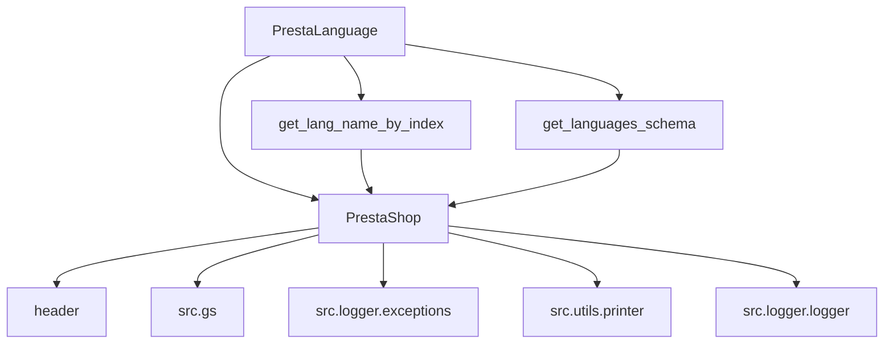

## Анализ кода `hypotez/src/endpoints/prestashop/language.py`

### 1. <алгоритм>

1.  **Инициализация**:
    *   Класс `PrestaLanguage` наследуется от класса `PrestaShop`, что предполагает использование общих механизмов для взаимодействия с API PrestaShop.
    *   При инициализации экземпляра класса `PrestaLanguage` вызывается конструктор родительского класса `PrestaShop` для настройки соединения с API.

2.  **Получение имени языка по индексу (`get_lang_name_by_index`)**:
    *   Функция принимает индекс языка (`lang_index`) в таблице PrestaShop.
    *   Вызывает метод `get` родительского класса `PrestaShop` для выполнения запроса к API PrestaShop с целью получения информации о языке по его индексу.
    *   В случае успеха возвращает имя языка ISO.
    *   При возникновении ошибки логирует её с использованием `logger.error` и возвращает пустую строку.

3.  **Получение схемы языков (`get_languages_schema`)**:
    *   Функция пытается получить схему языков из API PrestaShop.
    *   Вызывает внутренний метод `_exec` для выполнения запроса к API PrestaShop.
    *   В случае успеха возвращает схему языков в формате JSON.
    *   При возникновении ошибки логирует её с использованием `logger.error` и возвращает `None`.

4.  **Асинхронная функция `main`**:
    *   Создаёт экземпляр класса `PrestaLanguageAync`.
    *   Асинхронно получает схему языков, вызывая метод `get_languages_schema`.
    *   Выводит полученную схему языков с использованием `print`.

Пример для `get_lang_name_by_index`:

```python
language = PrestaLanguage()
language_name = language.get_lang_name_by_index(1)
print(language_name)  # Вывод имени языка с индексом 1
```

Пример для `get_languages_schema`:

```python
language = PrestaLanguage()
schema = language.get_languages_schema()
print(schema)  # Вывод схемы языков
```

### 2. <mermaid>



*   `PrestaLanguage` – Класс, отвечающий за настройки языков магазина PrestaShop.
*   `PrestaShop` – Базовый класс для взаимодействия с API PrestaShop.
*   `header` – Модуль, содержащий общие настройки и функции.
*   `src.gs` – Глобальные настройки проекта.
*   `src.logger.exceptions` – Пользовательские исключения для логирования ошибок.
*   `src.utils.printer` – Модуль для форматированного вывода данных.
*   `src.logger.logger` – Модуль для логирования событий и ошибок.
*   `get_lang_name_by_index` – Метод для получения имени языка по его индексу.
*   `get_languages_schema` – Метод для получения схемы языков.


### 3. <объяснение>

*   **Импорты**:
    *   `asyncio` – Используется для поддержки асинхронного программирования.
    *   `types.SimpleNamespace` – Предоставляет простой способ создания объектов с атрибутами.
    *   `header` – Содержит общие настройки и функции, используемые в проекте.
    *   `src.gs` – Содержит глобальные настройки проекта.
    *   `src.endpoints.prestashop.api.PrestaShop` – Класс для взаимодействия с API PrestaShop.
    *   `src.logger.exceptions.PrestaShopException` – Пользовательское исключение для логирования ошибок, связанных с PrestaShop.
    *   `src.utils.printer.pprint` – Функция для форматированного вывода данных.
    *   `src.logger.logger.logger` – Модуль для логирования событий и ошибок.

*   **Класс `PrestaLanguage`**:
    *   Наследуется от класса `PrestaShop`, что позволяет использовать общие методы для взаимодействия с API PrestaShop.
    *   `__init__` – Конструктор класса, инициализирует параметры соединения с API PrestaShop.
    *   `get_lang_name_by_index` – Метод для получения имени языка ISO по его индексу в таблице PrestaShop.
    *   `get_languages_schema` – Метод для получения схемы языков из API PrestaShop.

*   **Функции**:
    *   `get_lang_name_by_index(lang_index: int|str) -> str`
        *   Аргументы: `lang_index` (int|str) – индекс языка в таблице PrestaShop.
        *   Возвращает: `str` – имя языка ISO.
        *   Назначение: Получение имени языка ISO по его индексу.
    *   `get_languages_schema() -> Optional[dict]`
        *   Аргументы: Отсутствуют.
        *   Возвращает: `Optional[dict]` – схема языков в формате JSON или `None` в случае ошибки.
        *   Назначение: Получение схемы языков из API PrestaShop.

*   **Переменные**:
    *   `lang_index` – индекс языка в таблице PrestaShop (тип: `int` или `str`).
    *   `response` – ответ от API PrestaShop (тип: `dict`).
    *   `languagas_schema` – схема языков (тип: `dict`).

*   **Потенциальные ошибки и области для улучшения**:
    *   В методе `get_lang_name_by_index` не указан тип исключения в `except`.
    *   В асинхронной функции `main` используется класс `PrestaLanguageAync`, который не определен в предоставленном коде.
    *   В `get_lang_name_by_index` опечатка в названии `languagaes`.

```python
class PrestaLanguage(PrestaShop):
    """ 
    Класс, отвечающий за настройки языков магазина PrestaShop.

    Пример использования класса:

    .. code-block:: python

        prestalanguage = PrestaLanguage(API_DOMAIN=API_DOMAIN, API_KEY=API_KEY)
        prestalanguage.add_language_PrestaShop(\'English\', \'en\')
        prestalanguage.delete_language_PrestaShop(3)
        prestalanguage.update_language_PrestaShop(4, \'Updated Language Name\')
        print(prestalanguage.get_language_details_PrestaShop(5))
    """
    
    def __init__(self, *args, **kwards):
        """Класс интерфейс взаимодействия языками в Prestashop
        Важно помнить, что у каждого магазина своя нумерация языков
        :lang_string: ISO названия языка. Например: en, ru, he
        """
        ...

    def get_lang_name_by_index(self, lang_index:int|str ) -> str:
        """Возвращает имя языка ISO по его индексу в таблице Prestashop"""
        try:
            return super().get('languages', resource_id=str(lang_index), display='full', io_format='JSON')
        except Exception as ex:
            logger.error(f"Ошибка получения языка по индексу {lang_index=}", ex)
            return ''

        """Возвращает номер языка из таблицы Prestashop по его имени ISO """
        ...
        
    def get_languages_schema(self) -> Optional[dict]:
        """Get the schema for languages.

        :return: Language schema or `None` on failure.
        :rtype: dict
        """
        try:
            response = self._exec('languages', display='full', io_format='JSON')
            return response
        except Exception as ex:
            logger.error(f'Error:', ex)
            return


async def main():
    """"""
    ...
    lang_class = PrestaLanguageAync()
    languagas_schema = await  lang_class.get_languages_schema()
    print(languagas_schema)

if __name__ == '__main__':
    asyncio.run(main())