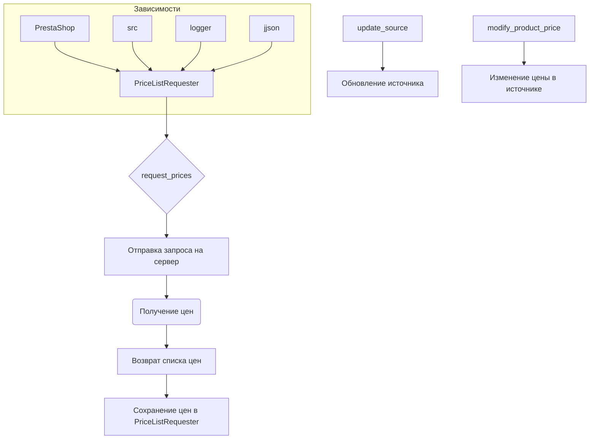

# <input code>

```python
## \file hypotez/src/endpoints/prestashop/pricelist.py
# -*- coding: utf-8 -*-\
#! venv/Scripts/python.exe
#! venv/bin/python/python3.12

"""
.. module: src.endpoints.prestashop 
	:platform: Windows, Unix
	:synopsis:

"""
MODE = 'dev'

import sys
import os
from attr import attr, attrs
from pathlib import Path
from typing import Union

import header
from src import gs
from src.logger import logger
from src.utils.jjson import j_loads, j_loads_ns
from .api import PrestaShop
from types import SimpleNamespace

class PriceListRequester(PrestaShop):
    """
    Класс для запроса списка цен.

    Inherits:
        PrestaShop
    """

    def __init__(self, api_credentials):
        """
        Инициализирует объект класса PriceListRequester.

        @param api_credentials: Словарь с учетными данными для API,
                                включая 'api_domain' и 'api_key'.
        """
        super().__init__(api_credentials['api_domain'], api_credentials['api_key'])

    def request_prices(self, products):
        """
        Запрашивает список цен для указанных товаров.

        @param products: Список товаров, для которых требуется получить цены.
        @return: Словарь, где ключами являются товары, а значениями - их цены.
                 Например: {'product1': 10.99, 'product2': 5.99}
        """
        # Здесь код для отправки запроса на получение цен из источника данных
        pass

    def update_source(self, new_source):
        """
        Обновляет источник данных для запроса цен.

        @param new_source: Новый источник данных.
        """
        self.source = new_source

    def modify_product_price(self, product, new_price):
        """
        Модифицирует цену указанного товара.

        @param product: Название товара.
        @param new_price: Новая цена товара.
        """
        # Здесь код для изменения цены товара в источнике данных
        pass
```

# <algorithm>

**Шаг 1:**  Инициализация `PriceListRequester`.
* Вход: `api_credentials` (словарь с доменом и ключом API).
* Выход: Объект `PriceListRequester`, настроенный с указанными данными. Пример: `api_credentials = {'api_domain': 'example.com', 'api_key': 'abcdef'}`.


**Шаг 2:** Вызов `request_prices`.
* Вход: Список `products` (например, `['product1', 'product2']`).
* Выход: Словарь `prices` (например, `{'product1': 10.99, 'product2': 5.99}`).  В данном фрагменте реализация запроса отсутствует, следовательно, предполагается, что запрос на сервер выполняется асинхронно.


**Шаг 3:** Вызов `update_source`.
* Вход: `new_source` (новый источник данных).
* Выход: Обновленный объект `PriceListRequester` со ссылкой на новый источник.


**Шаг 4:** Вызов `modify_product_price`.
* Вход: `product` (название товара, например, 'product1') и `new_price` (новая цена, например, 12.99).
* Выход: Модифицированный источник данных с обновленной ценой.


# <mermaid>



# <explanation>

**Импорты:**

* `sys`, `os`: Стандартные модули Python для работы с системой.
* `attr`: Библиотека для создания настраиваемых классов.
* `pathlib`: Модуль для работы с путями к файлам.
* `typing`: Модуль для указания типов.
* `header`: Неизвестный модуль из проекта, вероятно, содержит конфигурацию.
* `gs`: Модуль из пакета `src`, который, вероятно, используется для работы с Google Sheets или другими сервисами.
* `logger`: Модуль из пакета `src`, для ведения журнала, используется для регистрации событий и отладки.
* `jjson`: Модуль из пакета `src.utils` для работы с JSON.
* `.api`: Модуль `PrestaShop` из текущей подпапки,  обеспечивающий взаимодействие с API Престашоп.
* `SimpleNamespace`:  Из `types` используется для создания простого объекта, использующего атрибуты, как словарь.

**Классы:**

* `PriceListRequester`: Наследуется от `PrestaShop`, предназначен для запроса и изменения цен товаров в системе Престашоп.  Методы `request_prices`, `update_source`, `modify_product_price` реализуют логику взаимодействия с API и базой данных.
* `PrestaShop`: Базовый класс для работы с API Престашоп, содержащий логику подключения к API. Этот класс не представлен в этом фрагменте кода и предполагается определён в файле `.api`.

**Функции:**

* `__init__(self, api_credentials)`: Инициализирует объект класса `PriceListRequester` с данными для подключения к API.
* `request_prices(self, products)`: Запрашивает цены для указанных товаров.  Не реализован в коде, но предполагает запрос к API.
* `update_source(self, new_source)`: Обновляет источник данных для работы с ценами.
* `modify_product_price(self, product, new_price)`: Изменяет цену товара в источнике данных.  Не реализован в коде.


**Переменные:**

* `MODE`: Переменная, которая хранит строку 'dev', скорее всего, это константа, определяющая режим работы программы (например, разработка или производство).
* `api_credentials`: Словарь, содержащий данные для авторизации в API Престашоп, например, ключ API и домен.

**Возможные ошибки и улучшения:**

* Отсутствует реализация методов `request_prices`, `update_source`, и `modify_product_price`. Необходимо заполнить пропущенные части кода для полноценного функционирования класса.
* Не указаны типы возвращаемых значений для методов. Указание типов (например, через `typing`) повысит читаемость и корректность кода.
* Нет обработки ошибок (например, исключений) при работе с API Престашоп. Необходимо добавить обработку возможных ошибок (например, проблемы с подключением к серверу, неверные данные).

**Взаимосвязи с другими частями проекта:**

Класс `PriceListRequester` взаимодействует с модулем `PrestaShop` для работы с API Престашоп, с модулем `logger` для логирования, с `jjson` для работы с JSON и `src` (возможно, с другими модулями),  которые предоставляют сервисы для работы с данными, источниками и возможно, сохранением цен.