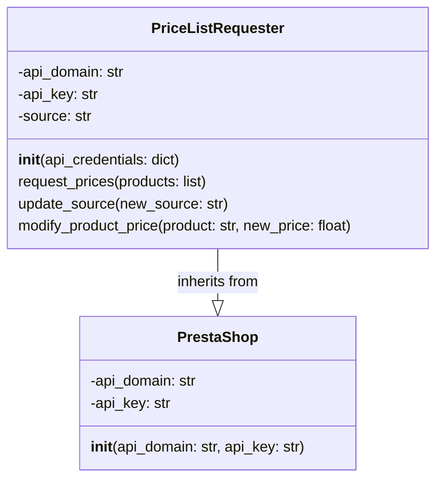

## Анализ кода `hypotez/src/endpoints/prestashop/pricelist.py`

### 1. <алгоритм>

**Блок-схема:**

```mermaid
graph LR
    A[Начало] --> B(Инициализация PriceListRequester);
    B --> C{Запрос цен (request_prices)?};
    C -- Да --> D[Получение списка цен];
    D --> E{Обновление источника данных (update_source)?};
     E -- Да --> F[Обновление источника];
    F --> G{Модификация цены товара (modify_product_price)?};
     G -- Да --> H[Изменение цены товара];
     H --> I[Конец]
      C -- Нет -->E
      E -- Нет -->G
       G -- Нет --> I;
    
   
    
    
    

    style A fill:#f9f,stroke:#333,stroke-width:2px
    style I fill:#f9f,stroke:#333,stroke-width:2px
    style B fill:#ccf,stroke:#333,stroke-width:2px
    style D fill:#ccf,stroke:#333,stroke-width:2px
    style F fill:#ccf,stroke:#333,stroke-width:2px
    style H fill:#ccf,stroke:#333,stroke-width:2px


```
**Примеры:**

1.  **Инициализация `PriceListRequester`:**
    *   `api_credentials = {'api_domain': 'example.com', 'api_key': 'test_key'}`
    *   Создается экземпляр `PriceListRequester` с указанными учетными данными.

2.  **Запрос цен (`request_prices`):**
    *   `products = ['product1', 'product2']`
    *   Метод `request_prices` вызывается со списком товаров,  пока возвращает `pass`
    *   В будущем должен вернуть словарь цен: `{'product1': 10.99, 'product2': 5.99}`.

3.  **Обновление источника данных (`update_source`):**
    *   `new_source = 'new_data_source'`
    *   Метод `update_source` обновляет атрибут `self.source` на `new_data_source`.

4.  **Модификация цены товара (`modify_product_price`):**
    *   `product = 'product1'`, `new_price = 12.99`
    *   Метод `modify_product_price` должен изменить цену `product1` на `12.99` в источнике данных. пока `pass`

### 2. <mermaid>



**Объяснение зависимостей:**

*   **`PriceListRequester` наследует от `PrestaShop`**: Класс `PriceListRequester` является подклассом `PrestaShop`, что означает, что он наследует все атрибуты и методы родительского класса. Это подразумевает, что `PriceListRequester` использует функциональность для взаимодействия с API PrestaShop, унаследованную от `PrestaShop`.

### 3. <объяснение>

**Импорты:**

*   `sys`, `os`: Стандартные модули Python для взаимодействия с системными ресурсами и операционной системой. Используются не напрямую в предоставленном коде, но могут быть использованы в других частях проекта.
*   `attr`, `attrs` из `attr`: Используется для создания классов с атрибутами. В данном коде не используется, но, возможно, будет использовано в будущих расширениях.
*   `pathlib.Path`: Предоставляет удобный способ работы с путями в файловой системе.
*    `typing.Union`: Используется для указания, что переменная может иметь один из нескольких типов.
*   `header`: Предположительно, локальный модуль для работы с заголовками.
*   `src.gs`: Вероятно, локальный модуль для глобальных настроек.
*    `src.logger.logger`: Локальный модуль для логирования.
*   `src.utils.jjson`: Предположительно, локальный модуль для работы с JSON. Содержит функции `j_loads` и `j_loads_ns` для загрузки JSON.
*   `.api.PrestaShop`: Локальный модуль, содержащий класс `PrestaShop` для работы с API PrestaShop.
*   `types.SimpleNamespace`: Позволяет создавать объекты с произвольными атрибутами.

**Классы:**

*   **`PriceListRequester`**:
    *   **Роль**: Класс для запроса и модификации цен товаров в PrestaShop.
    *   **Атрибуты**:
        *   `api_domain`: Строка, представляющая домен API PrestaShop.
        *    `api_key`: Строка, представляющая ключ API PrestaShop.
        *   `source`:  Источник данных, пока не определен.
    *   **Методы**:
        *   `__init__(api_credentials)`: Конструктор, инициализирует объект `PriceListRequester` с учетными данными API.
        *   `request_prices(products)`: Запрашивает цены для списка товаров. Возвращает словарь цен (пока `pass`, требуется реализация)
        *   `update_source(new_source)`: Обновляет источник данных для запроса цен.
        *   `modify_product_price(product, new_price)`: Изменяет цену товара в источнике данных (пока `pass`, требуется реализация).
        *   **Взаимодействие**:
                * Наследуется от `PrestaShop`, что позволяет ему использовать методы для работы с API PrestaShop.
    * **`PrestaShop`**:
        *   **Роль**: Базовый класс для работы с API PrestaShop.
         *   **Атрибуты**:
            *    `api_domain`: Строка, представляющая домен API PrestaShop.
            *    `api_key`: Строка, представляющая ключ API PrestaShop.
        *   **Методы**:
            *    `__init__(api_domain, api_key)`: Конструктор, инициализирует объект `PrestaShop` с учетными данными API.
        * **Взаимодействие**:
            *  Является базовым классом для `PriceListRequester`

**Функции:**

*   `__init__` (конструктор `PriceListRequester`):
    *   **Аргументы**: `api_credentials` (словарь с ключами `'api_domain'` и `'api_key'`).
    *   **Возвращаемое значение**: Нет.
    *   **Назначение**: Инициализирует объект `PriceListRequester`, передавая учетные данные родительскому классу `PrestaShop`.
    *   **Пример**: `api_credentials = {'api_domain': 'example.com', 'api_key': 'test_key'}`
*   `request_prices(products)`:
    *   **Аргументы**: `products` (список товаров).
    *   **Возвращаемое значение**: Словарь, где ключи - названия товаров, а значения - их цены (пока `pass`).
    *   **Назначение**: Запрашивает цены для указанных товаров.
    *   **Пример**: `products = ['product1', 'product2']`, ожидается возврат `{'product1': 10.99, 'product2': 5.99}`.
*   `update_source(new_source)`:
    *   **Аргументы**: `new_source` (строка, представляющая новый источник данных).
    *   **Возвращаемое значение**: Нет.
    *   **Назначение**: Обновляет источник данных для запроса цен.
    *   **Пример**: `new_source = 'new_data_source'`
*   `modify_product_price(product, new_price)`:
    *   **Аргументы**: `product` (название товара), `new_price` (новая цена товара).
    *   **Возвращаемое значение**: Нет.
    *   **Назначение**: Изменяет цену указанного товара в источнике данных (пока `pass`).
    *   **Пример**: `product = 'product1'`, `new_price = 12.99`.

**Переменные:**

*   `MODE`: Глобальная переменная, определяет режим работы приложения (здесь `'dev'`).

**Потенциальные ошибки и области для улучшения:**

*   Методы `request_prices` и `modify_product_price` имеют `pass` и не содержат реализации. Это требует доработки для реальной работы с данными.
*   Отсутствует обработка ошибок и исключений.
*   Отсутствует детальное описание формата `api_credentials`.
*   Необходимо описать формат данных `source` и `new_source`.
*   Отсутствует валидация входных данных.
*   Необходимо подробнее описать как класс `PriceListRequester` связан с другими частями проекта, например, как он используется для обновления цен на сайте.

**Взаимосвязь с другими частями проекта:**

*   Предполагается, что `PriceListRequester` будет использоваться в связке с API PrestaShop для получения и обновления информации о ценах.
*   `src.gs` может предоставлять конфигурационные данные, а `src.logger.logger` используется для ведения логов работы.
*   `src.utils.jjson` используется для работы с JSON, что может быть необходимо для обмена данными с API PrestaShop.
*  `header` вероятно используется для установки заголовков запроса

В целом, код предоставляет базовую структуру для работы с ценами PrestaShop, но требует дальнейшей реализации методов для реальной работы.