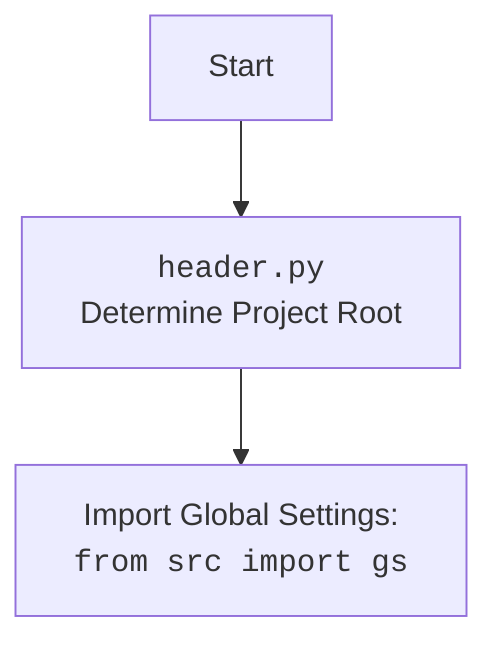

## Анализ кода `hypotez/src/endpoints/prestashop/pricelist.py`

### 1. <алгоритм>

**Общий рабочий процесс:**

1.  **Инициализация:**
    *   Создается экземпляр класса `PriceListRequester` с учетными данными API (`api_credentials`), включающими `api_domain` и `api_key`. Эти данные используются для инициализации базового класса `PrestaShop`.
    *   Пример: `requester = PriceListRequester({'api_domain': 'example.com', 'api_key': 'secret_key'})`

2.  **Запрос цен:**
    *   Вызывается метод `request_prices` со списком товаров.
    *   Метод отправляет запрос на получение цен. В текущей реализации этот метод заглушка ( `pass` ), но он должен обращаться к API или базе данных для получения цен.
    *   Пример: `prices = requester.request_prices(['product1', 'product2'])`. Ожидаемый результат: `{'product1': 10.99, 'product2': 5.99}`.

3.  **Обновление источника:**
    *   Метод `update_source` позволяет изменить источник данных для получения цен. Это может быть полезно, если необходимо переключиться на другой API или базу данных.
    *   Пример: `requester.update_source('new_api_url')`

4.  **Модификация цены товара:**
    *   Метод `modify_product_price` используется для изменения цены конкретного товара.
    *   Пример: `requester.modify_product_price('product1', 12.99)`.  В текущей реализации это также заглушка ( `pass`), но он должен изменять цену в базе данных или API.

**Поток данных:**

1.  Учетные данные API (`api_credentials`) передаются в конструктор `PriceListRequester` и используются для инициализации родительского класса `PrestaShop`.
2.  Список товаров (`products`) передается в метод `request_prices`.
3.  Новый источник данных (`new_source`) передается в метод `update_source` для обновления атрибута `self.source` экземпляра класса `PriceListRequester`.
4.  Название товара и новая цена (`product`, `new_price`) передаются в метод `modify_product_price`.

### 2. <mermaid>

```mermaid
flowchart TD
    Start[Start] --> Initialize[Инициализация PriceListRequester<br>с api_credentials]
    Initialize --> RequestPrices[request_prices(products)<br>Получение цен товаров]
    RequestPrices --> UpdateSource{Вызван<br>update_source?}
    UpdateSource -- Yes --> Update[update_source(new_source)<br>Обновление источника]
    UpdateSource -- No --> ModifyPrice{Вызван<br>modify_product_price?}
    ModifyPrice -- Yes --> Modify[modify_product_price(product, new_price)<br>Изменение цены товара]
    ModifyPrice -- No --> End[End]
    Update --> End
    Modify --> End
    
    classDef highlight fill:#f9f,stroke:#333,stroke-width:2px
    class Initialize,RequestPrices,Update,Modify highlight
```



**Описание `mermaid`:**

*   **`flowchart TD`**: Определяет тип диаграммы как блок-схему.
*   **`Start`**: Начало процесса.
*   **`Initialize`**: Инициализация объекта `PriceListRequester` с учетными данными API (`api_credentials`).
*   **`RequestPrices`**: Вызов метода `request_prices` для получения цен товаров.
*   **`UpdateSource`**: Условный переход, проверяющий, был ли вызван метод `update_source`.
*   **`Update`**: Обновление источника данных с помощью метода `update_source`.
*   **`ModifyPrice`**: Условный переход, проверяющий, был ли вызван метод `modify_product_price`.
*   **`Modify`**: Изменение цены товара с помощью метода `modify_product_price`.
*   **`End`**: Конец процесса.
*   `classDef highlight fill:#f9f,stroke:#333,stroke-width:2px` - объявляет стиль `highlight`.
*   `class Initialize,RequestPrices,Update,Modify highlight` - применяет стиль `highlight` к узлам `Initialize`, `RequestPrices`, `Update`, `Modify`.

**Импорты в `mermaid`:**

*   `PriceListRequester`, `request_prices`, `update_source`, `modify_product_price` - это имена классов и методов, определенные в данном модуле `pricelist.py`.
*   `api_credentials`, `products`, `new_source`, `product`, `new_price` - переменные, которые передаются как параметры в методы или используются внутри классов.

### 3. <объяснение>

**Импорты:**

*   `sys`, `os`: Стандартные модули Python для работы с системными параметрами и операционной системой. Здесь они могут быть использованы, но явно не применяются в текущем коде.
*   `attr`, `attrs`: Библиотека `attrs` для автоматизации создания классов с атрибутами, не используется в текущем примере.
*   `pathlib.Path`: Для работы с путями к файлам и директориям (не используется).
*   `typing.Union`:  Для определения типов, допускающих значения разных типов (не используется).
*   `header`: Пользовательский модуль `header`, вероятно, для определения пути к корню проекта и загрузки общих настроек.
*   `src.gs`: Модуль `gs` из пакета `src`, вероятно, содержащий глобальные настройки и константы проекта.
*   `src.logger.logger`: Модуль `logger` для логирования событий.
*   `src.utils.jjson`: Модуль `jjson` для работы с JSON (загрузка), не используется в этом модуле.
*   `.api.PrestaShop`: Модуль `PrestaShop` из текущего пакета (`src.endpoints.prestashop`), базовый класс для работы с API PrestaShop.
*  `types.SimpleNamespace`: Для создания простых объектов с атрибутами, не используется в текущем примере.

**Классы:**

*   `PriceListRequester(PrestaShop)`:
    *   **Роль**: Класс для запроса и управления ценами товаров через API PrestaShop.
    *   **Атрибуты**:
        *   `source`: (не определен в конструкторе)  Источник данных для запроса цен, который может быть установлен через метод `update_source`.
    *   **Методы**:
        *   `__init__(self, api_credentials)`: Конструктор класса, принимает учетные данные API и инициализирует базовый класс `PrestaShop`.
        *   `request_prices(self, products)`: Метод для запроса цен на товары (реализация отсутствует).
        *   `update_source(self, new_source)`: Метод для обновления источника данных.
        *   `modify_product_price(self, product, new_price)`: Метод для изменения цены товара (реализация отсутствует).
    *   **Взаимодействие**:
        *   Наследует от `PrestaShop` (из модуля `src.endpoints.prestashop.api`), получая функциональность для работы с API PrestaShop.
        *   Взаимодействует с базой данных/API через методы `request_prices` и `modify_product_price` (требуется реализация).

**Функции:**

*   В данном коде нет явно определенных функций, но есть методы внутри класса `PriceListRequester`.

**Переменные:**

*   `MODE`: Строковая переменная, определяющая режим работы (в данном случае, 'dev').
*   `api_credentials`: Словарь, содержащий данные для доступа к API PrestaShop ('api_domain', 'api_key').
*   `products`: Список товаров, для которых требуется получить цены.
*   `new_source`: Новый источник данных для запроса цен.
*   `product`: Название товара, цену которого нужно изменить.
*   `new_price`: Новая цена товара.

**Потенциальные ошибки и улучшения:**

1.  **Отсутствие реализации методов**: Методы `request_prices` и `modify_product_price` являются заглушками (`pass`). Необходимо реализовать функциональность для фактического запроса цен и их изменения.
2.  **Обработка ошибок**: Не хватает обработки ошибок при работе с API и внешними источниками данных.
3.  **Управление источником**: Метод `update_source` устанавливает атрибут `self.source` напрямую, без какой-либо валидации,  необходимо добавить проверку.
4.  **Обработка исключений**: Нет обработки возможных исключений при работе с внешними сервисами/API.

**Взаимосвязь с другими частями проекта:**

*   Зависит от модуля `PrestaShop` для работы с API PrestaShop.
*   Использует глобальные настройки из модуля `src.gs`.
*   Использует логирование через модуль `src.logger.logger`.
*   Может быть интегрирован с другими модулями проекта для получения списка товаров и дальнейшей обработки цен.

**Цепочка взаимосвязей:**

`pricelist.py` --> `PrestaShop` (API взаимодействие) --> `src.gs` (глобальные настройки) --> `src.logger` (логирование).