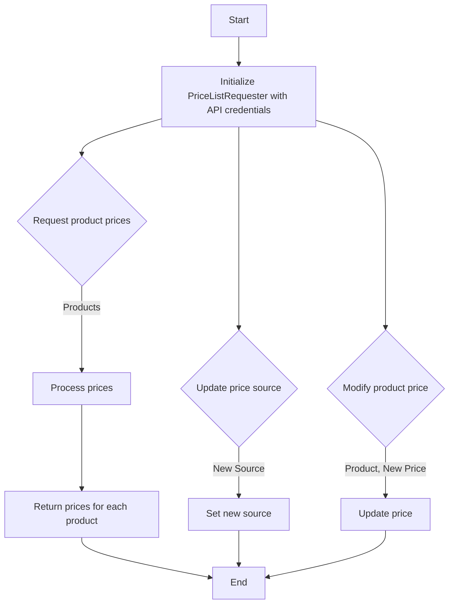
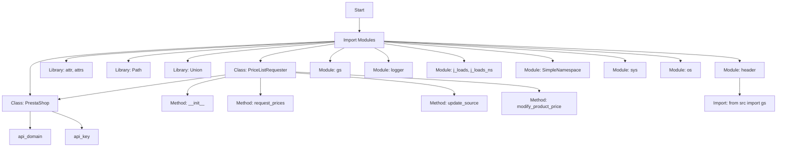

## ИНСТРУКЦИЯ:

Анализируй предоставленный код подробно и объясни его функциональность. Ответ должен включать три раздела:  

1. **<алгоритм>**: Опиши рабочий процесс в виде пошаговой блок-схемы, включая примеры для каждого логического блока, и проиллюстрируй поток данных между функциями, классами или методами.  
2. **<mermaid>**: Напиши код для диаграммы в формате `mermaid`, проанализируй и объясни все зависимости, 
    которые импортируются при создании диаграммы. 
    **ВАЖНО!** Убедитесь, что все имена переменных, используемые в диаграмме `mermaid`, 
    имеют осмысленные и описательные имена. Имена переменных вроде `A`, `B`, `C`, и т.д., не допускаются!  
    
    **Дополнительно**: Если в коде есть импорт `import header`, добавьте блок `mermaid` flowchart, объясняющий `header.py`:\
    ```mermaid
    flowchart TD
        Start --> Header[<code>header.py</code><br> Determine Project Root]
    
        Header --> import[Import Global Settings: <br><code>from src import gs</code>] 
    ```

3. **<объяснение>**: Предоставьте подробные объяснения:  
   - **Импорты**: Их назначение и взаимосвязь с другими пакетами `src.`.  
   - **Классы**: Их роль, атрибуты, методы и взаимодействие с другими компонентами проекта.  
   - **Функции**: Их аргументы, возвращаемые значения, назначение и примеры.  
   - **Переменные**: Их типы и использование.  
   - Выделите потенциальные ошибки или области для улучшения.  

Дополнительно, постройте цепочку взаимосвязей с другими частями проекта (если применимо).  

Это обеспечивает всесторонний и структурированный анализ кода.
## Формат ответа: `.md` (markdown)
**КОНЕЦ ИНСТРУКЦИИ**

## 1. <алгоритм>

**Примеры:**
*   **Инициализация `PriceListRequester`:**
    ```python
    api_creds = {'api_domain': 'example.com', 'api_key': 'your_api_key'}
    requester = PriceListRequester(api_creds)
    ```
*   **Запрос цен:**
    ```python
    products = ['product1', 'product2', 'product3']
    prices = requester.request_prices(products)
    # prices будет словарем типа: {'product1': 10.99, 'product2': 5.99, 'product3': 15.00}
    ```
*   **Обновление источника:**
    ```python
    new_source = 'new_data_source'
    requester.update_source(new_source)
    ```
*   **Изменение цены:**
     ```python
    product_to_modify = 'product1'
    new_price = 12.50
    requester.modify_product_price(product_to_modify, new_price)
    ```

## 2. <mermaid>

```mermaid
    flowchart TD
        Start --> Header[<code>header.py</code><br> Determine Project Root]
    
        Header --> import[Import Global Settings: <br><code>from src import gs</code>] 
    ```

**Объяснение `mermaid` диаграммы:**

*   **`ImportModules`**: Блок, обозначающий импорт различных модулей и библиотек, необходимых для работы данного скрипта.
*  **`PrestaShopClass`**: Класс, предоставляющий базовую функциональность для работы с PrestaShop API. Содержит атрибуты `api_domain` и `api_key` для аутентификации.
*   **`PriceListRequesterClass`**: Класс, наследующий `PrestaShop`,  предназначенный для запроса и изменения цен на товары.
*   **`InitMethod`**: Метод `__init__` класса `PriceListRequester`, отвечающий за инициализацию объекта.
*   **`RequestPricesMethod`**: Метод `request_prices` класса `PriceListRequester`, выполняющий запрос цен на товары.
*   **`UpdateSourceMethod`**: Метод `update_source` класса `PriceListRequester`, изменяющий источник данных.
*   **`ModifyProductPriceMethod`**: Метод `modify_product_price` класса `PriceListRequester`, изменяющий цену товара.
*   **`AttrsLib`**: Библиотека `attr` и `attrs`, используемая для создания классов с атрибутами.
*   **`PathLib`**: Библиотека `pathlib` для работы с файловыми путями.
*   **`TypingLib`**: Библиотека `typing`, предоставляющая типы для аннотаций.
*   **`HeaderModule`**: Модуль `header`, вероятно, используемый для настройки проекта.
*   **`GlobalSettingsModule`**: Модуль `gs`, предоставляющий глобальные настройки приложения.
*   **`LoggerModule`**: Модуль `logger` для журналирования событий.
*   **`JsonUtilsModule`**: Модуль `j_loads` и `j_loads_ns` для работы с JSON.
*   **`TypesModule`**: Модуль `types` для создания `SimpleNamespace` объектов.
*   **`SysModule`**: Модуль `sys` для доступа к параметрам и функциям среды выполнения.
*    **`OsModule`**: Модуль `os` для работы с операционной системой.
*   **`ImportGlobalSettings`**: Импорт глобальных настроек проекта из `src.gs`
*   Стрелки показывают зависимости и отношения между модулями и классами.

## 3. <объяснение>

**Импорты:**

*   `sys`: Используется для доступа к параметрам и функциям среды выполнения, в данном коде явно не используется, но может быть необходим для более сложных операций.
*   `os`: Предоставляет функции для взаимодействия с операционной системой, в данном коде явно не используется, но может быть необходим для работы с файловой системой или переменными среды.
*   `attr`, `attrs`: Из библиотеки `attrs` для упрощения создания классов с атрибутами, но явно не используются в данном коде.
*   `pathlib.Path`: Используется для работы с путями к файлам и каталогам.
*   `typing.Union`: Используется для указания, что переменная может иметь один из нескольких типов.
*   `header`: Пользовательский модуль, вероятно, для определения корневого каталога проекта и загрузки глобальных настроек.
*   `src.gs`: Модуль, содержащий глобальные настройки проекта.
*   `src.logger.logger`: Модуль для логирования событий.
*   `src.utils.jjson`: Модуль с функциями `j_loads` и `j_loads_ns` для загрузки JSON данных.
*   `.api.PrestaShop`: Класс `PrestaShop` из модуля `api`, вероятно, для взаимодействия с API PrestaShop.
*   `types.SimpleNamespace`: Класс для создания простых объектов, атрибуты которых могут задаваться динамически.

**Классы:**

*   `PriceListRequester(PrestaShop)`:
    *   **Роль:** Класс для запроса и изменения цен на товары в системе PrestaShop. Наследуется от `PrestaShop`, что подразумевает наличие методов для взаимодействия с API PrestaShop.
    *   **Атрибуты:**
        *   `source`: (не указано явно, но подразумевается) Хранит источник данных для цен.
    *   **Методы:**
        *   `__init__(self, api_credentials)`: Конструктор класса, принимает словарь с ключами `api_domain` и `api_key` для аутентификации API. Инициализирует родительский класс `PrestaShop`.
        *   `request_prices(self, products)`: Метод для запроса цен на товары. Принимает список товаров и должен возвращать словарь с ценами. В текущей реализации `pass` - необходимо добавить логику запроса.
        *   `update_source(self, new_source)`: Метод для обновления источника данных. Принимает новый источник и присваивает его атрибуту `self.source`.
        *   `modify_product_price(self, product, new_price)`: Метод для изменения цены товара. Принимает название товара и новую цену. В текущей реализации `pass` - необходимо добавить логику изменения.

**Функции:**

*   В коде явно не определены отдельные функции, кроме методов класса `PriceListRequester`.

**Переменные:**

*   `api_credentials`: Словарь, содержащий учетные данные для доступа к API (ключи: `api_domain`, `api_key`).
*  `products`: Список товаров, для которых требуется получить цены.
* `new_source`: Строка, представляющая новый источник данных.
* `product`: Строка, представляющая имя товара, цену которого нужно модифицировать.
* `new_price`: Число, представляющее новую цену товара.

**Потенциальные ошибки и области для улучшения:**

*   **Отсутствие реализации методов `request_prices` и `modify_product_price`:** В текущей реализации эти методы не содержат логики для работы с данными. Необходимо добавить функциональность для отправки запросов к PrestaShop API и обработки ответов.
*   **Нет обработки ошибок:**  Необходимо предусмотреть обработку возможных ошибок при обращении к API, например, неверные учетные данные, сетевые ошибки, проблемы с форматом данных и т.д.
*   **Нет логирования:** Необходима интеграция с модулем логирования `src.logger.logger` для записи действий, ошибок и предупреждений.
*   **Отсутствие документации:** Следует добавить документацию для каждого метода, класса и модуля, используя docstring.
*   **Атрибут `source` не инициализирован:** В `__init__` методе следует явно инициализировать атрибут `self.source` для контроля источников данных.

**Взаимосвязи с другими частями проекта:**

*   `header.py`: Вероятно, отвечает за определение корневого каталога проекта и загрузку глобальных настроек, что позволяет использовать относительные пути к другим модулям и файлам.
*   `src.gs`: Модуль с глобальными настройками, например, URL API, учетные данные.
*   `src.logger.logger`: Модуль для логирования, позволяющий записывать события и отслеживать работу скрипта.
*   `src.utils.jjson`: Модуль для обработки JSON данных, которые, вероятно, возвращает PrestaShop API.
*   `src.endpoints.prestashop.api.PrestaShop`: Класс для взаимодействия с API PrestaShop.

Таким образом, `pricelist.py` является частью модуля `prestashop` и отвечает за логику запроса и изменения цен на товары в системе PrestaShop. Он использует другие модули проекта для настройки, логирования и доступа к API, и требует дальнейшей реализации для работы с данными.