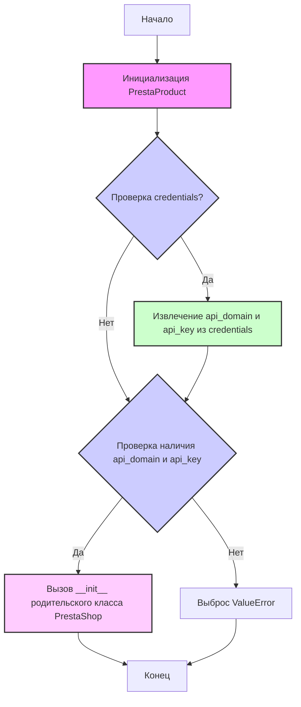
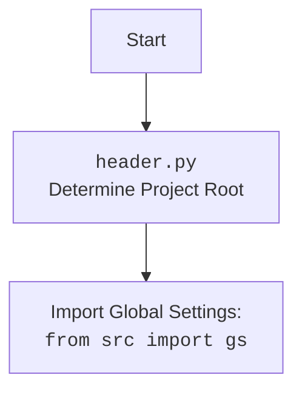

## <алгоритм>

1. **Инициализация**:
   -  Создается экземпляр класса `PrestaProduct`.
   -  При инициализации принимаются параметры `credentials` (опционально, словарь или `SimpleNamespace` с `api_domain` и `api_key`), `api_domain` (опционально) и `api_key` (опционально).
   -  Если `credentials` переданы, из них извлекаются `api_domain` и `api_key`, если они там есть.
   -  Проверяется, что `api_domain` и `api_key` установлены. Если нет, вызывается ошибка `ValueError`.
   -  Вызывается конструктор родительского класса `PrestaShop` с переданными параметрами.
    -  **Пример**:
     ```python
        product1 = PrestaProduct(credentials={"api_domain": "example.com", "api_key": "test_key"})
        # или
        credentials = SimpleNamespace(api_domain="example.com", api_key="test_key")
        product2 = PrestaProduct(credentials=credentials)
        # или
        product3 = PrestaProduct(api_domain="example.com", api_key="test_key")
     ```

2.  **Методы класса `PrestaProduct`** (в предоставленном коде не реализованы):
    -  `check(product_reference: str)`:
        -   Принимает `product_reference` (строка).
        -   Выполняет проверку наличия товара в БД по `product_reference`.
        -   Возвращает словарь с данными товара, если товар найден, иначе `False`.
        -   **Пример**:
            ```python
            product_data = product.check("SKU123")
            if product_data:
               print("Товар найден", product_data)
            else:
               print("Товар не найден")
            ```
    -   `search(filter: str, value: str)`:
        -   Принимает `filter` (строка) и `value` (строка).
        -   Выполняет расширенный поиск в БД по указанным фильтрам и значениям.
        -   Возвращает результаты поиска.
        -  **Пример**:
             ```python
             search_result = product.search("name", "test_product")
             print(search_result)
             ```
    -   `get(id_product)`:
        -   Принимает `id_product` (идентификатор товара).
        -   Получает информацию о товаре по указанному ID.
        -   Возвращает информацию о товаре.
        -  **Пример**:
             ```python
             product_info = product.get(123)
             print(product_info)
             ```

## <mermaid>




## <объяснение>

**Импорты:**

- `from types import SimpleNamespace`:
  - `SimpleNamespace` используется для создания объектов с произвольными атрибутами, что полезно для передачи параметров конфигурации, вроде `api_domain` и `api_key`, без необходимости определять класс.
- `from typing import Optional`:
  - `Optional` используется для указания, что переменная может быть либо определенного типа (например, `dict` или `SimpleNamespace`), либо `None`.
  - Это делает код более читаемым и позволяет статическим анализаторам кода выявлять возможные ошибки.
- `import header`:
  - Импортируется модуль `header`, предположительно для определения корневой директории проекта или для настройки окружения. Подробнее о `header.py` будет в отдельном блоке `mermaid` ниже.
- `from src.logger.logger import logger`:
    -  Импортируется объект `logger` из модуля `src.logger.logger`, который используется для логирования событий и ошибок в приложении. Это позволяет отслеживать работу программы и облегчает отладку.
-  `from src.utils.printer import pprint`:
    - Импортируется функция `pprint` из модуля `src.utils.printer`, которая, вероятно, предоставляет возможность "красивого" вывода данных на консоль, например, при отладке.
- `from .api import PrestaShop`:
  - Импортируется класс `PrestaShop` из модуля `api`, который находится в той же директории. Класс `PrestaShop` скорее всего реализует общую логику для взаимодействия с API PrestaShop.

**Классы:**

-   `PrestaProduct(PrestaShop)`:
    -   Это класс, представляющий товар в PrestaShop.
    -   Он наследуется от класса `PrestaShop`, что указывает на то, что он использует API PrestaShop для выполнения операций.
    -   **Атрибуты**:
        -   Нет явно определенных атрибутов в представленном коде, все данные, такие как `api_domain` и `api_key`, хранятся в родительском классе `PrestaShop`.
    -   **Методы**:
        -   `__init__(self, credentials=None, api_domain=None, api_key=None, *args, **kwards)`: Конструктор класса.
            -   Инициализирует объект `PrestaProduct` и вызывает конструктор родительского класса `PrestaShop` через `super().__init__(api_domain, api_key, *args, **kwards)`.
            -   Принимает параметры для настройки API: `credentials` (словарь или `SimpleNamespace`), `api_domain` и `api_key`.
            -   Если `credentials` переданы, пытается извлечь `api_domain` и `api_key` оттуда.
            -   Проверяет, что оба параметра `api_domain` и `api_key` установлены, и в противном случае выбрасывает `ValueError`.
        -   `check(product_reference)`: Проверяет наличие товара по `product_reference`. (не реализован)
        -   `search(filter, value)`: Ищет товар по фильтрам. (не реализован)
        -   `get(id_product)`: Получает информацию о товаре по ID. (не реализован)

**Функции:**

- `__init__`:
    -   Аргументы:
        - `credentials` (Optional[dict | SimpleNamespace]): Параметры аутентификации, либо словарь, либо объект `SimpleNamespace`, по умолчанию `None`.
        - `api_domain` (Optional[str]): Домен API PrestaShop, по умолчанию `None`.
        - `api_key` (Optional[str]): Ключ API PrestaShop, по умолчанию `None`.
        - `*args`, `**kwards`: Произвольные позиционные и именованные аргументы для родительского класса.
    -   Возвращаемое значение: None
    -   Назначение: Инициализация экземпляра класса `PrestaProduct` и настройка соединения с API PrestaShop.

**Переменные:**

- `MODE`:
  -  Глобальная переменная, установленная в значение `'dev'`, что может указывать на режим разработки. Эта переменная может использоваться для управления поведением программы в зависимости от окружения (например, логирование, использование отладочных параметров и т.д.).

**Потенциальные ошибки и области для улучшения:**

-   **Отсутствие реализации методов**: Методы `check`, `search` и `get` объявлены, но не реализованы. Это означает, что функциональность работы с товарами в PrestaShop пока не полная и требует дополнительной реализации.
-   **Обработка ошибок API**: Код не содержит явной обработки ошибок, которые могут возникнуть при взаимодействии с API PrestaShop. Следует добавить блоки `try...except` для обработки исключений (например, ошибок аутентификации, ошибок запроса, проблем с сетью).
-   **Логирование**: В коде есть импорт `logger`, но нет его использования. Рекомендуется добавить логирование для отслеживания ошибок и действий пользователя.
-   **Валидация ввода**: Код не проверяет формат или допустимость значений, переданных в `api_domain` и `api_key`. Перед использованием этих значений в запросах к API, следует выполнять их валидацию.

**Взаимосвязи с другими частями проекта:**

-   **`src.logger.logger`**: Этот модуль предоставляет функциональность логирования, которая используется в других частях проекта для отслеживания событий и ошибок.
-   **`src.utils.printer`**: Модуль используется для красивого вывода данных, что может быть полезно для отладки и вывода результатов в консоль.
-   **`.api`**: Класс `PrestaShop` из модуля `api` отвечает за взаимодействие с API PrestaShop и является базовым классом для `PrestaProduct`.

В целом, код представляет собой базовый класс для работы с товарами в PrestaShop, который требует дальнейшей реализации методов для полноценной функциональности. Также необходимо добавить обработку ошибок и логирование для повышения надежности и удобства использования.