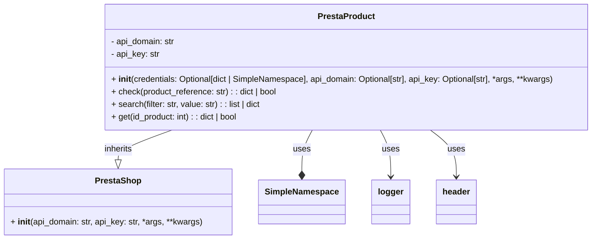

## Анализ кода `hypotez/src/endpoints/prestashop/product.py`

### <алгоритм>
1.  **Инициализация:**
    *   Создается экземпляр класса `PrestaProduct`.
    *   Принимаются параметры `credentials` (словарь или `SimpleNamespace`), `api_domain`, `api_key` и дополнительные `*args`, `**kwargs`.
    *   Если `credentials` переданы, то `api_domain` и `api_key` берутся из них, если они там есть, переопределяя значения по умолчанию.
    *   Проверяется, что `api_domain` и `api_key` не пустые. Если это не так, вызывается исключение `ValueError`.
    *   Вызывается конструктор родительского класса `PrestaShop` с полученными параметрами.

    *Пример:*
    ```python
    # Инициализация с передачей параметров
    product1 = PrestaProduct(api_domain='example.com', api_key='test_key') 
    
    # Инициализация с передачей credentials
    credentials_dict = {'api_domain': 'example.net', 'api_key': 'other_key'}
    product2 = PrestaProduct(credentials=credentials_dict)
    
    # Инициализация без необходимых параметров, приведет к ошибке.
    # product3 = PrestaProduct() # Ошибка ValueError: Необходимы оба параметра: api_domain и api_key.

    ```

2.  **Методы:**
    *   `check(product_reference)`:
        *   Принимает на вход `product_reference` (строку).
        *   Использует API PrestaShop для поиска товара по `product_reference`.
        *   Возвращает словарь с информацией о товаре, если товар найден, иначе `False`.
    *   `search(filter, value)`:
        *   Принимает на вход строку `filter` (например, "name") и строку `value` (например, "Product Name").
        *   Использует API PrestaShop для поиска товаров по заданным `filter` и `value`.
        *   Возвращает результат поиска (список товаров или информацию об ошибке).
    *   `get(id_product)`:
        *   Принимает на вход `id_product` (идентификатор товара).
        *   Использует API PrestaShop для получения информации о товаре по его `id`.
        *   Возвращает словарь с информацией о товаре, если товар найден, иначе `False`.

    *Пример:*
    ```python
    # Допустим, есть созданный объект product:
    # product = PrestaProduct(api_domain="...", api_key="...")

    # Пример вызова check:
    product_data = product.check(product_reference='SKU123') # Возвращает словарь или False
    
    # Пример вызова search:
    search_result = product.search(filter='name', value='Test Product') # Возвращает список словарей или информацию об ошибке
    
    # Пример вызова get:
    product_info = product.get(id_product=10) # Возвращает словарь или False
    ```
### <mermaid>


**Анализ зависимостей:**

*   `PrestaProduct` наследуется от `PrestaShop`, что означает, что `PrestaProduct` получает доступ ко всем методам и атрибутам `PrestaShop`.
*   `PrestaProduct` использует `SimpleNamespace` для хранения параметров конфигурации.
*   `PrestaProduct` использует `logger` для логирования.
*   `PrestaProduct` использует `header` для управления заголовками HTTP.

### <объяснение>

**Импорты:**

*   `from types import SimpleNamespace`: Импортирует класс `SimpleNamespace`, который позволяет создавать объекты с произвольными атрибутами.  В контексте этого кода он используется для гибкого управления настройками API (альтернатива словарю)
*   `from typing import Optional`: Импортирует `Optional`, который используется для определения типа аргументов, которые могут принимать значения типа, или `None`.
*   `import header`: Импортирует модуль `header`, вероятно, отвечающий за управление заголовками HTTP-запросов к API PrestaShop (не показан в текущем коде)
*   `from src.logger.logger import logger`: Импортирует логгер из модуля `src.logger.logger`, позволяя записывать отладочную информацию и ошибки.
*   `from src.utils.printer import pprint`: Импортирует функцию `pprint` для красивого вывода информации (не используется в текущем коде).
*   `from .api import PrestaShop`: Импортирует класс `PrestaShop` из модуля `api` в текущей директории, который предположительно инкапсулирует взаимодействие с API PrestaShop.

**Классы:**

*   `class PrestaProduct(PrestaShop)`:
    *   **Роль**: Представляет собой класс для работы с товарами в PrestaShop через API.
    *   **Атрибуты**:
        *   `api_domain`: Строка, хранит домен API PrestaShop.
        *   `api_key`: Строка, хранит ключ API PrestaShop.
    *   **Методы**:
        *   `__init__(self, credentials, api_domain, api_key, *args, **kwards)`: Конструктор класса, инициализирует объект, устанавливая `api_domain` и `api_key`, которые могут быть переданы напрямую или через словарь `credentials`. Вызывает конструктор родительского класса `PrestaShop`.
        *   `check(self, product_reference)`: Метод для проверки наличия товара в БД по `product_reference`.
        *   `search(self, filter, value)`: Метод для расширенного поиска в БД по фильтрам.
        *   `get(self, id_product)`: Метод для получения информации о товаре по ID.
    *   **Взаимодействие**: Наследуется от `PrestaShop`, использует его для выполнения запросов к API. Зависит от модулей `logger` и `header`.

**Функции:**

*   `__init__(self, credentials, api_domain, api_key, *args, **kwards)`:
    *   **Аргументы**:
        *   `credentials`: Опциональный словарь или `SimpleNamespace` с настройками `api_domain` и `api_key`.
        *   `api_domain`: Опциональная строка с доменом API.
        *   `api_key`: Опциональная строка с ключом API.
        *    `*args`, `**kwards`: Дополнительные аргументы, которые могут быть переданы в конструктор родительского класса `PrestaShop`.
    *   **Возвращаемое значение**: Отсутствует (конструктор).
    *   **Назначение**: Инициализирует объект `PrestaProduct`, настраивая соединение с API PrestaShop.
*  `check(self, product_reference)`:
    *   **Аргументы**:
        *   `product_reference`: Строка, артикул товара
    *   **Возвращаемое значение**: Словарь с данными о товаре, либо False если товар не найден
    *   **Назначение**: Проверяет наличие товара в БД по артикулу.
*   `search(self, filter, value)`:
    *   **Аргументы**:
        *   `filter`: Строка, поле для поиска
        *   `value`: Строка, значение для поиска
    *   **Возвращаемое значение**: Список словарей с товарами, либо словарь с ошибкой
    *   **Назначение**: Ищет товар по заданным параметрам фильтра.
*   `get(self, id_product)`:
    *   **Аргументы**:
        *   `id_product`: Целое число, ID товара
    *   **Возвращаемое значение**: Словарь с данными о товаре, либо False если товар не найден
    *   **Назначение**: Получает данные о товаре по ID.

**Переменные:**

*   `MODE`: Строка, глобальная переменная, указывающая режим работы (например, `dev` или `prod`), используется для настройки поведения программы, в данном коде не используется.

**Потенциальные ошибки и области для улучшения:**

*   **Обработка ошибок:** Код не содержит обработки ошибок при вызовах API. Нужно добавить блоки `try...except` для обработки возможных исключений, таких как сетевые ошибки или некорректные ответы API.
*   **Валидация данных:** Не хватает валидации данных. Например, нужно проверить, что `api_domain` и `api_key` имеют корректный формат.
*   **Документирование:**  В документации класса `PrestaProduct` не описаны возвращаемые значения методов `check`, `search`, `get`.

**Цепочка взаимосвязей с другими частями проекта:**

*   `src.endpoints.prestashop.product` зависит от `src.endpoints.prestashop.api` для взаимодействия с API PrestaShop.
*   `src.endpoints.prestashop.product` зависит от `src.logger.logger` для логирования.
*   `src.endpoints.prestashop.product` предположительно будет использоваться другими модулями проекта, которые нуждаются в данных о товарах PrestaShop.
*   `src.endpoints.prestashop.product` зависит от модуля `header` для формирования HTTP заголовков.