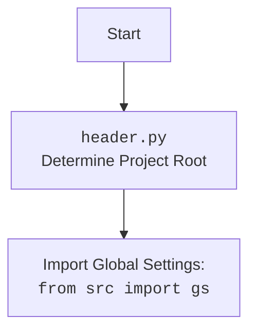

## ИНСТРУКЦИЯ:

Анализируй предоставленный код подробно и объясни его функциональность. Ответ должен включать три раздела:

1.  **<алгоритм>**: Опиши рабочий процесс в виде пошаговой блок-схемы, включая примеры для каждого логического блока, и проиллюстрируй поток данных между функциями, классами или методами.
2.  **<mermaid>**: Напиши код для диаграммы в формате `mermaid`, проанализируй и объясни все зависимости,
    которые импортируются при создании диаграммы.
    **ВАЖНО!** Убедитесь, что все имена переменных, используемые в диаграмме `mermaid`,
    имеют осмысленные и описательные имена. Имена переменных вроде `A`, `B`, `C`, и т.д., не допускаются!

    **Дополнительно**: Если в коде есть импорт `import header`, добавьте блок `mermaid` flowchart, объясняющий `header.py`:
    ```mermaid
    flowchart TD
        Start --> Header[<code>header.py</code><br> Determine Project Root]

        Header --> import[Import Global Settings: <br><code>from src import gs</code>]
    ```

3.  **<объяснение>**: Предоставьте подробные объяснения:
    *   **Импорты**: Их назначение и взаимосвязь с другими пакетами `src.`.
    *   **Классы**: Их роль, атрибуты, методы и взаимодействие с другими компонентами проекта.
    *   **Функции**: Их аргументы, возвращаемые значения, назначение и примеры.
    *   **Переменные**: Их типы и использование.
    *   Выделите потенциальные ошибки или области для улучшения.

Дополнительно, постройте цепочку взаимосвязей с другими частями проекта (если применимо).

Это обеспечивает всесторонний и структурированный анализ кода.
## Формат ответа: `.md` (markdown)
**КОНЕЦ ИНСТРУКЦИИ**

## 1. <алгоритм>

**Блок-схема:**

```mermaid
graph LR
    A[Начало: asyncio.run(main())] --> B{Создание ProductAsync};
    B --> C{Создание ProductFields};
    C --> D{Получение родительских категорий: ProductAsync.get_parent_categories(id_category=3)};
    D --> E{Вывод родительских категорий на экран};
    E --> F{Добавление нового продукта: ProductAsync.add_new_product(product_fields)};
    F --> G{Преобразование ProductFields в словарь: any2dict(product_fields)};
    G --> H{Получение родительских категорий для продукта: PrestaCategoryAsync.get_parent_categories_list(f.id_category_default)};
    H --> I{Создание продукта в PrestaShop API: ProductAsync.create('products', f_dict)};
     I -- Продукт не создан --> J{Логирование ошибки: logger.error};
     J --> K[return];
    I -- Продукт создан--> L{Создание бинарного файла изображения: ProductAsync.create_binary()};
    L -- Изображение не создано --> M{Логирование ошибки: logger.error};
     M --> K[return];
    L-- Изображение создано --> N{Возврат: return True};
    N-->O{Проверка результата добавления};
    O -- Ошибка добавления -->P{Вывод ошибки на экран};
    O -- Успешное добавление --> Q{Вывод id добавленного продукта};
    Q --> R{Вызов fetch_data_async};
    P --> R;
    R --> S[Конец];

    style A fill:#f9f,stroke:#333,stroke-width:2px
     style S fill:#f9f,stroke:#333,stroke-width:2px
    style B fill:#ccf,stroke:#333,stroke-width:2px
     style C fill:#ccf,stroke:#333,stroke-width:2px
    style D fill:#ccf,stroke:#333,stroke-width:2px
    style E fill:#ccf,stroke:#333,stroke-width:2px
    style F fill:#ccf,stroke:#333,stroke-width:2px
    style G fill:#ccf,stroke:#333,stroke-width:2px
        style H fill:#ccf,stroke:#333,stroke-width:2px
    style I fill:#ccf,stroke:#333,stroke-width:2px
     style J fill:#ccf,stroke:#333,stroke-width:2px
      style K fill:#ccf,stroke:#333,stroke-width:2px
    style L fill:#ccf,stroke:#333,stroke-width:2px
        style M fill:#ccf,stroke:#333,stroke-width:2px
         style N fill:#ccf,stroke:#333,stroke-width:2px
        style O fill:#ccf,stroke:#333,stroke-width:2px
             style P fill:#ccf,stroke:#333,stroke-width:2px
             style Q fill:#ccf,stroke:#333,stroke-width:2px
             style R fill:#ccf,stroke:#333,stroke-width:2px
```

**Примеры:**

*   **`asyncio.run(main())`**: Запускает асинхронную функцию `main`.
*   **`ProductAsync()`**: Создается экземпляр класса `ProductAsync` для взаимодействия с API PrestaShop.
*   **`ProductFields(name='Test Product Async', price=19.99, ...)`**: Создается экземпляр `ProductFields` с данными о продукте.
*   **`ProductAsync.get_parent_categories(id_category=3)`**: Вызывается для получения родительских категорий (пример: `parent_categories: [{'id_category': 2, 'name': 'Home'}]`).
*   **`ProductAsync.add_new_product(product_fields)`**: Добавляет продукт в PrestaShop используя API.
*   **`any2dict(product_fields)`**: Преобразует `ProductFields` в словарь Python (пример: `{'name': 'Test Product Async', 'price': 19.99, ...}`).
*   **`PrestaCategoryAsync.get_parent_categories_list(f.id_category_default)`**: Получает родительские категории товара из API.
*   **`ProductAsync.create('products', f_dict)`**: Создает продукт в PrestaShop API на основе словаря `f_dict`. Возвращает `ProductFields` с `id_product` в случае успеха, иначе `None`.
*   **`ProductAsync.create_binary('images/products/123', 'local/image.jpg', 123)`**: Загружает изображение продукта с локального пути в PrestaShop API.
*   **`print(f'New product id = {new_product.id_product}')`**: Выводит id созданного продукта (пример: `New product id = 123`).

## 2. <mermaid>

```mermaid
flowchart TD
    Start[Start] --> ProductAsyncClass[ProductAsync Class<br> Init with PrestaShopAsync and PrestaCategoryAsync];
    ProductAsyncClass --> add_new_product[add_new_product(f: ProductFields)<br> Add product to PrestaShop];
    add_new_product --> get_parent_categories_list[PrestaCategoryAsync.get_parent_categories_list(id_category_default)<br> Get category data];
    get_parent_categories_list --> any2dict_func[any2dict(f)<br>Convert ProductFields to Dict];
    any2dict_func --> create_product_api[ProductAsync.create('products', f_dict)<br>Create product via PrestaShop API];
     create_product_api -- Product not created --> logger_error_1[logger.error<br> Log error if product not create];
      logger_error_1 -->Return_None1[return None];
        create_product_api -- Product created --> create_binary_api[ProductAsync.create_binary()<br>Create image product via PrestaShop API];
         create_binary_api -- Error create binary  --> logger_error_2[logger.error<br> Log error if image not create];
             logger_error_2-->Return_None2[return None];
     create_binary_api --Image created--> return_True[return True];

    Return_None1 --> End[End];
    Return_None2 --> End[End];
      return_True--> End[End];


    style Start fill:#f9f,stroke:#333,stroke-width:2px
     style End fill:#f9f,stroke:#333,stroke-width:2px
    style ProductAsyncClass fill:#ccf,stroke:#333,stroke-width:2px
     style add_new_product fill:#ccf,stroke:#333,stroke-width:2px
    style get_parent_categories_list fill:#ccf,stroke:#333,stroke-width:2px
        style any2dict_func fill:#ccf,stroke:#333,stroke-width:2px
        style create_product_api fill:#ccf,stroke:#333,stroke-width:2px
        style logger_error_1 fill:#ccf,stroke:#333,stroke-width:2px
             style Return_None1 fill:#ccf,stroke:#333,stroke-width:2px
     style create_binary_api fill:#ccf,stroke:#333,stroke-width:2px
      style logger_error_2 fill:#ccf,stroke:#333,stroke-width:2px
           style Return_None2 fill:#ccf,stroke:#333,stroke-width:2px
           style return_True fill:#ccf,stroke:#333,stroke-width:2px

```

**Анализ зависимостей:**

*   **`ProductAsync`**: Основной класс для работы с продуктами через API PrestaShop. Зависит от `PrestaShopAsync` и `PrestaCategoryAsync`.
*   **`PrestaShopAsync`**: Класс для взаимодействия с PrestaShop API, реализует общую логику API.
*   **`PrestaCategoryAsync`**: Класс для работы с категориями через API PrestaShop.
*   **`ProductFields`**: Data class для хранения информации о продукте.
*    **`any2dict`**: Функция для преобразования dataclass в dict.
*   **`header`**: Модуль, определяющий корень проекта и глобальные настройки.
*   **`gs`**: Глобальные настройки, импортируются из `src`.
*   **`logger`**:  Модуль для логирования.

**Header.py Flowchart:**



## 3. <объяснение>

### Импорты:

*   **`from __future__ import annotations`**:  Позволяет использовать аннотации типов, которые содержат ссылки на типы, которые ещё не определены.
*   **`import asyncio`**: Используется для асинхронного программирования.
*   **`from dataclasses import dataclass, field`**: Используется для создания классов данных (`ProductFields`).
*   **`from typing import List, Dict, Any, Optional`**: Используется для аннотаций типов.
*   **`import header`**: Импортирует модуль `header`, который определяет корень проекта.
*   **`from src import gs`**: Импортирует глобальные настройки проекта.
*   **`from src.endpoints.prestashop.api import PrestaShopAsync`**: Импортирует класс для работы с PrestaShop API.
*   **`from src.endpoints.prestashop.category import PrestaCategoryAsync`**: Импортирует класс для работы с категориями PrestaShop.
*   **`from src.endpoints.prestashop.product_fields import ProductFields`**: Импортирует data class, представляющий поля продукта.
*   **`from src.utils.convertors.any import any2dict`**: Импортирует функцию для преобразования объекта в словарь.
*   **`from src.utils.printer import pprint as print`**:  Импортирует функцию для печати.
*   **`from src.logger import logger`**:  Импортирует модуль для логирования.

### Классы:

*   **`ProductAsync(PrestaShopAsync)`**:
    *   **Роль**: Предназначен для управления продуктами в PrestaShop, используя API.
    *   **Атрибуты**:
        *   `presta_category_async`: Экземпляр класса `PrestaCategoryAsync` для работы с категориями.
    *   **Методы**:
        *   `__init__(self, *args, **kwargs)`: Инициализирует объект, вызывая конструкторы `PrestaShopAsync` и `PrestaCategoryAsync`.
        *   `async def add_new_product(self, f: ProductFields) -> ProductFields | None`: Добавляет новый продукт в PrestaShop, возвращая `ProductFields` с `id_product` или `None` в случае ошибки. Использует методы `create` и `create_binary` для добавления продукта и изображения.

### Функции:

*   **`async def main()`**:
    *   **Аргументы**: Нет.
    *   **Возвращаемое значение**: Нет.
    *   **Назначение**: Асинхронная функция, демонстрирующая использование класса `ProductAsync`. Создает экземпляр `ProductAsync`, `ProductFields`, добавляет продукт и выводит результат.
    *   **Пример**:
        ```python
        product = ProductAsync()
        product_fields = ProductFields(name='Test Product Async', price=19.99, ...)
        new_product = await product.add_new_product(product_fields)
        ```
*    **`async def add_new_product(self, f: ProductFields) -> ProductFields | None`**:
    *   **Аргументы**:
         * `f`: Объект типа `ProductFields` содержащий данные о продукте.
    *   **Возвращаемое значение**:
         * `ProductFields` с `id_product` при успешном создании, либо None если ошибка.
    *   **Назначение**: Асинхронная функция, добавляет новый продукт, используя API PrestaShop. Загружает изображение.

### Переменные:

*   **`f`**: Экземпляр класса `ProductFields`, содержащий информацию о продукте, который нужно добавить.
*   **`f_dict`**: Словарь, полученный из `ProductFields`, для передачи в API.
*   **`new_f`**: Экземпляр `ProductFields` с присвоенным `id_product` полученным от API.

### Потенциальные ошибки и области для улучшения:

*   **Обработка ошибок**: В коде есть обработка ошибок с логированием, но она не всегда возвращает None при возникновении ошибки. Желательно, чтобы в случае ошибки `add_new_product` возвращал `None`.
*   **Обработка исключений**: В коде отсутствуют явные блоки `try ... except` для перехвата возможных исключений при запросах к API. Это может привести к неконтролируемым ошибкам.
*   **Улучшение логгирования**: Можно добавить больше информации в логи, например, id продукта, который не удалось создать, или причину ошибки.
*   **Изображения**: Код проверяет успешное создание бинарного файла, но не делает попыток повторить операцию в случае сбоя. Стоит добавить механизм retry с экспоненциальной задержкой.
*   **Типизация**: Некоторые переменные можно типизировать более явно, чтобы улучшить читаемость и предотвратить ошибки.
*   **Обработка ошибок API**: Код не обрабатывает возможные ошибки, которые может вернуть API PrestaShop (например, ошибки валидации данных). Следует добавить обработку таких ошибок.
*   **Отсутствие проверки на существование продукта**: Перед добавлением нового продукта нет проверки на его существование. Стоит добавить логику проверки существования продукта.
### Взаимосвязи с другими частями проекта:

*   **`src.endpoints.prestashop.api.PrestaShopAsync`**: Используется для выполнения запросов к PrestaShop API.
*   **`src.endpoints.prestashop.category.PrestaCategoryAsync`**: Используется для получения списка родительских категорий для товара.
*   **`src.endpoints.prestashop.product_fields.ProductFields`**:  Используется для структурированного представления данных о продукте.
*   **`src.utils.convertors.any.any2dict`**: Используется для преобразования объекта ProductFields в словарь.
*   **`src.utils.printer.pprint`**: Используется для вывода данных на экран.
*    **`src.logger.logger`**: Используется для логирования информации о работе кода.
*   **`src.gs`**: Используется для получения глобальных настроек проекта, например, для аутентификации в API.

Этот анализ предоставляет детальное понимание функциональности кода, его взаимосвязей и потенциальных областей для улучшения.