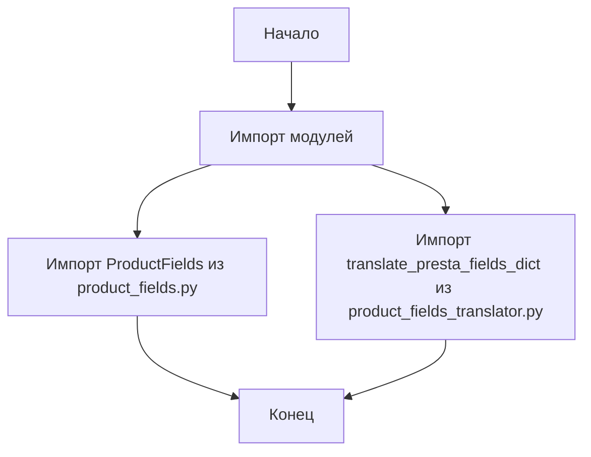
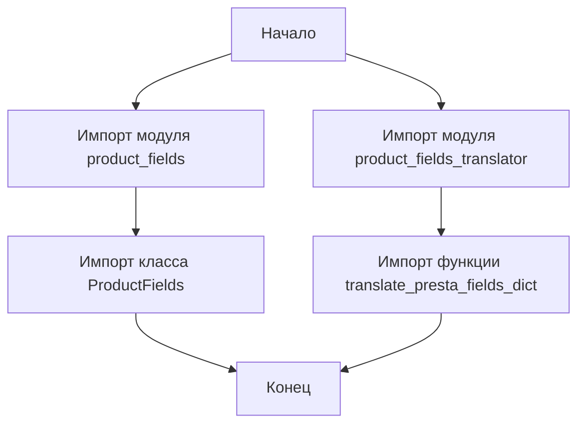

## АНАЛИЗ КОДА: `hypotez/src/endpoints/prestashop/product_fields/__init__.py`

### 1. <алгоритм>

**Блок-схема:**

**Примеры:**

1. **`from .product_fields import ProductFields`**: Импортирует класс `ProductFields` из модуля `product_fields.py`, расположенного в том же каталоге. Этот класс, вероятно, содержит логику для работы с полями продукта.
2. **`from .product_fields_translator import translate_presta_fields_dict`**: Импортирует функцию `translate_presta_fields_dict` из модуля `product_fields_translator.py`. Эта функция, скорее всего, используется для преобразования полей продукта в формат, понятный PrestaShop.

### 2. <mermaid>

**Зависимости:**

- `ProductFields`: Класс, импортированный из `product_fields.py`. Вероятно, он содержит методы для работы с полями продукта.
- `translate_presta_fields_dict`: Функция, импортированная из `product_fields_translator.py`. Вероятно, она используется для преобразования структуры данных полей продукта.

### 3. <объяснение>

**Импорты:**

-   `from .product_fields import ProductFields`: 
    -   Импортирует класс `ProductFields` из модуля `product_fields.py`, который находится в той же директории.
    -   Это указывает на то, что класс `ProductFields` предназначен для обработки данных, связанных с полями продукта, и является важной частью функциональности этого пакета.

-   `from .product_fields_translator import translate_presta_fields_dict`:
    -   Импортирует функцию `translate_presta_fields_dict` из модуля `product_fields_translator.py`, который также находится в той же директории.
    -   Эта функция, вероятно, выполняет преобразование данных полей продукта, адаптируя их к формату, ожидаемому PrestaShop API.

**Классы:**

-   `ProductFields`:
    -   Этот класс не определен в данном файле, но он импортируется из `product_fields.py`.
    -   Предположительно, он содержит методы и атрибуты для управления полями продукта.
    -   Он может включать методы для чтения, записи, обновления и валидации полей продукта.

**Функции:**

-   `translate_presta_fields_dict`:
    -   Эта функция также не определена в данном файле, но импортируется из `product_fields_translator.py`.
    -   Она, скорее всего, принимает структуру данных полей продукта и преобразует ее в формат, который PrestaShop может понять.
    -   Например, она может конвертировать имена полей, форматы данных и т.д.

**Переменные:**

- В данном файле нет явно объявленных переменных, так как он служит для импорта классов и функций.

**Потенциальные ошибки или области для улучшения:**

-   **Отсутствие документации:** Код содержит docstring, но было бы полезно иметь больше комментариев внутри файлов `product_fields.py` и `product_fields_translator.py` для объяснения деталей реализации.
-   **Зависимости:** Зависимость от файлов  `product_fields.py` и `product_fields_translator.py`. Необходимо убедится, что импортированные модули корректно работают, и нет проблем совместимости.
-   **Обработка ошибок:** Код не показывает, как обрабатываются потенциальные ошибки, возникающие при импорте или при работе с импортированными классами/функциями. 

**Взаимосвязи с другими частями проекта:**

-   Модуль `__init__.py` является частью пакета `product_fields` и, вероятно, используется как входная точка для доступа к функциональности обработки полей продукта.
-   Он, вероятно, является частью более широкого проекта, взаимодействующего с PrestaShop, где управление и преобразование полей продукта является важной задачей.
-   Цепочка связей:
    -   `src.endpoints.prestashop.product_fields` -> `src.endpoints.prestashop.product_fields.product_fields`
    -   `src.endpoints.prestashop.product_fields` -> `src.endpoints.prestashop.product_fields.product_fields_translator`

**Дополнение**:

Так как в коде нет импорта `header`, блок `mermaid` flowchart для `header.py` не требуется.