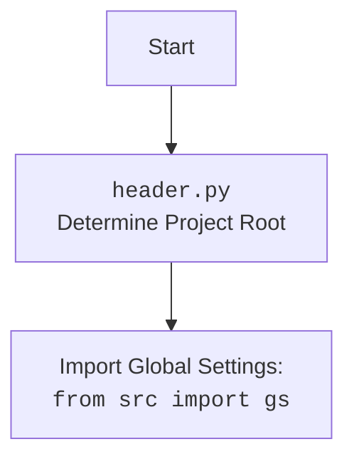

## ИНСТРУКЦИЯ:

Анализируй предоставленный код подробно и объясни его функциональность. Ответ должен включать три раздела:

1.  **<алгоритм>**: Опиши рабочий процесс в виде пошаговой блок-схемы, включая примеры для каждого логического блока, и проиллюстрируй поток данных между функциями, классами или методами.
2.  **<mermaid>**: Напиши код для диаграммы в формате `mermaid`, проанализируй и объясни все зависимости,
    которые импортируются при создании диаграммы.
    **ВАЖНО!** Убедитесь, что все имена переменных, используемые в диаграмме `mermaid`,
    имеют осмысленные и описательные имена. Имена переменных вроде `A`, `B`, `C`, и т.д., не допускаются!

    **Дополнительно**: Если в коде есть импорт `import header`, добавьте блок `mermaid` flowchart, объясняющий `header.py`:
    ```mermaid
    flowchart TD
        Start --> Header[<code>header.py</code><br> Determine Project Root]

        Header --> import[Import Global Settings: <br><code>from src import gs</code>]
    ```

3.  **<объяснение>**: Предоставьте подробные объяснения:
    -   **Импорты**: Их назначение и взаимосвязь с другими пакетами `src.`.
    -   **Классы**: Их роль, атрибуты, методы и взаимодействие с другими компонентами проекта.
    -   **Функции**: Их аргументы, возвращаемые значения, назначение и примеры.
    -   **Переменные**: Их типы и использование.
    -   Выделите потенциальные ошибки или области для улучшения.

Дополнительно, постройте цепочку взаимосвязей с другими частями проекта (если применимо).

Это обеспечивает всесторонний и структурированный анализ кода.
## Формат ответа: `.md` (markdown)
**КОНЕЦ ИНСТРУКЦИИ**

## <алгоритм>

```mermaid
graph TD
    A[Начало] --> B{Определение корня проекта `set_project_root`};
    B -- Да -- > C[Найдена папка с маркерным файлом]
    C --> D[Установка корня проекта];
    B -- Нет --> E[Корень проекта - текущая папка];
    E --> D
    D --> F[Добавление корня проекта в sys.path]
    F --> G[Импорт глобальных настроек `from src import gs`];
    G --> H{Чтение `settings.json`};
    H -- Да --> I[Загрузка настроек из `settings.json`]
    H -- Нет --> J[Настройки не загружены]
    I --> K{Чтение `README.MD`};
    J --> K
    K -- Да --> L[Загрузка документации из `README.MD`]
    K -- Нет --> M[Документация не загружена]
    L --> N[Определение переменных проекта из `settings.json` и `README.MD`]
    M --> N
    N --> O[Конец]
```

**Примеры:**

*   **Определение корня проекта:**
    *   Если маркерный файл (`__root__`, `.git`) находится в `/home/user/project`, то корень проекта будет `/home/user/project`.
    *   Если маркерные файлы не найдены, и скрипт находится в `/home/user/project/src/product`, то корень проекта будет `/home/user/project/src/product`.
*   **Чтение `settings.json`:**
    *   Файл `/home/user/project/src/settings.json` существует и содержит `{"project_name": "my_project", "version": "1.0"}`. Тогда `settings` будет словарем `{"project_name": "my_project", "version": "1.0"}`.
    *   Файл `settings.json` не существует, или неверный формат json. Тогда блок `try except` обработает ошибку, `settings` останется `None`.
*   **Чтение `README.MD`:**
    *   Файл `/home/user/project/src/README.MD` существует и содержит строку "My awesome project". Тогда `doc_str` будет "My awesome project".
    *   Файл `README.MD` не существует, или неверный формат, тогда блок `try except` обработает ошибку и `doc_str` останется `None`.
*   **Определение переменных проекта:**
    *   Если `settings = {"project_name": "my_project", "version": "1.0", "author": "John Doe"}` и `doc_str = "My project description"`, то `__project_name__` будет `"my_project"`, `__version__` будет `"1.0"`, `__doc__` будет `"My project description"`, `__author__` будет `"John Doe"` и другие переменные будут определены.
    *   Если `settings = None` и `doc_str = None`, то `__project_name__` будет `"hypotez"`, `__version__` будет `''`, `__doc__` будет `''`,  и другие переменные будут установлены значения по умолчанию.

## <mermaid>

```mermaid
flowchart TD
    Start --> FindProjectRoot[<code>set_project_root()</code><br>Найти корень проекта]
    FindProjectRoot -- Корневая директория определена --> AddToSysPath[Добавить корень проекта в <code>sys.path</code>]
    FindProjectRoot -- Корневая директория не определена --> AddToSysPath
    AddToSysPath --> ImportGlobalSettings[<code>import gs</code><br>Импорт глобальных настроек]
    ImportGlobalSettings --> ReadSettingsFile[Чтение <code>settings.json</code>]
    ReadSettingsFile -- Успешно --> ReadReadmeFile[Чтение <code>README.MD</code>]
    ReadSettingsFile -- Неудачно --> ReadReadmeFile
    ReadReadmeFile -- Успешно --> SetProjectVariables[Определение переменных проекта]
    ReadReadmeFile -- Неудачно --> SetProjectVariables
    SetProjectVariables --> End[Конец]
    

   
    classDef file fill:#f9f,stroke:#333,stroke-width:2px
    class FindProjectRoot, ReadSettingsFile, ReadReadmeFile file
    
```


**Объяснение зависимостей в диаграмме:**

*   `set_project_root()`: Функция, которая определяет корень проекта на основе наличия маркерных файлов.
*   `import gs`: Импорт модуля `gs` (global settings), который предположительно содержит пути и общие настройки проекта.
*   `settings.json`: Файл, содержащий настройки проекта в формате JSON.
*   `README.MD`: Файл, содержащий описание проекта.
*   `sys.path`: Список путей для поиска модулей.
*   `__project_name__`, `__version__`, `__doc__`, `__author__`, `__copyright__`, `__cofee__`: Глобальные переменные, содержащие метаданные проекта.

## <объяснение>

### Импорты:

*   `import sys`: Модуль `sys` используется для взаимодействия с интерпретатором Python, включая доступ к путям поиска модулей (`sys.path`).
*   `import json`: Модуль `json` используется для работы с данными в формате JSON, в данном случае для чтения файла `settings.json`.
*   `from packaging.version import Version`: Этот импорт не используется в предоставленном коде и может быть удален.
*   `from pathlib import Path`: Класс `Path` из модуля `pathlib` используется для представления путей к файлам и директориям, что облегчает работу с файловой системой.
*   `from src import gs`:  Импортирует модуль `gs` из пакета `src`. Этот модуль предположительно содержит глобальные настройки проекта, включая пути к различным директориям. Зависимость `src` указывает на то, что текущий файл является частью более крупного проекта, где `src` вероятно является корневой директорией исходного кода.

### Функции:

*   `set_project_root(marker_files=('__root__', '.git')) -> Path`:
    *   **Аргументы:**
        *   `marker_files` (tuple): Кортеж строк, представляющих имена файлов или папок, которые обозначают корень проекта. По умолчанию это `('__root__', '.git')`.
    *   **Возвращаемое значение:**
        *   `Path`: Объект `Path`, представляющий путь к корню проекта. Если ни один из `marker_files` не найден, возвращает путь к директории, в которой находится текущий файл.
    *   **Назначение:**
        *   Функция определяет корень проекта, поднимаясь по родительским директориям, пока не найдет маркерный файл.
    *   **Пример:** Если `__root__` или `.git` существуют в `/home/user/project`, и скрипт выполняется из `/home/user/project/src/product/`, функция вернет `Path("/home/user/project")`.

### Переменные:

*   `__root__`: (Path) Путь к корневой директории проекта. Инициализируется через вызов функции `set_project_root()`.
*   `settings`: (dict | None) Словарь, содержащий настройки проекта, загруженные из файла `settings.json`. Если файл не найден или содержит некорректный JSON, переменная будет равна `None`.
*   `doc_str`: (str | None) Строка, содержащая содержимое файла `README.MD`. Если файл не найден или не может быть прочитан, переменная будет равна `None`.
*   `__project_name__`: (str) Название проекта, взятое из `settings.json` или по умолчанию "hypotez".
*   `__version__`: (str) Версия проекта, взятая из `settings.json` или пустая строка по умолчанию.
*    `__doc__`: (str) Описание проекта, взятое из `README.MD` или пустая строка по умолчанию.
*   `__details__`: (str) Строка с дополнительной информацией (не используется в данном коде, задано как пустая строка `''` ).
*   `__author__`: (str) Автор проекта, взятый из `settings.json` или пустая строка по умолчанию.
*   `__copyright__`: (str) Информация об авторских правах, взятая из `settings.json` или пустая строка по умолчанию.
*  `__cofee__`: (str) Строка с призывом к пожертвованиям, взятая из `settings.json` или установленное значение по умолчанию.

### Объяснение работы кода:

1.  **Определение корня проекта:** Функция `set_project_root` ищет маркерные файлы `__root__` или `.git` в директории, в которой находится текущий файл, и во всех его родительских директориях. Это необходимо для корректного определения корневой директории проекта, независимо от того, где расположен скрипт. Найденный корень добавляется в `sys.path`, чтобы гарантировать, что все модули проекта будут доступны.
2.  **Импорт глобальных настроек:** Импортируется модуль `gs` из пакета `src`. Предположительно, `gs` используется для доступа к общим настройкам, таким как пути к различным директориям.
3.  **Чтение настроек из `settings.json`:** Код пытается загрузить настройки из файла `settings.json`, расположенного в подпапке `src` от корня проекта. Если загрузка прошла успешно, переменная `settings` будет содержать словарь с настройками. При возникновении ошибок `settings` остается `None`.
4.  **Чтение описания проекта из `README.MD`:** Код пытается прочитать содержимое файла `README.MD` из подпапки `src` от корня проекта. Если чтение прошло успешно, переменная `doc_str` будет содержать строку с описанием. При возникновении ошибок `doc_str` остается `None`.
5. **Установка переменных проекта:** На основе прочитанных данных из `settings.json` и `README.MD`, устанавливаются переменные проекта, такие как название проекта, версия, описание и автор. Если `settings` или `doc_str` равны `None`, используются значения по умолчанию.

### Потенциальные ошибки и области для улучшения:

*   **Обработка ошибок:** В блоках `try...except` используется `...` вместо конкретной обработки исключений. Это может скрыть важные ошибки. Было бы лучше добавить логирование ошибок, чтобы в случае их возникновения можно было их легко отследить.
*   **Типизация:** Хотя в коде есть аннотации типов, они не всегда соответствуют типам данных, которые могут возникнуть, например, `settings` может быть `None`. Лучше добавить проверки типов, чтобы предотвратить ошибки во время выполнения.
*   **Зависимость от `src`:** Код явно зависит от структуры проекта, в частности от расположения `settings.json` и `README.MD` в подпапке `src`. Это делает код менее гибким. Можно сделать расположение файлов настроек более настраиваемым.
*   **`packaging.version`:** Импорт `from packaging.version import Version` не используется в коде и может быть удален.
*  **Несогласованность в именах**: В коде встречаются опечатки `copyrihgnt`, которые должны быть исправлены.

### Взаимосвязи с другими частями проекта:

*   Этот модуль является частью структуры проекта `hypotez`, о чем говорит  `__project_name__ = 'hypotez'`.
*   Он использует глобальные настройки, доступные через модуль `gs` из пакета `src`.
*   Настройки и документация проекта загружаются из файлов `settings.json` и `README.MD`, которые также расположены в `src`.
*   Переменные, определенные в этом модуле, могут быть использованы другими модулями для доступа к метаданным проекта, что указывает на то, что это важная часть конфигурации проекта.

Этот анализ предоставляет подробное понимание работы кода, включая его функции, зависимости, потенциальные проблемы и связи с другими частями проекта.