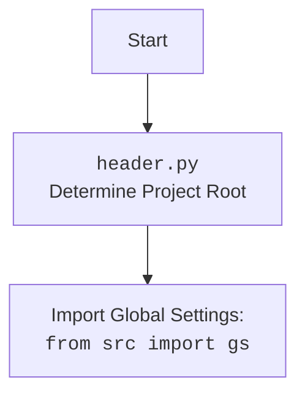

## ИНСТРУКЦИЯ:

Анализируй предоставленный код подробно и объясни его функциональность. Ответ должен включать три раздела:

1.  **<алгоритм>**: Опиши рабочий процесс в виде пошаговой блок-схемы, включая примеры для каждого логического блока, и проиллюстрируй поток данных между функциями, классами или методами.
2.  **<mermaid>**: Напиши код для диаграммы в формате `mermaid`, проанализируй и объясни все зависимости,
    которые импортируются при создании диаграммы.
    **ВАЖНО!** Убедитесь, что все имена переменных, используемые в диаграмме `mermaid`,
    имеют осмысленные и описательные имена. Имена переменных вроде `A`, `B`, `C`, и т.д., не допускаются!

    **Дополнительно**: Если в коде есть импорт `import header`, добавьте блок `mermaid` flowchart, объясняющий `header.py`:
    ```mermaid
    flowchart TD
        Start --> Header[<code>header.py</code><br> Determine Project Root]

        Header --> import[Import Global Settings: <br><code>from src import gs</code>]
    ```

3.  **<объяснение>**: Предоставьте подробные объяснения:
    *   **Импорты**: Их назначение и взаимосвязь с другими пакетами `src.`.
    *   **Классы**: Их роль, атрибуты, методы и взаимодействие с другими компонентами проекта.
    *   **Функции**: Их аргументы, возвращаемые значения, назначение и примеры.
    *   **Переменные**: Их типы и использование.
    *   Выделите потенциальные ошибки или области для улучшения.

Дополнительно, постройте цепочку взаимосвязей с другими частями проекта (если применимо).

Это обеспечивает всесторонний и структурированный анализ кода.
## Формат ответа: `.md` (markdown)
**КОНЕЦ ИНСТРУКЦИИ**

## <алгоритм>

```mermaid
graph LR
    A[Начало] --> B{Определение корня проекта: set_project_root()};
    B -- Найдено --> C[Установить корень проекта (__root__)]
    B -- Не найдено --> D[Установить __root__ как текущую директорию]
    C --> E[Добавить __root__ в sys.path]
    D --> E
    E --> F[Импорт глобальных настроек: from src import gs]
    F --> G{Чтение settings.json}
    G -- Успешно --> H[Загрузить настройки в переменную settings]
    G -- Ошибка --> I[Пропустить загрузку настроек]
    H --> J{Чтение README.md}
    I --> J
    J -- Успешно --> K[Загрузить описание в переменную doc_str]
    J -- Ошибка --> L[Пропустить загрузку описания]
    K --> M[Получение project_name из настроек]
    L --> M
    M --> N[Получение version из настроек]
    N --> O[Установка doc из doc_str]
     O --> P[Получение author из настроек]
    P --> Q[Получение copyright из настроек]
    Q --> R[Получение cofee из настроек]
    R --> S[Конец]
```

**Примеры для логических блоков:**

1.  **Определение корня проекта (set\_project\_root()):**
    *   **Пример 1 (Найдено):** Если в директории `/home/user/project/src/endpoints/prestashop/product_fields` есть файл `__root__` или директория `.git`, то корень проекта будет `/home/user/project/`.
    *   **Пример 2 (Не найдено):** Если ни в текущей директории, ни в родительских директориях нет файла `__root__` или директории `.git`, то корнем проекта будет `/home/user/project/src/endpoints/prestashop/product_fields`.
2.  **Чтение `settings.json`:**
    *   **Пример 1 (Успешно):** Если файл `/home/user/project/src/settings.json` существует и содержит корректный JSON, то его содержимое будет загружено в переменную `settings`.
    *   **Пример 2 (Ошибка):** Если файл `settings.json` не существует или содержит некорректный JSON, то переменная `settings` останется `None`.
3.  **Чтение `README.md`:**
    *   **Пример 1 (Успешно):** Если файл `/home/user/project/src/README.MD` существует, то его содержимое будет загружено в переменную `doc_str`.
    *   **Пример 2 (Ошибка):** Если файл `README.md` не существует или не может быть прочитан, то переменная `doc_str` останется `None`.
4.  **Получение параметров из настроек:**
    *   Если `settings` существует и содержит ключи `"project_name"`, `"version"`, `"author"`, `"copyrihgnt"`, и `"cofee"`, то соответствующие переменные (`__project_name__`, `__version__`, `__author__`, `__copyright__` и `__cofee__`) будут установлены в значения из настроек. В противном случае будут использованы значения по умолчанию.

## <mermaid>

```mermaid
flowchart TD
    Start[Начало] --> SetProjectRootCall[Вызов функции set_project_root()]
    SetProjectRootCall --> FindProjectRoot{Поиск корневой директории проекта}
    FindProjectRoot -- Найдено --> SetRootVar[Установить __root__]
    FindProjectRoot -- Не найдено --> SetCurrentDirAsRoot[Установить текущую директорию как __root__]
    SetRootVar --> AddRootToPath[Добавить __root__ в sys.path]
    SetCurrentDirAsRoot --> AddRootToPath
    AddRootToPath --> ImportGlobalSettings[Импорт глобальных настроек из src: `from src import gs`]
    ImportGlobalSettings --> ReadSettingsFile{Попытка чтения settings.json}
    ReadSettingsFile -- Успех --> LoadSettings[Загрузить настройки в переменную settings]
    ReadSettingsFile -- Ошибка --> SettingsError[Переменная settings = None]
    LoadSettings --> ReadReadmeFile{Попытка чтения README.md}
    SettingsError --> ReadReadmeFile
    ReadReadmeFile -- Успех --> LoadReadme[Загрузить описание в переменную doc_str]
    ReadReadmeFile -- Ошибка --> ReadmeError[Переменная doc_str = None]
    LoadReadme --> SetProjectVariables[Установка переменных проекта]
    ReadmeError --> SetProjectVariables
    SetProjectVariables --> End[Конец]
```



**Объяснение зависимостей `mermaid`:**

*   `Start`: Начало выполнения скрипта.
*   `SetProjectRootCall`: Вызов функции `set_project_root()`.
*   `FindProjectRoot`: Логический блок, который ищет маркерные файлы (`__root__`, `.git`) для определения корня проекта.
*   `SetRootVar`: Установка переменной `__root__` на найденную корневую директорию.
*   `SetCurrentDirAsRoot`: Установка переменной `__root__` на текущую директорию, если маркерные файлы не найдены.
*   `AddRootToPath`: Добавление найденной корневой директории в `sys.path`, что позволяет импортировать модули из этой директории.
*   `ImportGlobalSettings`: Импорт глобальных настроек из пакета `src`.
*   `ReadSettingsFile`: Попытка чтения файла `settings.json` для загрузки настроек проекта.
*   `LoadSettings`: Загрузка настроек из `settings.json` в переменную `settings`.
*   `SettingsError`: Установка `settings` в значение `None` в случае ошибки при чтении `settings.json`.
*   `ReadReadmeFile`: Попытка чтения файла `README.md`.
*   `LoadReadme`: Загрузка содержимого `README.md` в переменную `doc_str`.
*    `ReadmeError`: Установка `doc_str` в `None` в случае ошибки при чтении `README.md`.
*   `SetProjectVariables`: Установка переменных проекта (`__project_name__`, `__version__`, `__doc__`, `__author__`, `__copyright__`, `__cofee__`) на основе прочитанных настроек и содержимого `README.md`.
*   `End`: Конец выполнения скрипта.

## <объяснение>

### Импорты:

1.  `import sys`: Модуль `sys` используется для доступа к системным переменным и функциям, в частности, для добавления пути к корню проекта в `sys.path`. Это позволяет импортировать модули из корня проекта и его поддиректорий.
2.  `import json`: Модуль `json` используется для работы с JSON файлами, в частности, для загрузки настроек из `settings.json`.
3.  `from packaging.version import Version`: Импортирует класс `Version` из модуля `packaging.version`, который предназначен для сравнения версий. В данном коде не используется, возможно, планируется использовать в дальнейшем.
4.  `from pathlib import Path`: Импортирует класс `Path` из модуля `pathlib`, который обеспечивает объектно-ориентированный способ работы с путями к файлам и директориям.
5.  `from src import gs`: Импортирует модуль `gs` из пакета `src`. Предположительно, этот модуль содержит глобальные настройки, например пути к файлам.

### Функция:

1.  `set_project_root(marker_files=('__root__', '.git')) -> Path`:
    *   **Аргументы**:
        *   `marker_files`: Кортеж (tuple) строк, представляющих имена файлов или каталогов, которые используются для определения корня проекта. По умолчанию это `('__root__', '.git')`.
    *   **Возвращаемое значение**: Объект `Path`, представляющий путь к корню проекта.
    *   **Назначение**: Функция находит корень проекта, начиная с текущей директории файла, и поднимаясь вверх по дереву каталогов до тех пор, пока не найдет хотя бы один из файлов-маркеров. Если маркер не найден, возвращается директория, где расположен скрипт. Добавляет найденный корень проекта в `sys.path`, для дальнейшего корректного импорта модулей.
    *   **Примеры**:
        *   Если скрипт находится в `/home/user/project/src/product/product_fields/header.py`, и в `/home/user/project/` есть файл `__root__`, то функция вернёт `Path('/home/user/project/')`.
        *   Если скрипт находится в `/home/user/project/src/product/product_fields/header.py` и нигде выше нет ни `__root__`, ни `.git`, то функция вернёт `Path('/home/user/project/src/product/product_fields')`.

### Переменные:

1.  `__root__`: Переменная типа `Path`, представляющая путь к корню проекта. Устанавливается в результате вызова `set_project_root()`.
2.  `settings`: Переменная типа `dict` или `None`, представляющая словарь с настройками проекта, загруженными из `settings.json`.
3.  `doc_str`: Переменная типа `str` или `None`, представляющая строку с текстом документации, загруженную из `README.md`.
4.  `__project_name__`: Переменная типа `str`, представляющая имя проекта. Загружается из `settings` или присваивается значение по умолчанию `'hypotez'`.
5.  `__version__`: Переменная типа `str`, представляющая версию проекта. Загружается из `settings` или присваивается пустая строка `''`.
6.  `__doc__`: Переменная типа `str`, представляющая описание проекта, загруженное из `doc_str` или пустая строка `''`.
7.  `__details__`: Переменная типа `str`, изначально пустая строка `''`.
8.  `__author__`: Переменная типа `str`, представляющая автора проекта, загруженное из `settings` или пустая строка `''`.
9.  `__copyright__`: Переменная типа `str`, представляющая информацию об авторском праве, загруженную из `settings` или пустая строка `''`.
10. `__cofee__`: Переменная типа `str`, представляющая текст с информацией о возможности угостить разработчика кофе, загруженную из `settings` или строку по умолчанию `"Treat the developer to a cup of coffee for boosting enthusiasm in development: https://boosty.to/hypo69"`.

### Объяснение:

Данный код предназначен для определения корня проекта и загрузки его основных настроек и документации.

1.  Функция `set_project_root` находит корень проекта, добавляя его в `sys.path`. Это позволяет импортировать другие модули из проекта, используя относительные пути, без необходимости указывать абсолютные пути.
2.  Код пытается загрузить настройки из `settings.json` и документацию из `README.md`, и в случае ошибки устанавливает переменные `settings` и `doc_str` в `None`.
3.  На основе загруженных настроек и документации устанавливаются переменные проекта: `__project_name__`, `__version__`, `__doc__`, `__author__`, `__copyright__`, и `__cofee__`, которые могут быть использованы в других модулях проекта для получения информации о нем.
4.  Импорт `from src import gs` предполагает использование глобальных настроек проекта, таких как пути к основным директориям. Этот модуль, вероятно, определен в другом файле `src/gs.py`.

### Потенциальные ошибки и области для улучшения:

1.  **Обработка ошибок**: Код использует `try-except` блоки для обработки ошибок при загрузке файлов `settings.json` и `README.MD`, но никак не обрабатывает эти ошибки. Было бы полезно логировать или выводить предупреждения об ошибках при чтении этих файлов.
2.  **Отсутствие обработки ошибок в set\_project\_root**: функция не проверяет на ошибки (например, отсутствие прав доступа к файлам или директориям)
3.  **Зависимость от `settings.json`**: Код сильно зависит от наличия и корректности файла `settings.json`. Если этого файла не будет, то некоторые переменные будут установлены в значения по умолчанию. Возможно, стоит добавить проверки наличия обязательных ключей в файле `settings.json`.
4.  **Избыточность `doc_str`**: Содержание `README.MD` копируется в `__doc__`, но сама переменная `doc_str` больше не используется. Это можно упростить.
5.  **Отсутствие валидации**: Нет валидации загруженных настроек.

### Цепочка взаимосвязей с другими частями проекта:

1.  **`src/gs.py`**: Этот файл, вероятно, определяет глобальные настройки проекта, такие как пути к файлам, что используется в `header.py` для загрузки настроек и документации.
2.  **Другие модули проекта**: Переменные, определенные в `header.py` (например, `__project_name__`, `__version__`, `__doc__`), могут использоваться другими модулями проекта для отображения информации о проекте.
3.  **Конфигурационные файлы (`settings.json`, `README.md`)**: `header.py` зависит от этих файлов, которые предоставляют основные настройки и документацию проекта.

В целом, код выполняет задачу инициализации проекта, устанавливая основные переменные и предоставляя доступ к глобальным настройкам.