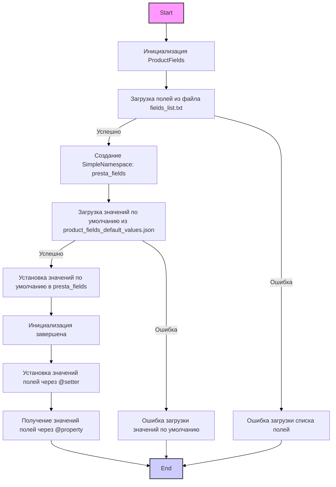

## ИНСТРУКЦИЯ:

Анализируй предоставленный код подробно и объясни его функциональность. Ответ должен включать три раздела:

1.  **<алгоритм>**: Опиши рабочий процесс в виде пошаговой блок-схемы, включая примеры для каждого логического блока, и проиллюстрируй поток данных между функциями, классами или методами.
2.  **<mermaid>**: Напиши код для диаграммы в формате `mermaid`, проанализируй и объясни все зависимости,
    которые импортируются при создании диаграммы.
    **ВАЖНО!** Убедитесь, что все имена переменных, используемые в диаграмме `mermaid`,
    имеют осмысленные и описательные имена. Имена переменных вроде `A`, `B`, `C`, и т.д., не допускаются!

    **Дополнительно**: Если в коде есть импорт `import header`, добавьте блок `mermaid` flowchart, объясняющий `header.py`:
    ```mermaid
    flowchart TD
        Start --> Header[<code>header.py</code><br> Determine Project Root]

        Header --> import[Import Global Settings: <br><code>from src import gs</code>]
    ```

3.  **<объяснение>**: Предоставьте подробные объяснения:
    -   **Импорты**: Их назначение и взаимосвязь с другими пакетами `src.`.
    -   **Классы**: Их роль, атрибуты, методы и взаимодействие с другими компонентами проекта.
    -   **Функции**: Их аргументы, возвращаемые значения, назначение и примеры.
    -   **Переменные**: Их типы и использование.
    -   Выделите потенциальные ошибки или области для улучшения.

Дополнительно, постройте цепочку взаимосвязей с другими частями проекта (если применимо).

Это обеспечивает всесторонний и структурированный анализ кода.
## Формат ответа: `.md` (markdown)
**КОНЕЦ ИНСТРУКЦИИ**
```markdown
## <алгоритм>

1. **Инициализация `ProductFields`**:
   - Создается экземпляр класса `ProductFields` с указанием `lang_index`. 
   - Вызывается метод `__post_init__`, который вызывает метод `_payload`.
   - **Пример**: `product_fields = ProductFields(lang_index=1)`

2. **Загрузка данных в `_payload`**:
   - Чтение списка полей из файла `fields_list.txt` с помощью `read_text_file` и сохранение в `presta_fields_list`.
     - **Пример**: `['id_product', 'id_supplier', 'name', ...]`
   - Если не удалось прочитать список, логгируется ошибка и возвращается `False`.
   - Создание `SimpleNamespace` объекта `presta_fields` с атрибутами, взятыми из `presta_fields_list` и инициализированными в `None`.
   - Загрузка значений по умолчанию из файла `product_fields_default_values.json` в объект `data_ns`.
   - Если не удалось прочитать данные из json файла, логгируется ошибка и возвращается `False`.
   - Обновление атрибутов объекта `presta_fields` значениями из `data_ns`.
   - При успешной загрузке возвращается `True`.
   - Если возникла ошибка при загрузке, логгируется ошибка и возвращается `False`.

3. **Работа с полями через property и setter**:
   - Для каждого поля в PrestaShop (например, `id_product`, `name`, `price` и т.д.) определены:
     - `@property`: Метод для получения текущего значения поля из `self.presta_fields`.
       - **Пример**: `product_fields.id_product` вернет значение `self.presta_fields.id_product`.
     - `@setter`: Метод для установки нового значения поля в `self.presta_fields`.
       - **Пример**: `product_fields.id_product = 123` установит `self.presta_fields.id_product` в 123.
   - При установке значения вызывается исключение `ProductFieldException`  и регистрируется ошибка.
     - **Пример**: `product_fields.id_product = "abc"` (неверный тип) вызовет ошибку в логе.

4. **Работа с ассоциациями**:
   - Методы `associations` (property и setter) работают со словарем ассоциаций.
   - Можно задать словарь ассоциаций для категорий, атрибутов и других сущностей.
   - **Пример**:
        -   `product_fields.associations = {"categories": [{"id": 1}, {"id": 2}]}`
        -   `categories = product_fields.associations`

5. **Работа с многоязычными полями**:
   - Для полей, таких как `description`, `name`, `meta_description` и др., значения устанавливаются как словари с ключом `language`.
   - Каждый словарь в списке `language` содержит атрибут `id`, который устанавливается значением `lang_index` и `value`.
   - **Пример**:
     -   `product_fields.name = "Название товара"` установит `self.presta_fields.name` в словарь `{'language': [{'attrs': {'id': 1}, 'value': 'Название товара'}]}`.
   - Поле `lang_index` определяет  язык по умолчанию.

6. **Служебные поля**:
     - Поля `images_urls`, `local_image_path`, `local_video_path` используются для хранения путей к файлам или URL.
     -  Поле `page_lang` сохраняет код языка, с которого была получена информация.
     -  Эти поля не являются полями `Prestashop` и хранятся в отдельном словаре `assist_fields_dict`.

**Поток данных:**

1.  Данные загружаются из файлов (`fields_list.txt`, `product_fields_default_values.json`) в объект `ProductFields` при инициализации.
2.  Данные устанавливаются через `@setter` методы в `self.presta_fields`.
3.  Данные получаются через `@property` методы из `self.presta_fields` или  `self.assist_fields_dict`.
4.  При ошибках устанавливаются значения по умолчанию, либо прерывается дальнейшее выполнение.

## <mermaid>



**Описание диаграммы:**

*   `Start`: Начало процесса.
*   `InitClass`: Инициализация класса `ProductFields`. Включает в себя чтение списка полей и значений по умолчанию, а также создание объекта для хранения данных полей `presta_fields`.
*   `LoadFields`: Загрузка списка полей из файла `fields_list.txt` с использованием функции `read_text_file`.
*   `CreateNameSpace`: Создание объекта `SimpleNamespace` для хранения полей продукта PrestaShop. Ключи полей берутся из списка `presta_fields_list`.
*   `LoadDefaultValues`: Загрузка значений по умолчанию для полей из файла `product_fields_default_values.json` с помощью `j_loads_ns`.
*   `SetDefaultValues`: Установка значений по умолчанию для полей в объекте `presta_fields`.
*   `EndInit`: Завершение процесса инициализации.
*   `SetProductFields`:  Установка значений полей продукта через методы `@setter`.
*   `GetProductFields`: Получение значений полей продукта через методы `@property`.
*   `ErrorLoadFields`:  Остановка процесса из-за ошибки при загрузке списка полей.
*   `ErrorLoadValues`: Остановка процесса из-за ошибки при загрузке значений по умолчанию.
*   `End`: Конец процесса.

**Зависимости:**

*   `header.py`: Этот файл не показан в текущей диаграмме,  но он импортируется и его цель - определение коря проекта.
    ```mermaid
    flowchart TD
        Start --> Header[<code>header.py</code><br> Determine Project Root]

        Header --> import[Import Global Settings: <br><code>from src import gs</code>]
    ```
*   `from src import gs`: Импортирует глобальные настройки проекта, используемые для доступа к путям файлов и другим настройкам.
*   `src.utils.jjson`: Импортирует `j_loads`, `j_loads_ns`, `j_dumps` для загрузки и работы с JSON файлами.
*   `src.utils.file`: Импортирует `read_text_file` для чтения текстовых файлов.
*   `src.utils.convertors.dict`: Импортирует `dict2ns` для преобразования словаря в `SimpleNamespace` (не используется напрямую в этом коде).
*   `src.logger`: Импортирует `logger` для логирования ошибок и отладочной информации.
*   `src.logger.exceptions`: Импортирует `ProductFieldException` для обработки ошибок, связанных с установкой значений полей.

## <объяснение>

### Импорты:

*   `import asyncio`: Библиотека для асинхронного программирования (не используется в предоставленном коде, но возможно используется в других частях проекта).
*   `from datetime import datetime`: Импортирует класс `datetime` для работы с датой и временем.
*   `from enum import Enum`: Импортирует `Enum` для создания перечислений.
*   `from dataclasses import dataclass, field`: Импортирует декоратор `dataclass` для создания классов данных и функцию `field` для определения атрибутов данных.
*   `from pathlib import Path`: Импортирует класс `Path` для работы с файловыми путями.
*   `from typing import List, Dict, Optional`: Импортирует типы для аннотаций типов.
*   `from types import SimpleNamespace`: Импортирует `SimpleNamespace` для создания простых объектов с произвольными атрибутами.
*   `import header`: Импортирует модуль `header`, который, вероятно, определяет корень проекта.
*   `from src import gs`: Импортирует глобальные настройки проекта из модуля `gs` в пакете `src`.
*   `from src.utils.jjson import j_loads, j_loads_ns, j_dumps`: Импортирует функции для работы с JSON из модуля `jjson` в пакете `src.utils`.
    *   `j_loads`: используется для загрузки JSON из строки.
    *   `j_loads_ns`: используется для загрузки JSON из файла в объект `SimpleNamespace`.
    *    `j_dumps`:  для записи JSON.
*   `from src.utils.file import read_text_file`: Импортирует функцию для чтения текстовых файлов из модуля `file` в пакете `src.utils`.
*   `from src.utils.convertors.dict import dict2ns`:  Импортирует функцию для конвертации словаря в SimpleNamespace.
*   `from src.logger import logger`: Импортирует объект `logger` для логирования из модуля `logger` в пакете `src`.
*   `from src.logger.exceptions import ProductFieldException`: Импортирует класс исключения `ProductFieldException` из модуля `exceptions` в пакете `src.logger`.

### Классы:

*   `ProductFields`:
    *   Роль: Представляет поля продукта PrestaShop для работы с API.
    *   Атрибуты:
        *   `lang_index` (`int`): Индекс языка.
        *   `product_fields_list` (`List[str]`): Список полей (инициализируется в `__post_init__`).
        *   `presta_fields` (`SimpleNamespace`): Объект для хранения значений полей PrestaShop (инициализируется в `__post_init__`).
        *   `assist_fields_dict` (`Dict[str, any]`): Словарь для хранения служебных данных, таких как URL изображений.
        *   `base_path`: (`Path`): Путь к файлам конфигурации.
    *   Методы:
        *   `__post_init__(self)`: Вызывается после создания экземпляра класса. Загружает данные полей и вызывает `_payload`.
        *   `_payload(self) -> bool`: Загружает значения полей из текстового и JSON файлов. Возвращает `True` в случае успеха, `False` при ошибке.
        *   `associations`: Property и setter для работы с ассоциациями.
        *   Множество property и setter для каждого поля PrestaShop (например, `id_product`, `name`, `price` и т.д.).
        *   Property и setter для полей в таблице `ps_product_lang`.

### Функции:

*   `__post_init__(self)`:
    *   Аргументы: `self` (экземпляр класса).
    *   Возвращаемое значение: `None`.
    *   Назначение: Инициализация экземпляра класса. Вызывает метод `_payload` для загрузки данных.
*   `_payload(self) -> bool`:
    *   Аргументы: `self` (экземпляр класса).
    *   Возвращаемое значение: `bool` (`True` при успехе, `False` при ошибке).
    *   Назначение: Загружает значения полей из текстового и JSON файлов и сохраняет в `self.presta_fields`.
    *   Пример:
        -   Читает список полей из `fields_list.txt` в список `presta_fields_list`, например, `['id_product', 'name', 'price']`.
        -   Создает `SimpleNamespace` объект `presta_fields`, в котором каждому ключу из списка `presta_fields_list` присваивается значение `None`.
        -   Читает словарь со значениями полей по умолчанию  из файла `product_fields_default_values.json`, например, `{'name': '', 'price': 0.0}`.
        -   Проходит циклом по ключам `data_ns` и устанавливает в `self.presta_fields` соответсвующие значения.
*   `@property`:
    *   Аргументы: `self` (экземпляр класса).
    *   Возвращаемое значение: Значение соответствующего поля из `self.presta_fields`.
    *   Назначение: Позволяет получить значения полей.
    *   Пример: `product_fields.id_product` (вызовет метод `@property def id_product(self)`).
*   `@setter`:
    *   Аргументы: `self` (экземпляр класса), `value` (новое значение поля).
    *   Возвращаемое значение: `None` или `bool` (обычно `True` при успехе, `None` при ошибке).
    *   Назначение: Устанавливает новые значения для полей в `self.presta_fields`.
    *   Пример: `product_fields.id_product = 123` (вызовет метод `@id_product.setter def id_product(self, value)`).

### Переменные:

*   `lang_index` (`int`): Индекс языка для мультиязычных полей.
*   `product_fields_list` (`List[str]`): Список названий полей PrestaShop (генерируется при инициализации).
*   `presta_fields` (`SimpleNamespace`): Объект для хранения значений полей PrestaShop.
*   `assist_fields_dict` (`Dict[str, any]`): Словарь для хранения служебных полей (например, URL изображений).
*   `base_path` (`Path`): Путь к файлам с конфигурациями.
*   `value` (`int`, `str`, `float` и др.): Значение, устанавливаемое для поля (тип зависит от поля).
*   `EnumRedirect`, `EnumCondition`, `EnumVisibity`, `EnumProductType` (`Enum`): Перечисления для работы с типами данных.
*   `data_ns` (`SimpleNamespace`): Объект, в который загружаются значения по умолчанию.

### Ошибки и улучшения:

*   **Отсутствует валидация типов**: В коде используется обработка исключений, но явная валидация типов данных перед присваиванием полям отсутствует. Например, перед присвоением значения полю `id_product`, следует проверять, что `value` является целым числом.
*   **Повторяющийся код**:  Множество однотипных `property` и `setter` методов, которые выполняют по сути одно и тоже действие. Можно использовать декоратор или метакласс для генерации этих методов,  что уменьшит количество повторяющегося кода.
*   **Обработка ошибок**: Все ошибки обрабатываются одинаково,  путем логирования. Можно добавить более гибкую систему обработки ошибок, например,  возвращать объект с ошибкой.
*   **Отсутствует документация для всех методов**: Некоторые методы (например, некоторые setter и property) не имеют docstring, которые описывали бы их назначение.
*    **Не используется `dict2ns`**: Импорт `dict2ns` присутствует, но не используется в этом коде, возможно он нужен для будущих реализаций.
*    **Жестко заданные индексы языка**: Присвоение языку индекса `1` по умолчанию.  Нужно это значение брать извне, т.к. индексы языков у разных клиентов могут отличаться.
*    **Не используется `j_dumps`**: Импорт есть, но не используется в данном коде. Возможно, предполагается использование в дальнейшем.

### Взаимосвязи с другими частями проекта:

*   **`header.py`**: Определяет корень проекта, что важно для правильной загрузки файлов конфигурации.
*   **`src.gs`**: Глобальные настройки, позволяющие получить пути к файлам и другие параметры конфигурации.
*   **`src.utils.jjson`**: Используется для загрузки значений по умолчанию из JSON-файлов,  а также для последующей обработки данных при работе с API.
*   **`src.utils.file`**: Используется для чтения списка полей из текстового файла.
*   **`src.logger`**: Используется для логирования ошибок, что помогает отлаживать код.
*   **`src.logger.exceptions`**:  Используется для определения и обработки исключений, связанных с полями продуктов.
*   **Другие части проекта**: Этот класс предназначен для работы с API PrestaShop, поэтому он, вероятно, будет использоваться в компонентах, которые взаимодействуют с этим API (например, импорт товаров, обновление товаров).
```