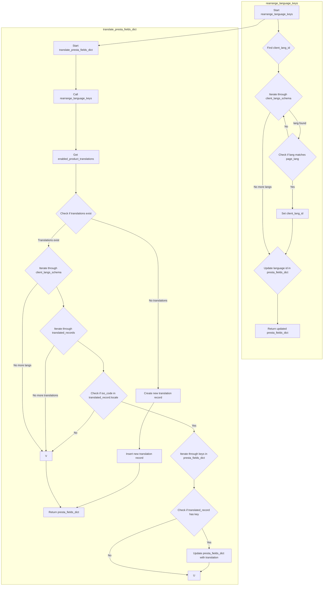

## АНАЛИЗ КОДА: `product_fields_translator.py`

### 1. <алгоритм>

**1. Функция `rearrange_language_keys`:**

   *   **Вход:** `presta_fields_dict` (словарь полей товара), `client_langs_schema` (схема языков клиента), `page_lang` (язык страницы).
   *   **Шаг 1:** Инициализация `client_lang_id` как `None`.
   *   **Шаг 2:** Перебор элементов `lang` в `client_langs_schema`.
        *   **Пример:** `client_langs_schema = [{'id': 1, 'locale': 'en-US', 'iso_code': 'en', 'language_code': 'en-us'}, {'id': 2, 'locale': 'ru-RU', 'iso_code': 'ru', 'language_code': 'ru-ru'}]`, `page_lang = 'ru-RU'`
        *   **Условие:** Если `lang['locale']` или `lang['iso_code']` или `lang['language_code']`  равны `page_lang`.
        *   **Пример:** для `lang = {'id': 2, 'locale': 'ru-RU', 'iso_code': 'ru', 'language_code': 'ru-ru'}` и `page_lang = 'ru-RU'` условие `lang['locale'] == page_lang` выполняется.
        *   **Действие:** Установить `client_lang_id` равным `lang['id']` и прервать цикл.
        *   **Пример:** `client_lang_id = 2`.
   *   **Шаг 3:** Если `client_lang_id` не `None`.
        *   **Действие:** Перебор всех `field` в `presta_fields_dict.values()`.
        *   **Условие:** Если `field` является словарем и содержит ключ `language`.
        *   **Действие:** Перебор элементов `lang_data` в `field['language']`.
        *   **Действие:** Обновить значение ключа `'id'` в `lang_data['attrs']` на строковое представление `client_lang_id`.
            *  **Пример:** `lang_data['attrs'] = {'id': '1'}`, `client_lang_id = 2`. => `lang_data['attrs'] = {'id': '2'}`.
   *  **Выход:** Обновленный `presta_fields_dict`.

**2. Функция `translate_presta_fields_dict`:**

   *   **Вход:** `presta_fields_dict` (словарь полей товара), `client_langs_schema` (схема языков клиента), `page_lang` (язык страницы).
   *   **Шаг 1:** Вызов `rearrange_language_keys` для обновления идентификаторов языка.
   *  **Пример:** `presta_fields_dict` = `{'name': {'language': [{'attrs': {'id': '1'}, 'value': 'Old Name'}]}}`. После `rearrange_language_keys` с `client_langs_schema` и `page_lang = 'ru-RU'` может стать  `{'name': {'language': [{'attrs': {'id': '2'}, 'value': 'Old Name'}]}}`
   *   **Шаг 2:** Получение `enabled_product_translations` из таблицы переводов по `presta_fields_dict['reference']`.
        *   **Пример:** `enabled_product_translations` может быть списком объектов, представляющих переводы из БД.
   *   **Шаг 3:** Если `enabled_product_translations` пустой список или равен `None`
        *   **Действие:** Создать новую запись перевода (`rec`) на основе `presta_fields_dict`.
        *   **Действие:** Вставить новую запись в таблицу переводов.
        *   **Возврат:** `presta_fields_dict`.
   *   **Шаг 4:** Перебор всех `client_lang` из `client_langs_schema`.
        *   **Пример:** `client_lang = {'id': 2, 'iso_code': 'ru'}`
        *   **Шаг 5:** Перебор всех `translated_record` из `enabled_product_translations`.
            *   **Пример:** `translated_record` - объект из базы данных с полями, представляющими перевод
            *   **Условие:** Если `client_lang['iso_code']` содержится в `translated_record.locale`.
                *   **Пример:** `client_lang['iso_code'] == 'ru'`, `translated_record.locale == 'ru-RU'`
                *   **Действие:** Перебор всех `key` в `presta_fields_dict`.
                    *   **Пример:** `key = 'name'`
                    *  **Условие:** Если `translated_record` имеет атрибут с именем `key`.
                    *  **Действие:** Обновить `presta_fields_dict[key]` на значение из `translated_record` в соответствующем языковом словаре.
                        *  **Пример:** `presta_fields_dict['name'] = {'language': [{'attrs': {'id': '2'}, 'value': 'Новое имя'}]}`.
   *  **Выход:** Обновленный `presta_fields_dict`.

### 2. <mermaid>

**Объяснение `mermaid`:**

-   **rearrange_language_keys subgraph**:
    -   `Start rearrange_language_keys`: Начало функции.
    -   `Find client_lang_id`: Поиск идентификатора языка клиента.
    -   `Iterate through client_langs_schema`: Перебор элементов в схеме языков.
    -   `Check if lang matches page_lang`: Проверка совпадения языка текущего элемента с языком страницы.
    -    `Set client_lang_id`: Установка `client_lang_id`.
    -   `Update language id in presta_fields_dict`: Обновление идентификаторов языка в словаре `presta_fields_dict`.
    -   `Return updated presta_fields_dict`: Возвращение обновленного словаря.

-   **translate_presta_fields_dict subgraph**:
    -    `Start translate_presta_fields_dict`: Начало функции.
    -   `Call rearrange_language_keys`: Вызов функции `rearrange_language_keys`.
    -   `Get enabled_product_translations`: Получение переводов товара из базы данных.
    -   `Check if translations exist`: Проверка, есть ли переводы в базе данных.
     -   `Create new translation record`: Создание новой записи перевода.
        - `Insert new translation record`: Вставка новой записи в базу данных.
    -    `Return presta_fields_dict`: Возврат словаря полей.
    -   `Iterate through client_langs_schema`: Цикл по языкам клиента.
    -   `Iterate through translated_records`: Цикл по записям переводов.
    -   `Check if iso_code in translated_record.locale`: Проверка, соответствует ли язык перевода текущему языку клиента.
    -   `Iterate through keys in presta_fields_dict`: Цикл по ключам словаря полей товара.
    -   `Check if translated_record has key`: Проверка, есть ли у записи перевода ключ.
    -   `Update presta_fields_dict with translation`: Обновление словаря полей товара данными перевода.

**Импорт зависимостей для `mermaid`:**

-   `from pathlib import Path`: Для работы с путями файловой системы, но не используется непосредственно в логике `mermaid` диаграммы.
-    `from typing import List`: Для аннотации типов, не используется непосредственно в логике `mermaid` диаграммы.
-   `from src import gs`: Импорт глобальных настроек, не участвует в `mermaid` диаграмме.
-   `from src.utils.printer import pprint`:  Для отладки и логирования, не участвует в `mermaid` диаграмме.
-   `from src.logger.logger import logger`: Для логирования ошибок, не участвует в `mermaid` диаграмме.
-   `from src.logger.exceptions import ProductFieldException`: Для обработки исключений, не участвует в `mermaid` диаграмме.
-  `from src.translator import get_translations_from_presta_translations_table`, `from src.translator import insert_new_translation_to_presta_translations_table` : Импорт функций работы с БД, участвует в логике `mermaid` диаграммы, как получение и сохранение переводов в таблице `presta_translations`.

### 3. <объяснение>

**Импорты:**

-   `from pathlib import Path`: Импортирует класс `Path` для работы с путями к файлам и директориям. В данном коде не используется, но может быть полезен для других частей модуля, если требуется работа с файловой системой.
-   `from typing import List`: Импортирует `List` для аннотации типов, что помогает улучшить читаемость и облегчить отладку кода, указывая, что переменные должны быть списками.
-   `from src import gs`: Импортирует глобальные настройки приложения, которые могут использоваться для различных конфигураций и констант, применяемых в проекте.
-   `from src.utils.printer import pprint`: Импортирует функцию `pprint` для "красивой" печати структур данных, используется для отладочного вывода в логи.
-   `from src.logger.logger import logger`: Импортирует объект `logger` для ведения журнала событий, используется для записи ошибок и отладочной информации.
-   `from src.logger.exceptions import ProductFieldException`: Импортирует исключение `ProductFieldException` для обработки ошибок, связанных с полями продукта.
- `from src.translator import get_translations_from_presta_translations_table`, `from src.translator import insert_new_translation_to_presta_translations_table`: Импортирует функции для работы с таблицей переводов в БД.

**Функции:**

1.  **`rearrange_language_keys(presta_fields_dict: dict, client_langs_schema: dict | List[dict], page_lang: str) -> dict`**:
    *   **Аргументы:**
        *   `presta_fields_dict`: Словарь с данными полей продукта, где ключи - это названия полей, а значения - словари с атрибутами `language`.
        *   `client_langs_schema`: Список или словарь, содержащий информацию о языках, используемых на клиентской стороне (id, locale, iso_code).
        *   `page_lang`: Язык страницы, с которой были получены данные продукта (например, 'en-US', 'ru-RU').
    *   **Назначение:** Функция перебирает языки клиента (`client_langs_schema`) и ищет совпадение с языком страницы (`page_lang`). Если совпадение найдено, она обновляет идентификаторы языка в словаре `presta_fields_dict`, заменяя их на идентификаторы из клиентской схемы.
    *   **Возвращаемое значение:** Обновленный словарь `presta_fields_dict`.
    *   **Пример:** Если `presta_fields_dict` содержит `{'name': {'language': [{'attrs': {'id': '1'}, 'value': 'Product Name'}]}}`, а `client_langs_schema` содержит язык с `locale = 'ru-RU'` и `id = 2`, после применения функции `attrs['id']` будет обновлен до `'2'`.
    *   **Потенциальные улучшения:**  Добавьте проверки на корректность типов входных данных.
2.  **`translate_presta_fields_dict(presta_fields_dict: dict, client_langs_schema: list | dict, page_lang: str = None) -> dict`**:
    *   **Аргументы:**
        *   `presta_fields_dict`: Словарь с данными полей продукта, которые нужно перевести.
        *   `client_langs_schema`: Схема языков клиента (список или словарь с `id`, `iso_code` и т.д.).
        *   `page_lang`: Язык страницы поставщика (по умолчанию `None`). Если `None`, язык будет определен в процессе работы.
    *   **Назначение:** Функция проводит перевод мультиязычных полей продукта. Она сначала переупорядочивает идентификаторы языка, затем ищет существующие переводы в таблице `presta_translations` и применяет их к `presta_fields_dict`. Если перевод отсутствует, создает новую запись.
    *   **Возвращаемое значение:** `presta_fields_dict` с переведенными или обновленными значениями.
    *   **Пример:**  Если в `presta_fields_dict` есть `{'name': {'language': [{'attrs': {'id': '1'}, 'value': 'Old Name'}]}}`, а в таблице есть перевод для языка `ru-RU`, функция может обновить `presta_fields_dict` на `{'name': {'language': [{'attrs': {'id': '2'}, 'value': 'Новое имя'}]}}`.
    *   **Потенциальные улучшения:**
        *   Добавить обработку случая, когда `page_lang` не определен и нет возможности определить язык из контента.
        *   Улучшить логику выбора языка перевода, возможно, использовать более гибкие критерии совпадения.
        *   Обработать ситуацию, когда  `translated_record` не содержит атрибут `key`

**Переменные:**

-   `presta_fields_dict`: Словарь, представляющий поля продукта. Содержит как мультиязычные, так и обычные значения.
-   `client_langs_schema`: Схема языков клиента, содержит соответствия между идентификаторами и кодами языков.
-   `page_lang`: Язык страницы поставщика, используется для определения соответствия языку клиента.
-   `client_lang_id`: Идентификатор языка клиента, полученный из `client_langs_schema`.
-   `enabled_product_translations`: Список или объект, содержащий переводы полей продукта из таблицы `presta_translations`.
-   `translated_record`: Объекты из базы данных, содержащие переводы для конкретного языка.
-  `record`: Глобальная переменная, используемая для создания нового объекта перевода.

**Взаимосвязи с другими частями проекта:**

-   **`src.gs`**:  Используется для доступа к глобальным настройкам проекта, что может влиять на работу модуля.
-   **`src.utils.printer`**:  Используется для форматированного вывода при отладке и логировании.
-   **`src.logger`**:  Используется для записи ошибок и отладочной информации, позволяя отслеживать работу модуля.
-  **`src.translator`**: Используется для получения и добавления переводов в таблицу переводов в БД.
-   **БД PrestaShop**: Данный модуль работает с данными полученными от PrestaShop, как с каталогом продуктов так и таблицей `presta_translations`.

**Общая картина:**

Модуль `product_fields_translator.py` предназначен для обработки данных полей товара, полученных от поставщика, и их перевода на языки, используемые в клиентской базе данных. Он обеспечивает гибкость в обработке мультиязычных полей, позволяя адаптировать данные для разных клиентов.  Модуль взаимодействует с БД, чтобы сохранить переводы, и использует настройки приложения для своей работы.