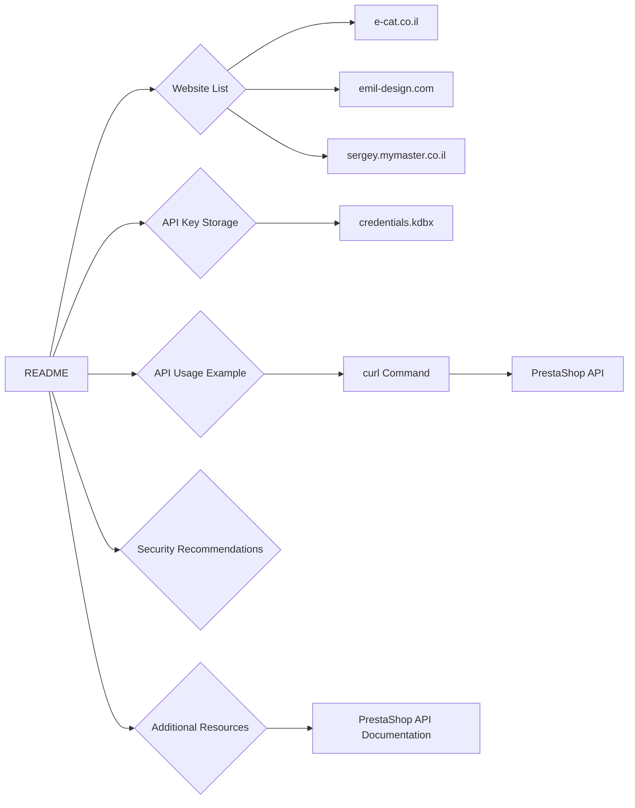

# <input code>

```markdown
# Managing PrestaShop Websites

This `README` file explains the structure and usage of your PrestaShop websites, as well as the storage and use of API keys.

## Websites

Your PrestaShop websites:
1. [e-cat.co.il](https://e-cat.co.il)
2. [emil-design.com](https://emil-design.com)
3. [sergey.mymaster.co.il](https://sergey.mymaster.co.il)

Each of these websites uses APIs to interact with various parameters and functions.

## Storing API Keys

API keys for each website are stored in the `credentials.kdbx` file. This file is a secure password database and contains the following data for each website:
- Website URL
- API Key
- Additional metadata (if necessary)

To work with the keys from the file, use a password manager that supports the `.kdbx` format, such as [KeePass](https://keepass.info/) or [KeePassXC](https://keepassxc.org/).

## Example API Usage

To connect to the API of one of your websites, follow the template below:

### API Request Example

**API Request Template:**
```bash
curl -X GET 'https://<SITE_URL>/api/<endpoint>' \
-H 'Authorization: Basic <base64(API_KEY)>'
```

**Parameter Explanation:**
- `<SITE_URL>` — the website address, e.g., `e-cat.co.il`.
- `<endpoint>` — the API endpoint (e.g., `products`, `customers`).
- `<API_KEY>` — the API key, encoded in Base64.

### Example API Call
To fetch a list of products from `e-cat.co.il`:
```bash
curl -X GET 'https://e-cat.co.il/api/products' \
-H 'Authorization: Basic <base64(API_KEY)>'
```

## Security Recommendations

- Never share the `credentials.kdbx` file with others.
- Ensure the file is stored in a secure location accessible only to you.
- Regularly update your API keys and database passwords.

## Additional Resources

If you encounter any issues or have questions about connecting to the API, refer to the [official PrestaShop API documentation](https://devdocs.prestashop.com/), which provides information on available endpoints and how to interact with them.
```
# <algorithm>

This code doesn't contain executable code. It's a README file describing how to interact with PrestaShop websites using their APIs.  There is no algorithm to describe.  The document provides:

* **Website Information:** Lists the websites being managed.
* **API Key Storage:** Explains how API keys are stored securely in a `.kdbx` file.
* **API Usage Example:**  Provides a template for making API requests, including the necessary headers and parameters.
* **Security Recommendations:**  Warns about the importance of secure storage of API keys.
* **Additional Resources:** Guides the user to official documentation for further details.

The document is primarily for documentation and setup, not for processing data or performing actions.
# <mermaid>


This mermaid diagram shows the structure of the information in the README file.  The `README` acts as a central node, connecting to various sections explaining website lists, key storage, API examples, security, and external documentation. No internal program dependencies are shown as the document is purely descriptive.


# <explanation>

This is a README file, not a piece of executable code.  Therefore, there are no imports, classes, functions, or variables in the traditional programming sense.  The file serves to document:

* **Project Overview:** It describes the PrestaShop websites being managed.
* **API Access:** It details how to access the APIs of those websites.
* **Security Procedures:**  It emphasizes the importance of protecting API keys.
* **External Resources:** It directs the reader to official PrestaShop API documentation for complete details.

The file is a critical part of the project's documentation, vital for anyone needing to use the APIs or interact with the websites.  There are no errors or areas for improvement in the context of a README file; it's designed to be easily readable and informative.

Possible next steps, implied in the file, might include creating scripts to interact with these APIs using `curl` (or libraries built on top of it) within a project folder.