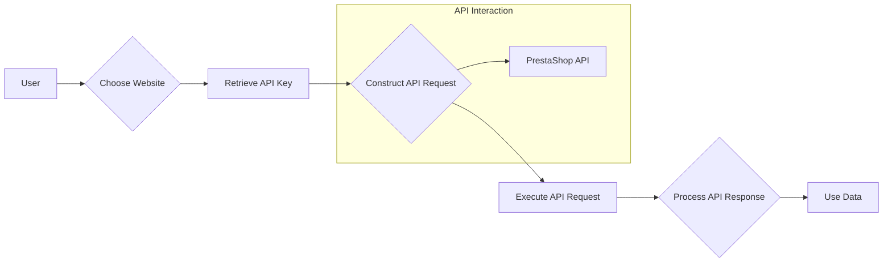

```MD
# Managing PrestaShop Websites

This `README` file explains the structure and usage of your PrestaShop websites, as well as the storage and use of API keys.

## Websites

Your PrestaShop websites:
1. [e-cat.co.il](https://e-cat.co.il)
2. [emil-design.com](https://emil-design.com)
3. [sergey.mymaster.co.il](https://sergey.mymaster.co.il)

Each of these websites uses APIs to interact with various parameters and functions.

## Storing API Keys

API keys for each website are stored in the `credentials.kdbx` file. This file is a secure password database and contains the following data for each website:
- Website URL
- API Key
- Additional metadata (if necessary)

To work with the keys from the file, use a password manager that supports the `.kdbx` format, such as [KeePass](https://keepass.info/) or [KeePassXC](https://keepassxc.org/).

## Example API Usage

To connect to the API of one of your websites, follow the template below:

### API Request Example

**API Request Template:**
```bash
curl -X GET 'https://<SITE_URL>/api/<endpoint>' \
-H 'Authorization: Basic <base64(API_KEY)>'
```

**Parameter Explanation:**
- `<SITE_URL>` — the website address, e.g., `e-cat.co.il`.
- `<endpoint>` — the API endpoint (e.g., `products`, `customers`).
- `<API_KEY>` — the API key, encoded in Base64.

### Example API Call
To fetch a list of products from `e-cat.co.il`:
```bash
curl -X GET 'https://e-cat.co.il/api/products' \
-H 'Authorization: Basic <base64(API_KEY)>'
```

## Security Recommendations

- Never share the `credentials.kdbx` file with others.
- Ensure the file is stored in a secure location accessible only to you.
- Regularly update your API keys and database passwords.

## Additional Resources

If you encounter any issues or have questions about connecting to the API, refer to the [official PrestaShop API documentation](https://devdocs.prestashop.com/), which provides information on available endpoints and how to interact with them.
```

## <algorithm>

This code doesn't have executable code; it's a README file describing how to interact with PrestaShop websites via their APIs.  Therefore, there's no algorithm in the traditional sense of a step-by-step process.  The file outlines the following steps for using the API:

1. **Identify the website:** Choose the desired PrestaShop website from the provided list (e.g., `e-cat.co.il`).
2. **Retrieve API key:** Obtain the API key for the chosen website from the `credentials.kdbx` file using a password manager.
3. **Construct API request:** Use the provided template to form the API request, replacing `<SITE_URL>`, `<endpoint>`, and `<API_KEY>` with the appropriate values.
4. **Execute the request:** Use `curl` (or a similar tool) to send the API request to the PrestaShop website.
5. **Process the response:** Analyze the response from the PrestaShop API to extract the desired data.


## <mermaid>



## <explanation>

This README file serves as documentation for interacting with PrestaShop websites through their APIs.  It doesn't contain any executable code; it describes the process.

**Importages:**  There are no imports as the file is not Python code, but plain markdown.

**Classes and Functions:** There are no classes or functions in the provided code. It's just documentation.

**Variables:** No variables are declared in the code.

**Potential Errors/Improvements:**

* **Security:** The emphasis on secure storage of API keys (`credentials.kdbx`) is crucial.  However, the README doesn't detail how to prevent accidental exposure of the file itself.  Explicit instructions for safeguarding the file (e.g., using a secure file sharing service, encryption, or access control) would strengthen the security aspect.

* **Error Handling:** The README lacks details on how to handle potential errors (e.g., API errors, network issues).  Documentation on dealing with various response codes and the structure of the API response would improve the usability.


**Dependencies:** The `curl` command-line tool is a dependency for executing the API requests.  The password manager (KeePass, KeePassXC) is a dependency for handling the `credentials.kdbx` file.  The PrestaShop API itself is also a dependency, since it determines the available endpoints and formats.  These are *external* dependencies, not part of the code within the markdown file itself.

**Relationship to other parts of the project:** The project likely includes code (not shown in this snippet) that interacts with the PrestaShop websites using the API keys and endpoints described.  The README provides instructions on how to use the API keys. This documentation is critical in orchestrating the relationship between the API calls and other parts of the project.