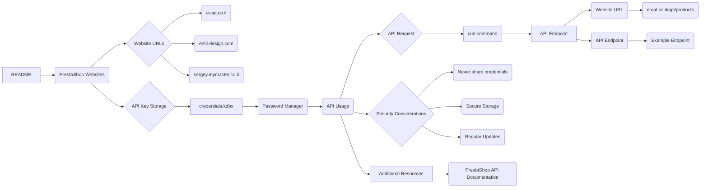

```MD
# Managing PrestaShop Websites

This `README` file explains the structure and usage of your PrestaShop websites, as well as the storage and use of API keys.

## Websites

Your PrestaShop websites:
1. [e-cat.co.il](https://e-cat.co.il)
2. [emil-design.com](https://emil-design.com)
3. [sergey.mymaster.co.il](https://sergey.mymaster.co.il)

Each of these websites uses APIs to interact with various parameters and functions.

## Storing API Keys

API keys for each website are stored in the `credentials.kdbx` file. This file is a secure password database and contains the following data for each website:
- Website URL
- API Key
- Additional metadata (if necessary)

To work with the keys from the file, use a password manager that supports the `.kdbx` format, such as [KeePass](https://keepass.info/) or [KeePassXC](https://keepassxc.org/).

## Example API Usage

To connect to the API of one of your websites, follow the template below:

### API Request Example

**API Request Template:**
```bash
curl -X GET 'https://<SITE_URL>/api/<endpoint>' \
-H 'Authorization: Basic <base64(API_KEY)>'
```

**Parameter Explanation:**
- `<SITE_URL>` — the website address, e.g., `e-cat.co.il`.
- `<endpoint>` — the API endpoint (e.g., `products`, `customers`).
- `<API_KEY>` — the API key, encoded in Base64.

### Example API Call
To fetch a list of products from `e-cat.co.il`:
```bash
curl -X GET 'https://e-cat.co.il/api/products' \
-H 'Authorization: Basic <base64(API_KEY)>'
```

## Security Recommendations

- Never share the `credentials.kdbx` file with others.
- Ensure the file is stored in a secure location accessible only to you.
- Regularly update your API keys and database passwords.

## Additional Resources

If you encounter any issues or have questions about connecting to the API, refer to the [official PrestaShop API documentation](https://devdocs.prestashop.com/), which provides information on available endpoints and how to interact with them.
```

## <algorithm>

This README file doesn't contain executable code; it's a documentation file.  Therefore, there's no algorithm to describe in a flowchart.  It explains how to use PrestaShop APIs.

## <mermaid>



## <explanation>

This `README` file serves as documentation for using PrestaShop websites and their APIs. It doesn't contain any code or functions to execute; instead, it describes the process of interacting with the websites' APIs.

**1. Content Overview**: The file explains:

* **Websites:** Lists the websites being used.
* **Storing API Keys:** Describes the secure storage of API keys in a `.kdbx` file, emphasizing the use of a password manager.
* **Example API Usage:**  Provides a `curl` command template to make API requests to PrestaShop websites.
* **Security Recommendations:** Important guidelines for secure API key management.
* **Additional Resources:** Points to the official PrestaShop API documentation for further information.


**2. Missing Code Analysis**: As there's no code to analyze, there are no imports, classes, functions, or variables to discuss in this context.

**3. Dependencies**: The `README` file depends on the existence of the PrestaShop websites and their APIs. It relies on a password manager supporting the `.kdbx` file format (like KeePass or KeePassXC). It also assumes familiarity with `curl` for making HTTP requests.

**4. Potential Improvements**:  While the README is well-structured, adding examples of API responses and more detailed explanations of specific endpoints could enhance usability.

**5. Relationships to Other Parts of the Project**:  The README is a crucial part of the project documentation and helps other developers understand how to access and use the PrestaShop websites through their APIs.  This is crucial for any integration or development effort using these APIs. The file itself is not part of the executable code structure, but its instructions are intended to guide external use of the PrestaShop endpoints.